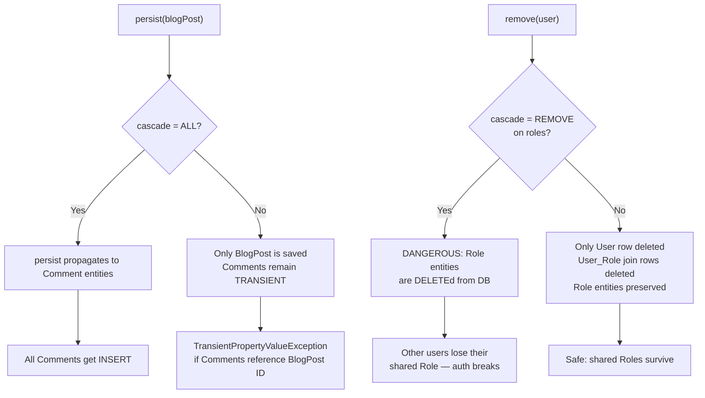

# Cascade Types in JPA

## WHY This Exists

In early JDBC code, saving an `Order` with its five `OrderItem` rows required six separate
INSERT calls written in the exact correct sequence. First you inserted the Order to get its
generated ID, then you iterated the items, manually setting the `order_id` FK on each, and
called INSERT five more times. Forget one item and you had silent data loss. Call them in the
wrong order and you got a FK violation. Add a second code path (an admin correction flow, a
CSV batch import) and you had to duplicate the six-step INSERT sequence everywhere. Any path
that deviated silently created orphaned records.

JPA's cascade mechanism solves this by propagating persistence operations from a parent entity
to its children automatically. When you call `entityManager.persist(order)`, JPA can cascade
that operation to every `OrderItem` in the collection — one call saves the whole object graph.
The cascade type controls exactly which operations propagate: persist, merge, remove, refresh,
detach, or all of them. Cascade is declared per relationship, so you can say "when I save an
Order, save its Items too, but when I save a User, do NOT automatically delete shared Role
records."

The power comes with a serious responsibility: wrong cascade types cause production disasters.
`CascadeType.REMOVE` on a relationship to shared entities silently deletes data that belongs
to other records. `CascadeType.ALL` on a `@ManyToMany` is one of the most dangerous
annotations you can write. Understanding precisely what each cascade type does — and equally
important, where NOT to use it — is the difference between a stable data model and a system
that silently destroys production data.

---

## Python Bridge

| Concept | Python / SQLAlchemy | Java / JPA |
|---------|---------------------|------------|
| Save children with parent | `cascade="save-update"` on `relationship()` | `CascadeType.PERSIST` + `CascadeType.MERGE` |
| Delete children when parent deleted | `cascade="all, delete"` | `CascadeType.REMOVE` |
| Delete orphaned children | `cascade="all, delete-orphan"` | `orphanRemoval=true` on `@OneToMany` |
| Full cascade (all operations) | `cascade="all, delete-orphan"` | `CascadeType.ALL` + `orphanRemoval=true` |
| Cascade nothing | Omit cascade parameter | Omit cascade on the annotation |
| Sync in-memory state from DB | No direct equivalent (Session.refresh) | `CascadeType.REFRESH` |
| Detach from session | No direct equivalent | `CascadeType.DETACH` |

**Mental model difference:** SQLAlchemy's cascade is a single string combining multiple
behaviors (`"all, delete-orphan"`), and it defaults to `"save-update, merge"` — meaning
SQLAlchemy cascades PERSIST and MERGE by default for all relationships. JPA defaults to NO
cascade — you must explicitly opt in. This is the opposite of SQLAlchemy. Python developers
transitioning to JPA frequently hit `TransientPropertyValueException` because they forgot to
add `CascadeType.PERSIST` and tried to save a parent that references an unsaved transient
child. The JPA "default to nothing" philosophy is intentional: in enterprise systems with
large graphs of shared entities, silent cascade is more dangerous than explicit persistence.

---

## Cascade Propagation Diagram



---

## Working Java Code

### Order with CascadeType.ALL and orphanRemoval

```java
// FILE: Order.java
// PURPOSE: Demonstrates correct cascade strategy for a parent-owns-children relationship.
// Order and OrderItem have an exclusive ownership relationship — items cannot exist
// without an order and are not shared between orders.
// PACKAGE: com.learning.hibernate.relationships
// AUTHOR: Spring Mastery Learning Repo
// DATE: 2026-04-05

package com.learning.hibernate.relationships;

import jakarta.persistence.*;
import java.math.BigDecimal;
import java.time.LocalDateTime;
import java.util.ArrayList;
import java.util.List;

/**
 * Order entity demonstrating CascadeType.ALL with orphanRemoval.
 *
 * <p>This is the correct cascade configuration for a parent-exclusively-owns-children
 * relationship. OrderItems cannot exist without an Order and are never shared between
 * orders — therefore all operations cascade and orphan removal is enabled.</p>
 */
@Entity
@Table(name = "orders")
public class Order {

    @Id
    @GeneratedValue(strategy = GenerationType.IDENTITY)
    private Long id;

    @Column(name = "customer_email", nullable = false)
    private String customerEmail;

    @Column(name = "created_at")
    private LocalDateTime createdAt;

    /**
     * Line items belonging exclusively to this order.
     *
     * <p>WHY CascadeType.ALL: persisting an Order should persist its items
     * (PERSIST), merging the Order should merge item changes (MERGE), deleting
     * the Order should delete all its items (REMOVE), refreshing from DB should
     * refresh items (REFRESH), and detaching should detach items (DETACH).
     * Items are private to this Order — there is no scenario where you would
     * want to manage item lifecycle separately.</p>
     *
     * <p>WHY orphanRemoval=true: this fires a DELETE when an item is removed
     * from the collection in Java — {@code order.getItems().remove(item)} issues
     * a DELETE in the database. Without orphanRemoval, the item row stays in the
     * DB with a null or stale FK, creating orphaned rows.</p>
     *
     * <p>WHY List here (not Set): OrderItems have a natural ordered sequence
     * (line item 1, 2, 3) and are unique by definition — no two identical items
     * share an order row. List is acceptable for @OneToMany owned children where
     * Hibernate uses the join column (not a join table) for dirty checking.</p>
     */
    @OneToMany(
        mappedBy = "order",
        cascade = CascadeType.ALL,   // WHY ALL: items are exclusively owned by this order
        orphanRemoval = true         // WHY: removing from collection triggers DELETE
    )
    private List<OrderItem> items = new ArrayList<>();

    /** Convenience method: adds item and sets the back-reference to this order. */
    public void addItem(OrderItem item) {
        items.add(item);
        item.setOrder(this);         // WHY: keeps bidirectional relationship consistent
    }

    /** Removes item — orphanRemoval ensures the DB row is deleted. */
    public void removeItem(OrderItem item) {
        items.remove(item);
        item.setOrder(null);         // WHY: null the FK reference on the child side
    }

    public Long getId() { return id; }
    public String getCustomerEmail() { return customerEmail; }
    public void setCustomerEmail(String e) { this.customerEmail = e; }
    public LocalDateTime getCreatedAt() { return createdAt; }
    public void setCreatedAt(LocalDateTime t) { this.createdAt = t; }
    public List<OrderItem> getItems() { return items; }
}
```

```java
// FILE: OrderItem.java
// PURPOSE: Child entity of Order — demonstrates @ManyToOne back-reference.
// PACKAGE: com.learning.hibernate.relationships

package com.learning.hibernate.relationships;

import jakarta.persistence.*;
import java.math.BigDecimal;

/** Single line item in an order. Cannot exist without a parent Order. */
@Entity
@Table(name = "order_item")
public class OrderItem {

    @Id
    @GeneratedValue(strategy = GenerationType.IDENTITY)
    private Long id;

    @Column(nullable = false)
    private String productName;

    @Column(nullable = false)
    private int quantity;

    @Column(nullable = false)
    private BigDecimal unitPrice;

    /**
     * WHY no cascade on @ManyToOne: cascading from child to parent is almost
     * never correct. If you cascade REMOVE from OrderItem to Order, removing
     * a single line item would delete the entire parent Order.
     */
    @ManyToOne(fetch = FetchType.LAZY) // WHY LAZY: loading item should not auto-load the full Order
    @JoinColumn(name = "order_id", nullable = false)
    private Order order;

    public Long getId() { return id; }
    public String getProductName() { return productName; }
    public void setProductName(String p) { this.productName = p; }
    public int getQuantity() { return quantity; }
    public void setQuantity(int q) { this.quantity = q; }
    public BigDecimal getUnitPrice() { return unitPrice; }
    public void setUnitPrice(BigDecimal p) { this.unitPrice = p; }
    public Order getOrder() { return order; }
    public void setOrder(Order o) { this.order = o; }
}
```

### User with PERSIST-Only Roles

```java
// FILE: AppUser.java
// PURPOSE: Demonstrates CascadeType.PERSIST only for shared reference entities.
// Roles are pre-seeded reference data shared across many users — they must NOT
// be deleted when a user is deleted.
// PACKAGE: com.learning.hibernate.relationships

package com.learning.hibernate.relationships;

import jakarta.persistence.*;
import java.util.HashSet;
import java.util.Set;

/**
 * Application user entity.
 *
 * <p>Roles are shared reference data (ROLE_ADMIN, ROLE_USER, ROLE_MODERATOR).
 * They exist independently of any user. Cascade strategy: PERSIST only — so that
 * if a new Role is created programmatically and added to a new User in the same
 * transaction, the Role is also persisted. REMOVE is explicitly excluded because
 * deleting a User must not delete shared Roles.</p>
 */
@Entity
@Table(name = "app_user")
public class AppUser {

    @Id
    @GeneratedValue(strategy = GenerationType.IDENTITY)
    private Long id;

    @Column(unique = true, nullable = false)
    private String username;

    /**
     * WHY CascadeType.PERSIST only: Roles are shared reference entities.
     * Using REMOVE here would delete the Role from the database when ANY user
     * holding that role is deleted — a production catastrophe in a multi-user
     * system. MERGE is omitted because Role data is managed by administrators,
     * not by user operations.
     *
     * WHY Set: Role is a shared entity — duplicates must be prevented both at
     * the application level and via the unique constraint on the join table.
     */
    @ManyToMany(cascade = CascadeType.PERSIST) // WHY PERSIST only: never REMOVE or ALL on shared entities
    @JoinTable(
        name = "user_role",
        joinColumns = @JoinColumn(name = "user_id"),
        inverseJoinColumns = @JoinColumn(name = "role_id")
    )
    private Set<Role> roles = new HashSet<>();

    public Long getId() { return id; }
    public String getUsername() { return username; }
    public void setUsername(String u) { this.username = u; }
    public Set<Role> getRoles() { return roles; }
}
```

### orphanRemoval vs CascadeType.REMOVE — The Critical Difference

```java
// WHY: These two look similar but fire in different situations.
// Understanding this distinction is critical for Staff Engineer interviews.

// orphanRemoval = true fires when:
//   1. The parent entity is deleted (same as REMOVE)
//   2. The child is removed from the parent's collection:
//      order.getItems().remove(item)  --> DELETE issued for item row
//
// CascadeType.REMOVE fires ONLY when:
//   1. The parent entity is deleted via entityManager.remove(parent)
//
// If you use CascadeType.REMOVE WITHOUT orphanRemoval:
//   order.getItems().remove(item);  // item removed from collection in Java
//   entityManager.merge(order);    // item row STAYS in DB with its order_id FK
//                                  // --> orphaned row, data inconsistency
//
// If you use orphanRemoval = true:
//   order.getItems().remove(item);  // item removed from collection
//   entityManager.merge(order);    // DELETE item row issued automatically

// RULE OF THUMB:
//   - Exclusively owned children (OrderItem, Comment): CascadeType.ALL + orphanRemoval=true
//   - Shared reference entities (Role, Category):      CascadeType.PERSIST only
//   - @ManyToOne child-to-parent:                      NO cascade ever
```

---

## Real-World Use Cases

**1. E-commerce — Order to LineItems (CascadeType.ALL + orphanRemoval)**
In platforms like Shopify or Amazon Seller Central, an `Order` owns its `LineItem` entities
exclusively. When a customer submits an order, the service calls `entityManager.persist(order)`
and all line items persist automatically via `CascadeType.PERSIST`. When a customer cancels
and modifies their cart, `order.getItems().remove(lineItem)` triggers a DELETE via
`orphanRemoval=true`. Without `orphanRemoval`, cancelled line items accumulate as orphaned
rows — the order shows zero items but the database retains the rows, causing revenue
reconciliation errors and incorrect inventory counts.

**2. HR System — Employee to Certificates (CascadeType.PERSIST only)**
In enterprise HR platforms (Workday, SAP SuccessFactors), an Employee has a collection of
professional certificates (AWS Certified, PMP). Certificates are independently managed by the
HR certification team — they are not created or deleted as a side effect of employee
operations. The correct cascade is `CascadeType.PERSIST` only: when a new employee is
onboarded with a pre-existing certificate added to their profile, the certificate is persisted
if new. Using `CascadeType.REMOVE` here would delete the certificate record from the master
catalog when the employee leaves the company — other employees sharing that certification
reference would be silently affected.

---

## Anti-Patterns

### 1. CascadeType.ALL on @ManyToMany

**What developers do:**
```java
@ManyToMany(cascade = CascadeType.ALL)  // WRONG — catastrophic
@JoinTable(name = "user_role", ...)
private Set<Role> roles;
```

**Why it fails in production:** `CascadeType.ALL` includes `CascadeType.REMOVE`. Deleting a
`User` cascades DELETE to every `Role` in the user's collection. Because Roles are shared
reference data, this deletes `ROLE_ADMIN` from the database — instantly locking every other
admin out of the system. The failure is silent during development because test datasets rarely
have two users sharing the same Role entity. It surfaces in production on the first user
deletion.

**The fix:**
```java
@ManyToMany(cascade = CascadeType.PERSIST)  // CORRECT: only cascade persist for new Roles
@JoinTable(name = "user_role", ...)
private Set<Role> roles;
// Or omit cascade entirely if Roles are always pre-seeded reference data
```

---

### 2. CascadeType.REMOVE Without orphanRemoval

**What developers do:**
```java
@OneToMany(mappedBy = "order", cascade = CascadeType.REMOVE)  // INCOMPLETE
private List<OrderItem> items;

// Then later in service code:
order.getItems().remove(itemToCancel);  // Developer expects DELETE to fire
entityManager.merge(order);            // But no DELETE fires — orphaned row remains
```

**Why it fails in production:** `CascadeType.REMOVE` only propagates deletion when the
parent entity itself is deleted via `entityManager.remove(parent)`. Removing a child from the
collection in Java (collection mutation) does NOT trigger DELETE without `orphanRemoval=true`.
The child row stays in the database with its FK intact, creating an orphaned record. In an
order system this means cancelled line items are counted in inventory reports and revenue
calculations — real financial errors that are hard to trace back to the missing `orphanRemoval`.

**The fix:**
```java
@OneToMany(
    mappedBy = "order",
    cascade = CascadeType.ALL,
    orphanRemoval = true             // CORRECT: collection removal triggers DELETE
)
private List<OrderItem> items;
```

---

### 3. No Cascade at All — Manual Child Persistence

**What developers do:**
```java
// No cascade declared
@OneToMany(mappedBy = "order")
private List<OrderItem> items;

// Then in service code — every developer must remember to do this:
entityManager.persist(order);
for (OrderItem item : order.getItems()) {
    entityManager.persist(item);     // WRONG: boilerplate that gets forgotten
}
```

**Why it fails in production:** With no cascade, every code path that creates an Order must
also explicitly persist each OrderItem. When a new developer adds a feature (an order
duplication API, a CSV import job) and forgets the explicit item persists, orders are created
with zero items in the database while the in-memory object looks correct. Bugs like this are
hard to find because the same transaction that creates the items reads them back successfully
from the first-level cache — the problem only appears after the session closes and the order
is loaded fresh from DB.

**The fix:**
```java
@OneToMany(mappedBy = "order", cascade = CascadeType.ALL, orphanRemoval = true)
private List<OrderItem> items;

// Now a single call persists the full graph — no per-item boilerplate
entityManager.persist(order);  // CORRECT: items are persisted automatically
```

---

## Interview Questions

### Conceptual

**Q1: Your team is building a document management system where a `Document` has many `Revision` entities. A Document should never exist without at least its initial revision. What cascade configuration would you choose and why?**
> `CascadeType.ALL` with `orphanRemoval=true`. Revisions are exclusively owned by a Document — they have no meaning or existence outside of their parent. CascadeType.PERSIST ensures creating a Document with its initial Revision in one call. CascadeType.REMOVE ensures that deleting a Document cleans up all its Revision rows. orphanRemoval ensures that programmatically removing a Revision from `document.getRevisions()` fires the DELETE immediately on flush — preventing orphaned revision rows in the database. CascadeType.MERGE ensures in-memory edits to Revision objects propagate when the Document is merged back into the persistence context.

**Q2: Explain precisely how `orphanRemoval=true` differs from `CascadeType.REMOVE`. Describe a scenario where using only `CascadeType.REMOVE` causes a data bug that `orphanRemoval` would have prevented.**
> `CascadeType.REMOVE` propagates `entityManager.remove(parent)` to child entities — children are deleted when the parent is explicitly deleted. `orphanRemoval=true` fires a DELETE when a child is removed from the parent's collection in Java code: `parent.getChildren().remove(child)`. The data bug scenario: an e-commerce service calls `order.getItems().remove(cancelledItem)` to cancel one line item, then calls `entityManager.merge(order)`. With only `CascadeType.REMOVE`, no DELETE fires for the item — it remains in the DB as an orphaned row with `order_id` still set. Inventory counts are wrong, and the cancelled item appears in reporting queries. Adding `orphanRemoval=true` fires the DELETE automatically when the item is removed from the collection.

### Scenario / Debug

**Q3: A production incident report shows that deleting a user account caused 47 other admin users to lose access to the system. The on-call engineer sees that the `role` table has zero rows after the deletion. What JPA configuration caused this and what is the immediate remediation?**
> The root cause is `CascadeType.ALL` (or `CascadeType.REMOVE`) on the `@ManyToMany` relationship between `User` and `Role`. When the user was deleted, Hibernate cascaded the REMOVE operation to all Role entities in that user's roles collection — including `ROLE_ADMIN`, which was shared across all admin accounts. Immediate remediation: restore the role data from the last backup or re-insert the pre-seeded Role rows manually. Long-term fix: change the cascade on the `@ManyToMany` to `CascadeType.PERSIST` only (or remove it entirely for pre-seeded roles), add an integration test that deletes a user and asserts all Role rows still exist, and add a `@PreRemove` method on User that clears the roles collection before deletion as a safety net.

### Quick Fire

- What is the default cascade value when no `cascade` attribute is specified? *(No cascade — JPA defaults to an empty array, meaning no operations propagate.)*
- Does `orphanRemoval=true` fire when you call `entityManager.remove(parent)`? *(Yes — it fires in both cases: parent deletion AND collection removal.)*
- Is `CascadeType.ALL` always a good shortcut? *(No — on relationships to shared entities it is dangerous because it includes REMOVE, which can delete shared reference data.)*
