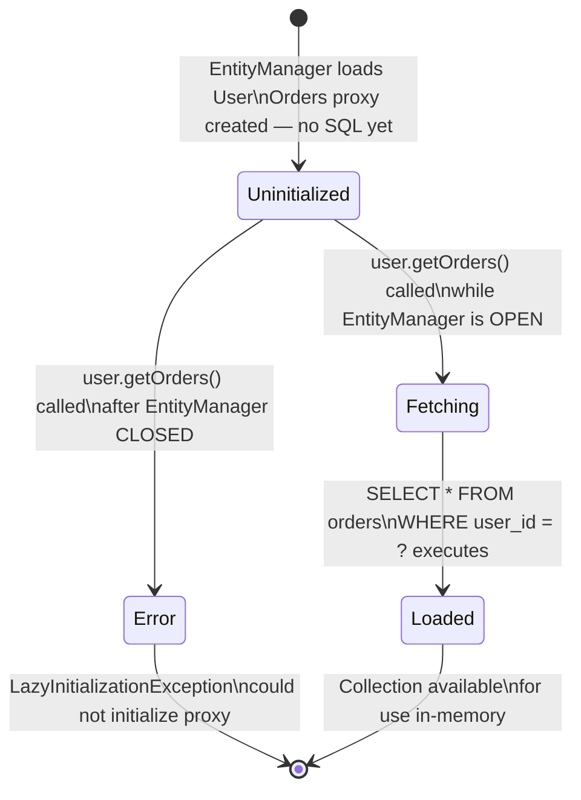

# Fetch Strategies in JPA

## WHY This Exists

Early ORMs, including the first versions of Hibernate 1.x and TopLink, loaded everything
eagerly by default. The philosophy was simple: when you load an entity, you probably need
all its data. Every `session.find(User.class, id)` also fetched their orders, their order
items, their addresses, their payment methods, and their audit log entries. This felt
convenient in demos and small applications.

In production with real data, this was a disaster. Loading a list of 100 users for a homepage
banner would JOIN across six tables, pulling thousands of rows into memory for data that was
never displayed. A single `findAll()` on a User table in an e-commerce system could generate
megabytes of result sets because every User dragged in their full order history. Response
times ballooned, heap memory was exhausted, and the database spent most of its time processing
joins that answered questions nobody asked.

Hibernate introduced configurable fetch strategies to solve this. The default for
`@OneToMany` and `@ManyToMany` is now `FetchType.LAZY` — meaning Hibernate loads only the
parent entity, and defers loading children until you explicitly access the collection. The
default for `@ManyToOne` and `@OneToOne` is `FetchType.EAGER` — meaning the associated single
entity is loaded in the same query. Knowing these defaults by memory is essential because
accidentally overriding them in the wrong direction is one of the most common sources of
Hibernate performance bugs in production codebases.

---

## Python Bridge

| Concept | Python / SQLAlchemy | Java / JPA |
|---------|---------------------|------------|
| Lazy load (default for collections) | `lazy='select'` (default for `relationship()`) | `FetchType.LAZY` (default for @OneToMany, @ManyToMany) |
| Eager load | `lazy='joined'` or `lazy='subquery'` | `FetchType.EAGER` (default for @ManyToOne, @OneToOne) |
| JOIN FETCH per query | `query.options(joinedload(User.orders))` | `SELECT u FROM User u LEFT JOIN FETCH u.orders` |
| Subquery load per query | `query.options(subqueryload(User.orders))` | `@Fetch(FetchMode.SUBSELECT)` |
| Batch loading | `query.options(selectinload(User.orders))` | `@BatchSize(size=N)` |
| Declarative per-method override | No direct equivalent | `@EntityGraph(attributePaths={"orders"})` |
| LazyInitializationException equivalent | `DetachedInstanceError` in some cases | `LazyInitializationException` — session closed before lazy access |

**Mental model difference:** SQLAlchemy uses the `lazy=` parameter as a loading strategy hint
that applies to the class definition but can be overridden per query with `.options()`. The
session boundary in SQLAlchemy is more forgiving — you can often access lazy attributes
outside a request context because SQLAlchemy reopens a connection transparently if the session
is still available. JPA is stricter: the `EntityManager` has a defined lifecycle tied to a
transaction or request. Once the `EntityManager` closes, accessing a LAZY proxy throws
`LazyInitializationException` — there is no transparent reconnection. This strictness is
intentional: it forces developers to declare their data loading requirements up front rather
than relying on implicit reconnection behavior that hides performance problems.

---

## LAZY Proxy State Diagram



---

## Working Java Code

### Demonstrating LazyInitializationException and the Fixes

```java
// FILE: UserRepository.java
// PURPOSE: Spring Data JPA repository demonstrating @EntityGraph as the preferred
// fix for LazyInitializationException in REST API contexts.
// PACKAGE: com.learning.hibernate.relationships
// AUTHOR: Spring Mastery Learning Repo
// DATE: 2026-04-05

package com.learning.hibernate.relationships;

import jakarta.persistence.EntityGraph;
import org.springframework.data.jpa.repository.EntityGraph;
import org.springframework.data.jpa.repository.JpaRepository;
import org.springframework.data.jpa.repository.Query;
import org.springframework.data.repository.query.Param;
import java.util.Optional;
import java.util.List;

/**
 * User repository showing multiple strategies to avoid LazyInitializationException.
 *
 * <p>Spring Data JPA closes the EntityManager after the repository method returns.
 * If the controller then accesses a LAZY collection on the returned entity,
 * Hibernate throws LazyInitializationException because the session is gone.
 * The fixes below address this at the query level — the correct place to declare
 * what data you need.</p>
 */
public interface UserRepository extends JpaRepository<AppUser, Long> {

    /**
     * Fix 1: JOIN FETCH in JPQL query.
     *
     * <p>WHY JOIN FETCH: rewrites the SQL to a single JOIN query that loads
     * the User and all their Orders in one round trip. Best for single-use
     * queries where you always need the orders. Risk: if you add a second
     * JOIN FETCH for a different collection (addresses) in the same query,
     * you get a Cartesian product.</p>
     *
     * @param id user ID
     * @return user with orders collection initialized
     */
    @Query("SELECT u FROM AppUser u LEFT JOIN FETCH u.orders WHERE u.id = :id")
    Optional<AppUser> findByIdWithOrders(@Param("id") Long id);

    /**
     * Fix 2: @EntityGraph — declarative and Spring Data-friendly.
     *
     * <p>WHY @EntityGraph: generates the same JOIN FETCH SQL as above, but
     * declared as metadata on the method rather than embedded in a JPQL string.
     * Easier to read, reusable, and correctly handles the DISTINCT requirement
     * that JOIN FETCH needs to avoid duplicate parent rows when collections
     * have multiple elements.</p>
     *
     * @param id user ID
     * @return user with orders and addresses collections initialized
     */
    @EntityGraph(attributePaths = {"orders"})    // WHY: loads orders eagerly for this call only
    Optional<AppUser> findById(Long id);          // WHY override: standard findById gets EntityGraph applied

    /**
     * List users — intentionally NO @EntityGraph here.
     *
     * <p>WHY no eager loading on list endpoint: loading orders for every user
     * in a list would be a catastrophic N+1 or Cartesian product. List endpoints
     * should project to DTOs or use pagination + explicit JOIN FETCH only when
     * the orders data is actually required by the consumer.</p>
     */
    List<AppUser> findByUsername(String username);
}
```

```java
// FILE: UserService.java
// PURPOSE: Service demonstrating where LazyInitializationException occurs and
// the correct architectural boundary for loading decisions.
// PACKAGE: com.learning.hibernate.relationships

package com.learning.hibernate.relationships;

import org.springframework.stereotype.Service;
import org.springframework.transaction.annotation.Transactional;
import java.util.List;

/**
 * Service layer showing correct transaction boundaries for lazy loading.
 *
 * <p>The EntityManager is open for the duration of a @Transactional method.
 * Any LAZY access inside the transaction boundary works correctly. The
 * LazyInitializationException occurs when a LAZY proxy is accessed AFTER
 * the @Transactional method returns and the EntityManager is closed.</p>
 */
@Service
public class UserService {

    private final UserRepository userRepository;

    public UserService(UserRepository userRepository) {
        this.userRepository = userRepository;
    }

    /**
     * CORRECT: accessing lazy collection inside the transaction boundary.
     *
     * <p>WHY @Transactional here: the EntityManager stays open for the full
     * duration of this method. Accessing user.getOrders() inside this method
     * triggers a lazy SELECT — but the session is still active, so it succeeds.
     * The controller receives the initialized collection.</p>
     *
     * @param userId ID of user to summarize
     * @return order count
     */
    @Transactional(readOnly = true)              // WHY readOnly: optimizes for SELECT-only workload
    public int getOrderCount(Long userId) {
        AppUser user = userRepository.findById(userId)
            .orElseThrow(() -> new IllegalArgumentException("User not found: " + userId));
        return user.getOrders().size();           // WHY: lazy load fires here — session is still open
    }

    /**
     * ALSO CORRECT: use @EntityGraph to load orders eagerly in the query.
     *
     * <p>WHY prefer @EntityGraph for controllers: the controller layer receives
     * a fully initialized entity and never needs to access the EntityManager.
     * This makes the service method's data contract explicit — callers know
     * they will receive a User with orders populated.</p>
     *
     * @param userId ID of user
     * @return user with orders initialized
     */
    @Transactional(readOnly = true)
    public AppUser findWithOrders(Long userId) {
        // WHY findByIdWithOrders: uses JOIN FETCH, returns initialized collection
        return userRepository.findByIdWithOrders(userId)
            .orElseThrow(() -> new IllegalArgumentException("User not found: " + userId));
    }
}
```

---

## Real-World Use Cases

**1. E-commerce Product Listing — Never EAGER load Reviews**
In a product catalog service (similar to Amazon or Shopify storefronts), the listing endpoint
returns 50 products per page. Each `Product` has a `@OneToMany` relationship to `Review`
entities (potentially hundreds per product). If a developer changes the fetch strategy to
`FetchType.EAGER`, every product listing query now loads all reviews for all 50 products —
potentially thousands of rows. Memory usage spikes and response times increase from under
100ms to over 3 seconds. The product listing page never displays reviews, so all those loaded
rows are discarded immediately. The correct configuration is `FetchType.LAZY` (the default)
with a separate review-loading endpoint for the product detail page.

**2. User Profile Page — EAGER load UserProfile since it is always needed**
In a social platform (LinkedIn-style), every `User` has a one-to-one `UserProfile` containing
display name, bio, and avatar URL. The profile is displayed everywhere the user appears — in
comments, search results, and the dashboard. Loading a `User` without its `UserProfile` is
never useful in this system. For this specific case, `FetchType.EAGER` on the `@OneToOne` is
correct: it avoids a second SELECT on every access. However, this optimization is only valid
when the associated entity is small (a few columns) and always needed. The moment the
`UserProfile` grows to include large TEXT fields or BLOBs, switch to LAZY and use
`@EntityGraph` to load it only when the full profile is requested.

---

## Anti-Patterns

### 1. @OneToMany(fetch = EAGER) on a List Endpoint

**What developers do:**
```java
// "Fix" for LazyInitializationException by making the relationship always eager
@OneToMany(fetch = FetchType.EAGER, mappedBy = "user")  // WRONG on a collection
private List<Order> orders;
```

**Why it fails in production:** Every query that loads a `User` — including `findAll()`,
search queries, and pagination queries — now generates a JOIN that loads all orders for every
user in the result set. A page that lists 100 users for an admin dashboard now loads every
order ever placed by those 100 users. With an average of 50 orders per user, that is 5,000
order rows loaded into memory for a page that shows only usernames and emails. Heap exhaustion
and out-of-memory errors follow under load.

**The fix:**
```java
// Keep LAZY (it is the default — no annotation needed)
@OneToMany(mappedBy = "user")
private List<Order> orders;

// Load eagerly only when orders are needed, per-method:
@EntityGraph(attributePaths = {"orders"})
Optional<AppUser> findByIdWithOrders(Long id);
```

---

### 2. Open Session in View — Keeping the Session Open for the View Layer

**What developers do:**
```java
# application.properties
spring.jpa.open-in-view=true  # WRONG — this is the default in Spring Boot, but it should be disabled
```

**Why it fails in production:** Open Session in View (OSIV) keeps the Hibernate
`EntityManager` open from the start of the HTTP request all the way until the HTTP response
is serialized — including the controller, service, and view rendering layers. Lazy collections
accessed in the controller or during JSON serialization silently trigger SQL queries. The
result is unpredictable database calls during response serialization, N+1 queries in loops
inside template rendering, and performance that is impossible to reason about because SQL
executes in unexpected places. The fix appears to work (LazyInitializationException goes
away), but the underlying data loading is uncontrolled and causes database overload at scale.

**The fix:**
```java
# application.properties
spring.jpa.open-in-view=false  # CORRECT: forces explicit data loading decisions

# Then fix LazyInitializationException properly:
# - Use @EntityGraph on repository methods
# - Use JOIN FETCH in queries
# - Use @Transactional on service methods that need lazy access
```

---

### 3. Accessing Lazy Collections in toString()

**What developers do:**
```java
@Entity
public class User {
    @OneToMany(mappedBy = "user")
    private List<Order> orders;

    @Override
    public String toString() {
        // WRONG: accesses lazy collection — triggers SELECT every time this is logged
        return "User{id=" + id + ", orders=" + orders + "}";
    }
}
```

**Why it fails in production:** Logging frameworks call `toString()` on objects passed to log
statements, even at DEBUG level. Every `log.debug("Processing: {}", user)` statement triggers
a SELECT on the `orders` table for that user. If this happens inside a loop over 100 users,
it generates 100 unexpected SELECTs during logging. If the EntityManager is closed (common in
async processing or after the transaction ends), it throws `LazyInitializationException` in
a log statement — a confusing and hard-to-reproduce error.

**The fix:**
```java
@Override
public String toString() {
    // CORRECT: never reference lazy fields in toString — use only basic columns
    return "User{id=" + id + ", username='" + username + "'}";
}
```

---

## Interview Questions

### Conceptual

**Q1: Your application throws `LazyInitializationException` in the controller after a `@Transactional` service method returns the entity. Three developers propose three different fixes: one says enable Open Session in View, one says switch the relationship to EAGER, one says use `@EntityGraph`. Rank these solutions from worst to best and justify each ranking.**
> Worst: enable Open Session in View. This keeps the database session open through HTTP response serialization, making SQL execution unpredictable and untraceable. It hides the problem without fixing it and causes N+1 queries in logging and serialization layers at scale. Second worst: switch to EAGER. This loads the collection on every single query that loads the parent entity — including list endpoints and admin queries that do not need the collection. It trades a runtime exception for a performance regression that compounds with every new query. Best: `@EntityGraph`. It loads the collection eagerly only for the specific repository method that needs it, leaving all other queries unaffected. The data loading contract is explicit and co-located with the query definition.

**Q2: A colleague says "I'll just put `FetchType.EAGER` on `@ManyToOne` fields to avoid lazy loading complexity." Given that `@ManyToOne` already defaults to EAGER, what is the implication of this statement, and in what scenarios would you actually want to override `@ManyToOne` to LAZY?**
> The colleague is correct that `@ManyToOne` defaults to EAGER — their statement has no practical effect since they are setting the default explicitly. The scenarios where overriding `@ManyToOne` to LAZY is correct: (1) when the associated entity is large (many columns or LOB fields) and not always needed — for example, loading a `Comment` rarely requires the full `BlogPost` entity, only its ID; (2) when loading a collection of children where each child has an EAGER `@ManyToOne` parent — loading 100 OrderItems would also EAGER-load the parent Order 100 times (N+1 variant via EAGER); (3) performance-critical read paths like search indexes where the minimum data footprint per entity matters. Override `@ManyToOne` to LAZY with `@JoinColumn(name="author_id", insertable=false, updatable=false)` to retain the FK column while preventing the join.

### Scenario / Debug

**Q3: Your product detail page takes 4 seconds to load. The page shows a product with its 200 customer reviews. You suspect a fetch strategy misconfiguration. Describe your investigation and the specific Hibernate configuration change you would make.**
> First, enable Hibernate SQL logging (`spring.jpa.show-sql=true`, `logging.level.org.hibernate.SQL=DEBUG`, `logging.level.org.hibernate.orm.jdbc.bind=TRACE`). Load the product detail page once and count the SQL statements. If you see one SELECT for the product followed by 200 individual SELECT statements for each review (N+1), the reviews collection is LAZY and being accessed in a loop or serialization. If you see one massive JOIN query pulling all products and all reviews (wrong scope), reviews is EAGER and the query is too broad. For the product detail page specifically, the fix is `@EntityGraph(attributePaths = {"reviews"})` on the `findById` method used by the detail controller — this generates one efficient JOIN query loading the product and all its reviews in a single round trip, rather than 201 queries.

### Quick Fire

- What is the default fetch type for `@OneToMany`? *(LAZY — Hibernate loads the collection only when accessed.)*
- What is the default fetch type for `@ManyToOne`? *(EAGER — Hibernate loads the associated entity in the same query.)*
- Name the exception thrown when a LAZY collection is accessed after the EntityManager closes. *(`LazyInitializationException`)*
