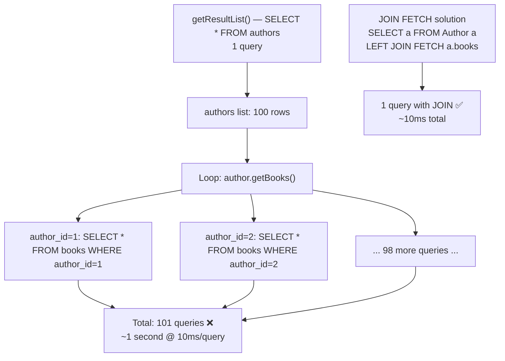

# 06 — The N+1 Problem: Hibernate's Most Dangerous Performance Trap

## Why This Matters Before We Define Anything

The N+1 problem is the silent performance killer in Hibernate applications. It looks like correct code in code review. Tests pass. But in production, loading 100 orders generates 101 database queries instead of 1 — and you won't notice until the app collapses under load. The name comes from a simple formula: 1 query for the parent list + N queries (one per parent) for each child collection = N+1 total.

The insidious part is that it's invisible unless you look at the SQL log. A developer writes:

```java
List<Author> authors = session.createQuery("FROM Author", Author.class).getResultList();
for (Author a : authors) {
    System.out.println(a.getName() + ": " + a.getBooks().size() + " books");
}
```

This looks perfectly reasonable. But with 100 authors, Hibernate fires 1 query for authors and then 100 separate queries to load each author's books — 101 queries total. With 10ms per query, that's 1 second of DB time for what should take 10ms. The code compiles, unit tests pass (you only tested with 1 author), and the problem only surfaces at production scale.

The reason this happens is Hibernate's default fetch strategy: `FetchType.LAZY` for `@OneToMany`. When you navigate `author.getBooks()`, Hibernate hasn't loaded those books yet. It fires a new SQL query right there, inside your Java loop, one per iteration. The laziness is the feature — but the loop is the trap. Every ORM framework has this behaviour by default, and every backend engineer will encounter it. Knowing how to detect it, diagnose it, and choose the right fix is a Staff Engineer-level skill.

---

## Python Bridge — SQLAlchemy vs. Hibernate

| Concept | SQLAlchemy | Hibernate |
|---|---|---|
| N+1 cause | `lazy='select'` (default) in a loop | `FetchType.LAZY` (default for `@OneToMany`) in a loop |
| Fix: JOIN | `joinedload(Author.books)` | `JOIN FETCH` in JPQL |
| Fix: subquery | `subqueryload(Author.books)` | `@Fetch(FetchMode.SUBSELECT)` |
| Fix: select-in / batch | `selectinload(Author.books)` | `@BatchSize(size=N)` |
| Detection | `echo=True` on engine | `hibernate.show_sql=true` |
| Statistics | SQLAlchemy event listeners | `hibernate.generate_statistics=true` |

**Mental model:** SQLAlchemy and Hibernate behave identically by default — lazy loading fires a separate query per parent. The difference is that SQLAlchemy's `selectinload` generates a single `WHERE author_id IN (1,2,3...)` query, while Hibernate's `@BatchSize` does the same thing. Both are solving the same problem with the same solution. If you've ever debugged N+1 in a Python/FastAPI app by switching from `lazy='select'` to `selectinload`, you already understand the Hibernate fix — you just need to learn the different annotation names.

---

## How N+1 Happens: Data Flow Diagram



---

## The 4 Fixes

### Fix 1 — JOIN FETCH (JPQL)

The most direct fix. Forces Hibernate to include a SQL JOIN in the parent query, loading children in the same round trip.

```java
// 1 query with JOIN — the gold standard for primary fetch paths
List<Author> authors = session.createQuery(
    "SELECT DISTINCT a FROM Author a LEFT JOIN FETCH a.books", Author.class)
    .getResultList();

// SQL: SELECT DISTINCT a.*, b.* FROM authors a LEFT JOIN books b ON b.author_id = a.id

// WHY DISTINCT: without it, each book creates a duplicate Author row in the result.
// If author 1 has 3 books, you get author 1 three times in the Java list.
// DISTINCT collapses these back to one Author with a populated books list.
```

**Tradeoff:** If you JOIN FETCH two `@OneToMany` collections on the same parent (e.g., `a.books` AND `a.tags`), you get a Cartesian product and potentially `MultipleBagFetchException`. Only JOIN FETCH one collection at a time.

---

### Fix 2 — @EntityGraph (Declarative)

Preferred in Spring Data JPA repositories. Generates the same JOIN as Fix 1 but expressed as an annotation rather than JPQL.

```java
// In a Spring Data JPA repository interface:
@EntityGraph(attributePaths = {"books"})
List<Author> findAll();

// Or inline on a query method:
@EntityGraph(attributePaths = {"books", "books.chapters"}) // nested fetch
List<Author> findByNameContaining(String namePart);

// WHY prefer this over JOIN FETCH in Spring apps:
// - Repository method stays clean (no JPQL string manipulation)
// - attributePaths is type-safe-ish and easy to extend
// - Works with Spring Data pagination unlike some JOIN FETCH usages
```

---

### Fix 3 — @BatchSize (Annotation-Level Safety Net)

Instead of 1 query per parent, Hibernate batches the IN clause: "load books for authors 1–25, then 26–50, etc."

```java
@Entity
@Table(name = "authors")
public class Author {

    @OneToMany(mappedBy = "author", fetch = FetchType.LAZY)
    @BatchSize(size = 25) // WHY 25: ceil(100 authors / 25) = 4 queries instead of 100
    private List<Book> books;
}

// SQL generated (for 100 authors):
// SELECT * FROM books WHERE author_id IN (1,2,3,...,25)   [batch 1 — 1 query]
// SELECT * FROM books WHERE author_id IN (26,...,50)      [batch 2 — 1 query]
// SELECT * FROM books WHERE author_id IN (51,...,75)      [batch 3 — 1 query]
// SELECT * FROM books WHERE author_id IN (76,...,100)     [batch 4 — 1 query]
// Total: 4 queries instead of 100

// WHY NOT always use this instead of JOIN FETCH:
// Still fires multiple queries (just batched). JOIN FETCH is 1 query.
// But @BatchSize is an excellent safety net — put it on every @OneToMany.
```

---

### Fix 4 — @Fetch(FetchMode.SUBSELECT)

Loads all children using a subquery matching the original parent query. Always exactly 2 queries regardless of parent count.

```java
@Entity
@Table(name = "authors")
public class Author {

    @OneToMany(mappedBy = "author")
    @Fetch(FetchMode.SUBSELECT) // org.hibernate.annotations.Fetch
    private List<Book> books;
}

// SQL generated:
// Query 1: SELECT * FROM authors WHERE ...
// Query 2: SELECT * FROM books
//          WHERE author_id IN (SELECT id FROM authors WHERE ...)
//
// WHY 2 queries, not 1: The parent query runs first, then the subselect
// re-executes it inside the child query. The DB optimizer often handles
// this efficiently via index scan.
//
// WHY use SUBSELECT over JOIN FETCH:
// - Works when the parent query is complex (pagination, filters)
// - No Cartesian product risk
// - Always exactly 2 queries, predictable
//
// WATCH OUT: If the parent query is expensive, SUBSELECT runs it twice.
```

---

## When to Use Each Fix

| Fix | Best for | Watch out for |
|---|---|---|
| JOIN FETCH | JPQL queries, one collection at a time | Cartesian product with multiple collections; `MultipleBagFetchException` |
| @EntityGraph | Spring Data JPA repositories | Same JOIN caveat as above; complex graphs can get unwieldy |
| @BatchSize | Multiple collections, simple annotation, safety net | Still multiple queries (just fewer); choose batch size based on expected parent count |
| SUBSELECT | Large collections, predictable 2-query behavior | Entire parent result set re-queried in the subselect; bad if parent query is expensive |

**Recommended combination:** Use `JOIN FETCH` (or `@EntityGraph`) for your primary fetch path, AND annotate every `@OneToMany` with `@BatchSize(size=25)` as a fallback safety net for any lazy access you didn't anticipate.

---

## How to Detect N+1 in Development

**Option 1: `hibernate.show_sql=true`**
Watch the console for repeated patterns like:
```
select b1_0.author_id, b1_0.id, b1_0.title from books b1_0 where b1_0.author_id=?
select b1_0.author_id, b1_0.id, b1_0.title from books b1_0 where b1_0.author_id=?
select b1_0.author_id, b1_0.id, b1_0.title from books b1_0 where b1_0.author_id=?
```
Same query, different bind parameter = N+1.

**Option 2: `hibernate.generate_statistics=true`**
```java
SessionFactory sf = ...;
sf.getStatistics().setStatisticsEnabled(true);

// After executing your code:
long queryCount = sf.getStatistics().getPrepareStatementCount();
System.out.println("Queries executed: " + queryCount); // Should be 1, not 101
```

**Option 3: datasource-proxy or p6spy in tests**
```java
// In @SpringBootTest, use datasource-proxy to assert max query count:
@Test
void loadAuthorsWithBooks_shouldUseOneQuery() {
    // datasource-proxy intercepts all JDBC calls
    assertThat(queryCount).isEqualTo(1); // Fails immediately if N+1 is introduced
}
```
This is the gold standard — put it in your test suite so regressions are caught in CI, not in production.

---

## Real-World Use Cases

### 1. E-commerce Product Listing (Shopify-style)

Loading 50 products each with their variant list (colour, size combinations). N+1 = 51 queries. With `JOIN FETCH`: 1 query. Shopify-style stores with large product catalogs collapse under N+1 during browse sessions — the product listing page, which should return in 50ms, can take 3+ seconds when variants are lazy-loaded per product. The fix: `@EntityGraph(attributePaths = {"variants"})` on the repository `findAll(Pageable)` method.

### 2. Banking Transaction List

Loading 1000 transactions each with their associated `Account` details (account holder name, account number for display). N+1 = 1001 queries. Fix: `@BatchSize(size=100)` = 11 queries total. In real banking systems, slow transaction history pages are often caused by this exact issue. The `@ManyToOne` relationship to `Account` is the culprit — even a single-entity relationship causes N+1 when iterated over 1000 rows. `@BatchSize` on `@ManyToOne` is less common but equally valid.

---

## Anti-Patterns

### Anti-pattern 1: Using FetchType.EAGER to "fix" N+1

```java
// WRONG — trades one problem for another
@OneToMany(fetch = FetchType.EAGER) // "I'll just always load books"
private List<Book> books;
```

Now **every** load of `Author` loads **all** books, even when you only need the author's name for a dropdown. N+1 is gone for this one query, but you're always loading thousands of books. A `findAll()` for 1000 authors now loads 1000 × N books into memory. This is often **worse** than N+1 at scale, because at least N+1 only loads books when you navigate the association.

### Anti-pattern 2: Relying on L2 Cache to Hide N+1

```java
// WRONG — treating the symptom, not the cause
@Cache(usage = CacheConcurrencyStrategy.READ_WRITE)
@OneToMany(mappedBy = "author")
private List<Book> books;
```

If the books are cached, N+1 queries hit L2 instead of the DB. Latency drops from 10ms to <1ms per hit. Problem seems gone. But a cache miss — cold start, cache eviction after a bulk update, `@CacheEvict` call — means N+1 suddenly hits the DB at full force. The N+1 was hidden, not fixed. Additionally, the cache hit itself is not free; 100 L2 cache lookups still costs CPU and memory.

### Anti-pattern 3: JOIN FETCH on Multiple @OneToMany Collections

```java
// WRONG — causes MultipleBagFetchException or Cartesian product
session.createQuery(
    "SELECT a FROM Author a " +
    "LEFT JOIN FETCH a.books " +      // First collection
    "LEFT JOIN FETCH a.tags",          // Second collection — PROBLEM
    Author.class)
    .getResultList();
// If author has 10 books and 5 tags: 10 × 5 = 50 rows per author in result set
// Hibernate throws MultipleBagFetchException for List<> typed bags
```

**Fix:** Keep `JOIN FETCH` for the most important collection (books), add `@BatchSize(size=25)` to the second collection (tags). Or use `Set<>` for both collections (Set de-duplicates, so Cartesian product rows collapse), but be aware that very large Sets have their own memory implications.

---

## Interview Questions

This topic is interview-critical. Staff Engineer interviews will probe here.

---

### Q1: Your production app runs fine with 10 users but becomes unresponsive with 1000 rows in the authors table. You haven't changed any code. A colleague suggests "the database is slow." What's your first diagnostic step, and what are the top 3 possible Hibernate-related causes?

> **Answer:** Enable `hibernate.show_sql=true` (or attach datasource-proxy to count queries per request cycle) and reproduce the slow endpoint. Count the number of SQL statements per request — if it scales with the number of rows returned rather than staying constant, you have a query multiplication problem.
>
> **Top 3 Hibernate-related causes:**
> 1. **N+1 problem:** A `@OneToMany` or `@ManyToOne` association is lazy-loaded inside a loop. 1000 parent rows = 1001 queries.
> 2. **Missing pagination:** `findAll()` is loading the entire table into memory on every request. Not a query-count problem but a data-volume problem — worse at 1000 rows than at 10.
> 3. **Missing database index on a filtered column:** The query itself is correct, but Hibernate generates a `WHERE name = ?` that triggers a full table scan because the index was never created. Common in dev (small data = fast anyway) but breaks in prod.

---

### Q2: You've added `JOIN FETCH` to load Author + Books in 1 query. But now you also need to load Author + Tags. You add a second `JOIN FETCH`. Hibernate throws `MultipleBagFetchException`. Why, and how do you fix it?

> **Answer:** Two simultaneous `LEFT JOIN FETCH` on two different `@OneToMany` collections creates a Cartesian product in the SQL result: every (author, book, tag) triple becomes a separate row. With 10 books and 5 tags per author, 1 author = 50 rows in the result set. Hibernate refuses to do this for `List<>` typed collections (called "bags") because it cannot reliably de-duplicate them — hence `MultipleBagFetchException`.
>
> **Fix options:**
> 1. Change both collections to `Set<>` — `Set` de-duplicates, so the 50 rows collapse back to 1 author with 10 unique books and 5 unique tags. But large Sets still load the Cartesian product from the DB.
> 2. Keep `JOIN FETCH` for books (the more frequently needed collection), add `@BatchSize(size=25)` to tags — books load in 1 JOIN, tags load in ceil(N/25) batches. Total: 2–3 queries instead of 101, no Cartesian product.
> 3. Use two separate queries: one JPQL for authors+books, one for authors+tags, then merge in application code — rare but sometimes the cleanest for complex use cases.

---

### Q3: A Spring Boot app has `@OneToMany(mappedBy="order", fetch=LAZY)` on `Order.items`. A REST endpoint loads a page of 20 orders and returns them as JSON. The controller logs show the endpoint takes 2 seconds. How do you diagnose and fix this?

> **Answer:**
>
> **Diagnosis:** Enable `hibernate.show_sql=true` or add datasource-proxy to the test. You'll see exactly 21 queries: 1 `SELECT * FROM orders LIMIT 20` followed by 20 `SELECT * FROM order_items WHERE order_id = ?`. The Jackson serializer, while converting each `Order` to JSON, calls `getItems()` on each order — this navigates the lazy association and triggers a Hibernate proxy load, firing a new SQL query per order. This is the classic Open Session in View + N+1 combination.
>
> **Fix:** Add `@EntityGraph(attributePaths = {"items"})` to the Spring Data repository method:
> ```java
> @EntityGraph(attributePaths = {"items"})
> Page<Order> findAll(Pageable pageable);
> ```
> This changes the generated SQL to a single `SELECT o.*, i.* FROM orders o LEFT JOIN order_items i ON i.order_id = o.id LIMIT 20` — one query per page instead of 21. If the `items` list is large, also consider pagination on the items themselves or using a DTO projection.

---

### Quick Fire Round

- **What does N+1 mean?**
  *1 query for the parent list + N queries (one per parent) for each child collection = N+1 total queries.*

- **What SQL does `JOIN FETCH` generate?**
  *A SQL JOIN — a single query that selects both parent and child columns in one round trip to the database.*

- **Why use `@BatchSize(size=25)` instead of `FetchType.EAGER`?**
  *`@BatchSize` only fires when the collection is accessed, and loads in batches of 25 rather than per-entity. `FetchType.EAGER` loads ALL books on EVERY Author load, even when you only need the author's name. `@BatchSize` is opt-in at access time; `EAGER` is mandatory at all times.*
