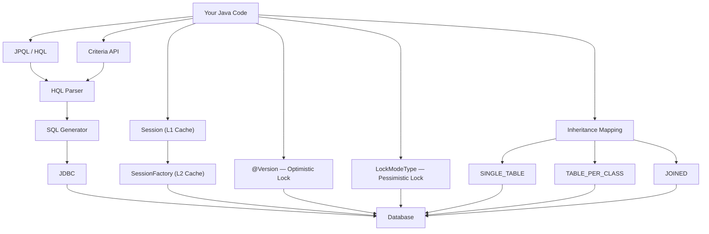

# 03 — Advanced Hibernate

## What This Module Covers

This module takes you past the basics of entity mapping and relationships into the techniques that separate a developer who "uses Hibernate" from one who "understands Hibernate." You will learn how to write object-oriented queries, build dynamic search features, control caching layers, protect concurrent updates, and choose the right inheritance strategy for your domain model.

By the end of this module you will be able to:
- Write HQL/JPQL queries using entity and field names instead of table and column names
- Build dynamic, type-safe queries with the Criteria API (no runtime string errors)
- Explain and demonstrate L1 and L2 cache behavior with measurable query counts
- Implement optimistic and pessimistic locking for concurrent data protection
- Choose the correct inheritance mapping strategy and justify the tradeoff

---

## Advanced Concepts Stack



---

## Python Bridge — SQLAlchemy vs HQL/JPQL

If you are coming from SQLAlchemy, the mental model maps naturally:

| Concept | SQLAlchemy (Python) | Hibernate / JPA (Java) |
|---|---|---|
| String-based query | `session.execute(text("SELECT * FROM products WHERE price > :p"), {"p": 10})` | `session.createQuery("FROM Product p WHERE p.price > :price", Product.class).setParameter("price", 10)` |
| ORM query API | `session.query(Product).filter(Product.price > 10)` | `CriteriaBuilder cb = ...` with `cb.greaterThan(root.get("price"), 10)` |
| Paginate results | `.limit(10).offset(20)` | `.setMaxResults(10).setFirstResult(20)` |
| Named query | `@event.listens_for` + stored query string | `@NamedQuery(name="...", query="...")` |
| L1 cache (identity map) | SQLAlchemy Session identity map (automatic) | Hibernate Session L1 cache (automatic) |
| L2 cache | `dogpile.cache` / `redis-py` (manual wiring) | `@Cacheable` + Ehcache/Caffeine (declarative) |
| Optimistic lock | `__version_id_col__ = Column(Integer)` | `@Version private Integer version;` |
| Pessimistic lock | `session.query(T).with_for_update()` | `session.find(T.class, id, LockModeType.PESSIMISTIC_WRITE)` |
| Inheritance: single table | `__mapper_args__ = {"polymorphic_on": type_col}` | `@Inheritance(strategy = InheritanceType.SINGLE_TABLE)` |
| Inheritance: joined | `__tablename__` + FK to parent | `@Inheritance(strategy = InheritanceType.JOINED)` |

The key difference is that Java's type system enables **compile-time safety** with the Criteria API in a way that Python's dynamic typing cannot. You trade conciseness for correctness guarantees.

---

## Module Structure

```
03-advanced-hibernate/
├── README.md                         ← you are here
├── MINDMAP.md                        ← full topic map
├── explanation/
│   ├── 01-hql-jpql.md                ← JPQL query language
│   ├── 02-criteria-api.md            ← type-safe dynamic queries
│   ├── 03-caching.md                 ← L1, L2, query cache
│   ├── 04-optimistic-locking.md      ← @Version, OptimisticLockException
│   ├── 05-pessimistic-locking.md     ← SELECT FOR UPDATE
│   ├── 06-inheritance-mapping.md     ← 3 strategies compared
│   ├── HQLDemo.java                  ← runnable JPQL examples
│   ├── CriteriaApiDemo.java          ← dynamic filter demo
│   ├── CachingDemo.java              ← L1 cache behavior
│   ├── LockingDemo.java              ← optimistic + pessimistic
│   └── InheritanceMappingDemo.java   ← all 3 strategies
├── exercises/
│   ├── Ex01_QueryOptimization.java   ← write JPQL + Criteria queries
│   ├── Ex02_CachingStrategy.java     ← L1 cache exploration
│   └── solutions/
│       ├── Sol01_QueryOptimization.java
│       └── Sol02_CachingStrategy.java
└── resources/
    ├── progressive-quiz-drill.md     ← 4-round quiz
    ├── one-page-cheat-sheet.md       ← quick reference
    └── top-resource-guide.md         ← curated external links
```

---

## Prerequisites

Before starting this module you should be comfortable with:
- Creating `@Entity` classes with `@Id`, `@GeneratedValue`, basic field annotations
- `@OneToMany`, `@ManyToOne`, `@ManyToMany` relationships
- `FetchType.LAZY` vs `FetchType.EAGER` and the N+1 problem
- Opening a `SessionFactory` and running basic `session.save()` / `session.find()` operations

---

## Learning Order

Work through the files in this order for the best conceptual build-up:

1. `01-hql-jpql.md` + `HQLDemo.java` — learn the query language first
2. `02-criteria-api.md` + `CriteriaApiDemo.java` — build on JPQL knowledge
3. `03-caching.md` + `CachingDemo.java` — understand the cache layers
4. `04-optimistic-locking.md` → `05-pessimistic-locking.md` + `LockingDemo.java` — concurrency control
5. `06-inheritance-mapping.md` + `InheritanceMappingDemo.java` — schema design choices
6. `Ex01_QueryOptimization.java` → `Ex02_CachingStrategy.java` — apply everything
7. `resources/progressive-quiz-drill.md` — validate understanding

---

## Interview Relevance

At Staff Engineer level, interviewers at Amazon, Google, Netflix, and Stripe will probe:
- "How does Hibernate's L1 cache differ from L2 cache, and when does L1 cache become a problem?" (stale data in long-running batch jobs)
- "Walk me through how @Version prevents lost updates without holding a database lock."
- "When would you choose JOINED inheritance over SINGLE_TABLE, and what is the performance cost?"
- "Your product search API has 12 optional filters. How do you implement this without 12 if/else JPQL string concatenations?"

These questions test whether you understand the WHY behind the abstractions, not just the annotation syntax.
