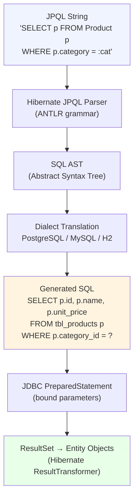

# JPQL and HQL — Querying by Object Model, Not Table Structure

## Contents

- Why JPQL Exists
- Python Bridge
- How JPQL Works (Architecture)
- JPQL Syntax Deep Dive
- Working Java Code
- Real-World Use Cases
- Anti-Patterns and Common Mistakes
- Interview Questions

---

Before JPQL existed, every Java developer writing database queries embedded raw SQL
strings into their code. The SQL referenced table names and column names — the physical
database schema. `SELECT product_name, cat_id FROM tbl_products WHERE cat_id = ? AND
unit_price > ?`. The problem: your Java object model never perfectly mirrors your schema.
You might have a `Product` class with a `price` field backed by a column named
`unit_price`. You might rename `tbl_products` to `products` during a cleanup sprint.
Every rename touches every query, across every file, and the compiler cannot catch a
single one. You find the broken queries at runtime, in production, under load.

JPQL (Java Persistence Query Language) solves this by letting you query against your
Java class names and field names — not the underlying table or column names. You write
`SELECT p FROM Product p WHERE p.price > :minPrice`. Hibernate reads your entity
mapping annotations, figures out the actual table name (`tbl_products`) and column name
(`unit_price`), and generates the correct SQL. Rename the column? Update the
`@Column(name="unit_price")` annotation in one place and every query that references
`p.price` automatically uses the new name. The queries themselves are unchanged.

HQL (Hibernate Query Language) predates JPQL — Hibernate invented it before JPA existed
as a standard. When JPA standardized on JPQL, it took most of HQL and codified it.
Today, JPQL is the portable, JPA-standard subset, and HQL is Hibernate's superset that
adds non-standard features like `FETCH JOIN` tweaks and Hibernate-specific functions.
In practice, prefer JPQL: it works with any JPA provider (EclipseLink, OpenJPA) without
lock-in. Fall back to HQL-only syntax only when you need a Hibernate-specific capability,
and document why.

---

## Python Bridge

> **Python/FastAPI equivalent:** SQLAlchemy ORM query interface (`session.query()` or
> the 2.x `select()` construct).

```python
# Python / SQLAlchemy — ORM-level queries
from sqlalchemy import select

# Basic ORM query
stmt = select(Employee).where(Employee.salary > min_salary)
employees = session.execute(stmt).scalars().all()

# Aggregation
stmt = (
    select(func.avg(Employee.salary), Employee.department)
    .group_by(Employee.department)
)
results = session.execute(stmt).all()
```

```java
// Java / JPQL equivalent
List<Employee> employees = em.createQuery(
    "SELECT e FROM Employee e WHERE e.salary > :min", Employee.class)
    .setParameter("min", minSalary)
    .getResultList();

// Aggregation
List<Object[]> results = em.createQuery(
    "SELECT AVG(e.salary), e.department FROM Employee e GROUP BY e.department",
    Object[].class)
    .getResultList();
```

| Concept | Python / SQLAlchemy | Java / JPQL |
|---------|---------------------|-------------|
| Basic entity query | `select(Product)` | `SELECT p FROM Product p` |
| WHERE filter | `.where(Product.price > 100)` | `WHERE p.price > :minPrice` |
| Named parameter | N/A (positional or keyword arg) | `:paramName` |
| Positional parameter | `.where(Product.price > ?)` | `?1` (avoid — use named) |
| Pagination | `.limit(size).offset(page * size)` | `.setFirstResult().setMaxResults()` |
| Result as typed list | `.scalars().all()` | `TypedQuery<T>.getResultList()` |
| Projection (DTO) | `select(Product.id, Product.name)` | `SELECT NEW com.dto.Summary(p.id, p.name)` |
| Named query (precompiled) | `session.execute(text(...))` | `@NamedQuery` on entity class |
| Raw SQL escape hatch | `session.execute(text("..."))` | `em.createNativeQuery("...")` |

**Key difference:** SQLAlchemy builds queries by chaining Python method calls on model
classes — the query is a Python object with `.where()`, `.order_by()`, `.limit()` calls.
JPQL is a string-based DSL: you write the query as a string and Hibernate parses it at
execution time (for `createQuery`) or at startup (for `@NamedQuery`). This means JPQL
typos produce runtime `IllegalArgumentException` rather than Python's `AttributeError`
at the call site. The Criteria API (see `02-criteria-api.md`) trades string queries for
type-safe builder objects — closer to SQLAlchemy's style.

---

## How JPQL Works (Architecture)



**Important:** `@NamedQuery` queries are parsed and validated at `SessionFactory` startup.
If you have a typo in a `@NamedQuery`, your application fails to start — a much earlier
and clearer failure than a runtime exception.

---

## JPQL Syntax Deep Dive

### Entity Name vs Table Name

```java
// The entity name (default: class name) — NOT the table name
@Entity
@Table(name = "tbl_products")  // actual DB table
public class Product { ... }   // entity name = "Product"

// JPQL uses the entity name:
"SELECT p FROM Product p"       // correct
"SELECT p FROM tbl_products p"  // WRONG — will throw exception
```

### Named Parameters (Preferred)

```java
// Named params: :paramName — safe, readable, reusable
TypedQuery<Employee> q = em.createQuery(
    "SELECT e FROM Employee e WHERE e.salary > :min AND e.department = :dept",
    Employee.class);
q.setParameter("min", 50000);
q.setParameter("dept", "Engineering");

// Positional params: ?1, ?2 — avoid (error-prone ordering)
TypedQuery<Employee> q2 = em.createQuery(
    "SELECT e FROM Employee e WHERE e.salary > ?1 AND e.department = ?2",
    Employee.class);
q2.setParameter(1, 50000);
q2.setParameter(2, "Engineering");
```

---

## Working Java Code

```java
// ===========================================================
// File: JpqlExamplesService.java
// Package: com.learning.hibernate.advanced
// Purpose: Demonstrates the five core JPQL patterns —
//          basic query, WHERE filter, pagination, aggregation,
//          and DTO projection — used in a product catalogue
//          service. All queries use jakarta.persistence.
// ===========================================================
package com.learning.hibernate.advanced;

import jakarta.persistence.EntityManager;
import jakarta.persistence.TypedQuery;
import org.springframework.stereotype.Service;
import org.springframework.transaction.annotation.Transactional;

import java.math.BigDecimal;
import java.util.List;

/**
 * Demonstrates five JPQL query patterns commonly used in enterprise
 * Spring Boot applications.
 *
 * <p>All queries use named parameters (:name) to prevent injection,
 * and TypedQuery to enforce compile-time return type safety.
 *
 * <p>Key rule: JPQL uses Java class names and field names, not
 * database table names and column names.
 */
@Service
@Transactional(readOnly = true) // WHY: default read-only; overrides save methods
public class JpqlExamplesService {

    private final EntityManager em;

    public JpqlExamplesService(EntityManager em) {
        this.em = em;
    }

    // -------------------------------------------------------
    // Pattern 1: Basic entity query — equivalent to SELECT *
    // Returns full entity objects, not scalar values.
    // -------------------------------------------------------
    /**
     * Load all employees. Returns full Employee entities.
     *
     * <p>JPQL: "SELECT e FROM Employee e"
     * Generated SQL: SELECT e.id, e.name, e.salary, e.dept_id FROM employees e
     */
    public List<Employee> findAllEmployees() {
        return em.createQuery(
                "SELECT e FROM Employee e", Employee.class)
            .getResultList();
    }

    // -------------------------------------------------------
    // Pattern 2: WHERE clause with named parameters
    // Uses field name (salary), not column name (emp_salary).
    // -------------------------------------------------------
    /**
     * Find employees earning above the given salary in the given department.
     *
     * <p>Named parameters (:minSalary, :department) prevent SQL injection
     * and make the query readable regardless of parameter count.
     *
     * @param minSalary  minimum salary threshold (inclusive)
     * @param department department name to filter by
     * @return matching employees ordered by salary descending
     */
    public List<Employee> findHighEarners(BigDecimal minSalary, String department) {
        return em.createQuery(
                // WHY: 'e.salary' refers to the Java field, not the DB column
                // Hibernate resolves field → column via @Column mapping
                "SELECT e FROM Employee e " +
                "WHERE e.salary > :minSalary " +
                "  AND e.department.name = :department " +
                "ORDER BY e.salary DESC",
                Employee.class)
            .setParameter("minSalary", minSalary)       // WHY: named param, not ?1
            .setParameter("department", department)
            .getResultList();
    }

    // -------------------------------------------------------
    // Pattern 3: Pagination — essential for any list endpoint
    // setFirstResult = OFFSET, setMaxResults = LIMIT
    // -------------------------------------------------------
    /**
     * Return a page of products, sorted by name.
     *
     * <p>Without pagination, getResultList() on a large table loads
     * ALL rows into heap memory — an OutOfMemoryError waiting to happen.
     *
     * @param page zero-based page index
     * @param size number of results per page
     */
    public List<Product> findProductsPage(int page, int size) {
        return em.createQuery(
                "SELECT p FROM Product p ORDER BY p.name ASC",
                Product.class)
            .setFirstResult(page * size)   // WHY: calculates DB OFFSET
            .setMaxResults(size)            // WHY: sets DB LIMIT / FETCH FIRST
            .getResultList();
    }

    // -------------------------------------------------------
    // Pattern 4: Aggregation with GROUP BY
    // Returns Object[] when selecting multiple mixed expressions.
    // -------------------------------------------------------
    /**
     * Calculate average salary per department for the HR dashboard.
     *
     * <p>Returns List of Object[2]: [0]=avg salary (Double), [1]=dept name (String).
     * Alternatively, project into a DTO record (see Pattern 5).
     */
    public List<Object[]> avgSalaryByDepartment() {
        return em.createQuery(
                // WHY: aggregate functions (AVG, SUM, COUNT, MAX, MIN) work
                // on Java field names — no SQL column aliasing needed
                "SELECT AVG(e.salary), e.department.name " +
                "FROM Employee e " +
                "GROUP BY e.department.name " +
                "ORDER BY AVG(e.salary) DESC",
                Object[].class)
            .getResultList();
    }

    // -------------------------------------------------------
    // Pattern 5: DTO Projection — SELECT NEW syntax
    // Avoids fetching unused columns. Returns a typed record,
    // not a raw Object[] or a full heavyweight entity.
    // -------------------------------------------------------
    /**
     * Return only the fields needed for the employee summary list page.
     *
     * <p>SELECT NEW requires a constructor in the target class that
     * exactly matches the projected fields in order and type.
     * The DTO class must be referenced by its fully-qualified name.
     */
    public List<EmployeeSummary> findEmployeeSummaries() {
        return em.createQuery(
                // WHY: fetching full Employee entities would load salary,
                // hire_date, address, notes, etc. — all unused by the
                // summary page. Projection reduces data transfer.
                "SELECT NEW com.learning.hibernate.advanced.EmployeeSummary(" +
                "  e.id, e.firstName, e.lastName, e.department.name" +
                ") " +
                "FROM Employee e " +
                "ORDER BY e.lastName ASC, e.firstName ASC",
                EmployeeSummary.class)
            .getResultList();
    }
}
```

### Named Query (Precompiled at Startup)

```java
// ===========================================================
// Annotation on the entity — validated when SessionFactory
// starts, not when the query is first executed.
// Startup failure is far better than production runtime failure.
// ===========================================================

@Entity
@Table(name = "products")
// WHY: @NamedQuery is parsed at application startup — typos fail fast
@NamedQuery(
    name = "Product.findByCategory",
    query = "SELECT p FROM Product p WHERE p.category = :category ORDER BY p.price ASC"
)
public class Product {
    @Id @GeneratedValue
    private Long id;
    private String name;
    private String category;
    private BigDecimal price;
    // ... fields, getters, setters
}

// Usage:
List<Product> electronics = em.createNamedQuery("Product.findByCategory", Product.class)
    .setParameter("category", "Electronics")
    .getResultList();
```

### Native Query Escape Hatch

```java
// WHY: createNativeQuery for DB-specific SQL that JPQL cannot express,
// such as PostgreSQL's JSONB operators or window functions.
// Use sparingly — you lose portability and Hibernate's schema mapping.
@SuppressWarnings("unchecked")
public List<Object[]> findTopProductsByRevenue(int topN) {
    return em.createNativeQuery(
            // PostgreSQL-specific window function — not expressible in JPQL
            "SELECT p.id, p.name, SUM(oi.quantity * oi.price) AS revenue " +
            "FROM products p " +
            "JOIN order_items oi ON oi.product_id = p.id " +
            "GROUP BY p.id, p.name " +
            "ORDER BY revenue DESC " +
            "LIMIT :topN")
        .setParameter("topN", topN)
        .getResultList();
}
```

---

## Real-World Use Cases

**E-commerce product search — Zalando, ASOS:**
An e-commerce catalogue API must filter products by category, price range, brand, and
availability, returning only the fields the frontend renders (id, name, thumbnail URL,
price). Without JPQL projections, the query loads the full `Product` entity including
image blobs, long descriptions, and metadata not needed for the listing page. At 5000
concurrent product search requests per second, this wastes hundreds of MB of database
transfer and Java heap. Applying `SELECT NEW` DTO projection reduces each row's payload
from ~8KB to ~200 bytes. The consequence of skipping this: heap pressure, GC pauses,
and API latency degradation under peak traffic (Black Friday, flash sales).

**HR analytics dashboard — Workday, SAP SuccessFactors style systems:**
HR dashboards aggregate salary data across departments, locations, and job bands —
`SELECT AVG(e.salary), MAX(e.salary), e.department FROM Employee e GROUP BY e.department`.
These queries run against entities with 30+ mapped columns. Raw JDBC would require
hardcoding column names: `SELECT AVG(emp_base_compensation), dept_code FROM hcm_employees`.
When the HR schema is normalized and the column is renamed to `base_salary` during a
compliance remediation project, every JDBC string breaks silently. The JPQL query
references `e.salary` — the Java field. Update the `@Column(name=...)` annotation once
and the dashboard continues to work without touching the query strings.

---

## Anti-Patterns and Common Mistakes

**1. String Concatenation for Dynamic Filters**

```java
// WRONG — JPQL injection: user controls the category value
public List<Product> search(String category) {
    String jpql = "FROM Product WHERE category = '" + category + "'";
    // If category = "' OR '1'='1", this becomes:
    // FROM Product WHERE category = '' OR '1'='1'
    // Returns all products regardless of category
    return em.createQuery(jpql, Product.class).getResultList();
}

// RIGHT — always bind parameters
public List<Product> search(String category) {
    return em.createQuery(
            "SELECT p FROM Product p WHERE p.category = :category",
            Product.class)
        .setParameter("category", category)  // Hibernate safely binds as PreparedStatement param
        .getResultList();
}
```

JPQL injection is less common than SQL injection but the risk is real: a crafted string
can change the WHERE clause semantics. Hibernate's parameterized binding always escapes
the value as a JDBC PreparedStatement parameter — the string never touches the query
structure.

**2. Unbounded getResultList() on Large Tables**

```java
// WRONG — loads entire table into heap
public List<Order> getAllOrders() {
    return em.createQuery("SELECT o FROM Order o", Order.class)
        .getResultList();  // If orders table has 10M rows, this loads all 10M
}

// RIGHT — always paginate list queries
public List<Order> getOrders(int page, int pageSize) {
    return em.createQuery("SELECT o FROM Order o ORDER BY o.createdAt DESC", Order.class)
        .setFirstResult(page * pageSize)
        .setMaxResults(pageSize)
        .getResultList();
}
// Or use Spring Data's Pageable parameter — it calls these same methods internally
```

In production, an order management system at a mid-size retailer with 2M orders will
throw `OutOfMemoryError` the first time a developer accidentally calls `findAll()` on
the orders table. The fix at 3am is obvious in hindsight; the safeguard is building
pagination in from the start.

**3. Over-Fetching with Full Entity When Only 2 Fields Are Needed**

```java
// WRONG — loads 15-column entity when only id and name are displayed
public List<Product> getProductDropdown() {
    return em.createQuery("SELECT p FROM Product p", Product.class)
        .getResultList()
        .stream()
        .map(p -> Map.of("id", p.getId(), "name", p.getName()))
        .toList();
    // Fetched: id, name, description, image_url, weight, dimensions,
    //          category_id, supplier_id, price, stock_count, ...
    // Used: id, name — only 2 of 15 fields
}

// RIGHT — project only what you need
public List<ProductOption> getProductDropdown() {
    return em.createQuery(
            "SELECT NEW com.learning.hibernate.advanced.ProductOption(p.id, p.name) " +
            "FROM Product p ORDER BY p.name",
            ProductOption.class)
        .getResultList();
    // Generated SQL: SELECT p.id, p.name FROM products p ORDER BY p.name
    // Database transfers 2 columns, not 15.
}
```

---

## Interview Questions

### Conceptual

**Q1: Your team renames the `unit_price` column to `price` in the products table. You're
using JPQL throughout the service layer. How many query strings need to change?**
> Zero query strings need to change. JPQL queries reference the Java field name
> (`p.price`), not the column name. You update the `@Column(name = "unit_price")`
> annotation on the `Product.price` field to `@Column(name = "price")` — one change in
> one file. Hibernate re-generates SQL from the updated mapping for every query that
> touches that field. This is the core value proposition of JPQL over raw SQL strings.

**Q2: You have a JPQL query that works at runtime but has a subtle typo in the entity
name. A colleague changes the same query to a @NamedQuery — now the application fails
to start. Is this a step forward or backward?**
> Decisively a step forward. A `@NamedQuery` is parsed and validated when the
> `SessionFactory` initializes at application startup. If the entity name is wrong, the
> application fails immediately with a clear error before serving a single request.
> A runtime-only query fails when that code path is first executed in production —
> potentially hours or days after deployment, under real user traffic. Early failure
> (startup) is always preferable to late failure (runtime).

### Scenario / Debug

**Q3: A developer reports that `em.createQuery("SELECT p FROM Products p", Product.class)`
throws `IllegalArgumentException: Unknown entity: Products`. The `Product` entity class
exists. What are the two most likely causes?**
> Cause 1: Entity name casing mismatch. By default, the JPQL entity name equals the
> unqualified class name: `Product` (capital P, singular). The query uses `Products`
> (plural) — Hibernate's entity registry has no entry for `Products`. Fix: change the
> query to `"SELECT p FROM Product p"`.
>
> Cause 2: The entity name was explicitly overridden with `@Entity(name = "Prod")`. In
> this case, both `Product` and `Products` fail — the registered name is `Prod`. Check
> the `@Entity` annotation on the class for a `name` attribute.

### Quick Fire

- What is the difference between JPQL `?1` and `:name` parameters? *(`:name` named params are preferred — position-independent, readable, safe to reorder; `?1` breaks if parameter order changes)*
- `getResultList()` vs `getSingleResult()` — when does `getSingleResult()` throw? *(Throws `NoResultException` if 0 rows; throws `NonUniqueResultException` if more than 1 row)*
- Can a `@NamedQuery` use `:named` parameters? *(Yes — and it is strongly recommended over positional `?1` params)*
