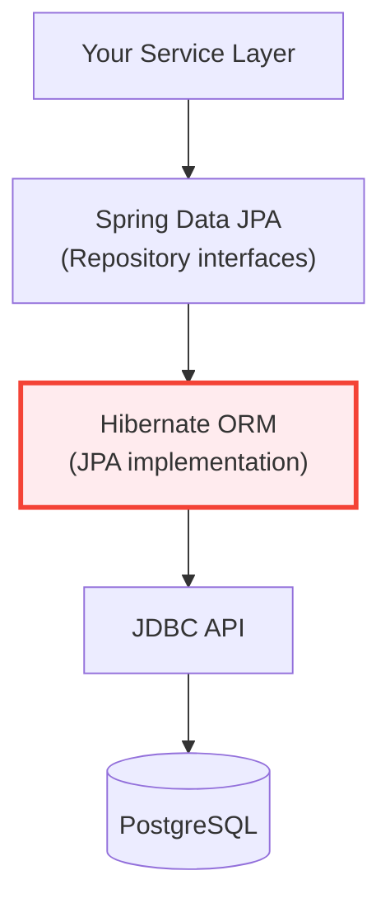

# 04 — Hibernate & JPA

## Overview
Hibernate is the most widely-used **ORM (Object-Relational Mapping)** framework for Java. JPA (Jakarta Persistence API) is the standard specification that Hibernate implements. Together, they let you work with database tables as Java objects.

> **Python Bridge:** Hibernate is Java's equivalent of **SQLAlchemy ORM**. JPA annotations map to SQLAlchemy's `declarative_base()` + `Column()`. The Session is equivalent to SQLAlchemy's `Session`.

## Where Hibernate Fits

**You are here:** Learning Layer C (Hibernate/JPA) — the ORM between Spring Data and JDBC.

## Module Structure

| Sub-Topic | Focus | Key Concepts |
|---|---|---|
| **01-hibernate-basics** | ORM concept, entity annotations, Session, CRUD | `@Entity`, `@Table`, `@Id`, SessionFactory |
| **02-relationships** | Entity relationships, cascading, fetching | `@OneToMany`, `@ManyToMany`, LazyLoading |
| **03-advanced-hibernate** | HQL/JPQL, Criteria API, caching, locking | Queries, L1/L2 cache, optimistic locks |
| **mini-project-04-blog** | Blog engine using Hibernate | Post, Comment, Tag entities |

## Python ↔ Java Quick Reference

| Python (SQLAlchemy) | Java (Hibernate/JPA) |
|---|---|
| `class User(Base):` | `@Entity class User {}` |
| `Column(String(50))` | `@Column(length = 50)` |
| `relationship("Address")` | `@OneToOne Address address` |
| `session.add(user)` | `session.persist(user)` |
| `session.query(User).all()` | `session.createQuery("FROM User")` |
| `session.commit()` | `transaction.commit()` |
| `session.delete(user)` | `session.remove(user)` |
