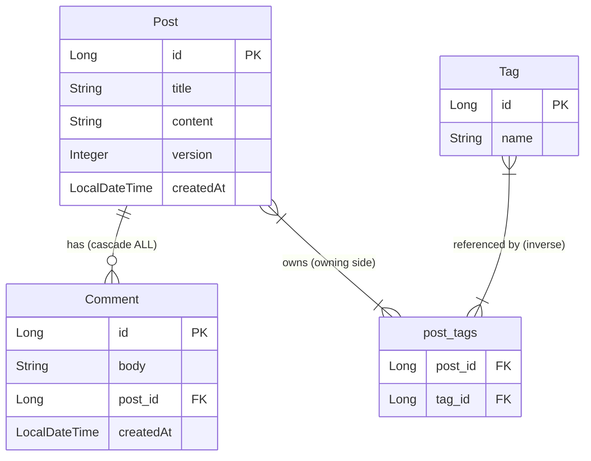

# Architecture — Mini-Project 04: Blog Engine with Hibernate ORM

---

## Overview

This project is a **three-layer application** with no web server, no Spring Boot,
and no external database. It runs entirely inside the JVM using:

- **Pure Hibernate 6.4** (no Spring Data, no EntityManager abstraction)
- **H2 in-memory database** (schema auto-created and auto-dropped)
- **Manual transaction management** (begin / commit / rollback)

The goal is to expose every Hibernate concept without framework magic hiding it.

---

## C4 Container Diagram

```
C4Container
title Blog Engine — Container View

Person(learner, "Learner", "Runs BlogApp.main() to observe Hibernate in action")

Container(app, "BlogApp", "Java 21", "Entry point — configures Hibernate, orchestrates demo sequence")
Container(service, "BlogService", "Java class", "Business logic — creates posts, adds comments, handles optimistic lock conflicts")
Container(dao, "PostDao", "Java class", "Data access — JPQL, JOIN FETCH, session management")
Container(hibernate, "Hibernate ORM 6.4", "JPA Provider", "Maps Java entities to SQL, manages session/tx lifecycle, generates DDL")
ContainerDb(h2, "H2 Database", "In-memory SQL", "Stores posts, comments, tags — wiped on JVM exit")

Rel(learner, app, "runs")
Rel(app, service, "creates and calls")
Rel(app, dao, "injects into service")
Rel(service, dao, "delegates DB operations to")
Rel(dao, hibernate, "opens Session, runs JPQL via")
Rel(hibernate, h2, "executes generated SQL against")
```

---

## ASCII Data Flow Diagram

```
BlogApp.main()
    │
    │  1. Build StandardServiceRegistry (H2 + show_sql settings)
    │  2. Register Post, Comment, Tag annotated classes
    │  3. Build SessionFactory (one-time heavyweight setup)
    │
    ▼
BlogService  (receives SessionFactory via constructor)
    │
    ├── createPost(title, content, tagNames...)
    │       │  Opens session → begins tx
    │       │  Builds Post entity → creates/finds Tag entities
    │       │  Links Tags via post.addTag(tag)   ← manages join table
    │       │  session.persist(post)             ← cascade PERSIST to Tags
    │       └─ tx.commit()  → Hibernate flushes INSERT sqls
    │
    ├── addComment(postId, body)
    │       │  Opens session → begins tx
    │       │  session.find(Post, id)            ← SELECT by PK
    │       │  post.addComment(new Comment(body)) ← convenience method
    │       └─ tx.commit()  → INSERT INTO comments (cascade from Post)
    │
    ├── getPostReport()
    │       │  Calls PostDao.findAllWithTags()
    │       │    JPQL: SELECT DISTINCT p FROM Post p LEFT JOIN FETCH p.tags
    │       │    → ONE SQL with JOIN (not N+1 per post)
    │       └─ Prints each post's title, tag list, comment count
    │
    ├── updatePostTitle(postId, newTitle)
    │       │  Opens session → begins tx
    │       │  session.find(Post, id)
    │       │  post.setTitle(newTitle)
    │       │  tx.commit()
    │       │    → UPDATE posts SET title=?, version=? WHERE id=? AND version=?
    │       │    → If version mismatch: StaleObjectStateException caught
    │       └─ On conflict: prints warning, retries with fresh load
    │
    └── deletePost(postId)
            │  Calls PostDao.delete(id)
            │  session.remove(post)
            │    → Hibernate first DELETEs child comments (cascade=ALL)
            │    → Then DELETEs post_tags join rows
            └─ Then DELETEs the post row itself
                 (orphanRemoval=true ensures no dangling comments)

PostDao  (receives SessionFactory via constructor)
    │
    ├── save(Post)         → session.persist()  in tx
    ├── findById(Long)     → session.find()
    ├── findByIdWithComments(Long)
    │       JPQL: "SELECT p FROM Post p LEFT JOIN FETCH p.comments WHERE p.id = :id"
    │       → Single SQL JOIN — prevents N+1 for comment loading
    ├── findAll()          → "FROM Post p ORDER BY p.createdAt DESC"
    ├── findAllWithTags()
    │       JPQL: "SELECT DISTINCT p FROM Post p LEFT JOIN FETCH p.tags"
    │       → Single SQL JOIN — prevents N+1 for tag loading
    ├── update(Post)       → session.merge()  in tx
    └── delete(Long)       → session.find() + session.remove()  in tx

Hibernate SessionFactory (built from MetadataSources)
    │
    └── H2 In-Memory Database  (jdbc:h2:mem:blog;DB_CLOSE_DELAY=-1)
            Tables auto-created by hbm2ddl.auto=create-drop:
            ┌─────────┐      ┌──────────────┐      ┌──────┐
            │  posts  │──────│  post_tags   │──────│ tags │
            └─────────┘      └──────────────┘      └──────┘
                 │
                 │ post_id FK
                 ▼
            ┌──────────┐
            │ comments │
            └──────────┘
```

---

## Entity Relationship Diagram



---

## Design Decisions

| Decision | Choice | Why |
|---|---|---|
| **Database** | H2 in-memory | Zero setup — learner can run `./gradlew run` immediately without Docker or PostgreSQL. Identical SQL dialect switching is trivial (change one config line). |
| **No Spring Boot** | Raw `SessionFactory` | Exposes what Spring Boot hides. Learner sees `StandardServiceRegistryBuilder`, `MetadataSources`, and manual transaction management — exactly what Spring's `LocalSessionFactoryBean` wraps. |
| **`@Version` (optimistic)** | `Integer version` field | Best fit for a blog: concurrent edits are rare, so we prefer no database locks. Optimistic locking adds zero overhead on reads, only checks version on write. |
| **`fetch = LAZY` everywhere** | Default on all collections | Avoids unintentional full-graph loading. Forces the developer to be explicit about what data they need (JOIN FETCH). Models real production behaviour. |
| **JOIN FETCH in PostDao** | `LEFT JOIN FETCH p.comments` | Eliminates N+1: instead of 1 post query + N comment queries, a single SQL JOIN fetches both. This is the most important Hibernate performance pattern. |
| **`cascade = ALL, orphanRemoval = true`** | On `Post.comments` | Comments have no meaning without their parent post. When a post is deleted, all its comments must be deleted too. `orphanRemoval` also handles `post.getComments().remove(c)`. |
| **`cascade = {PERSIST, MERGE}` only** | On `Post.tags` | Tags are shared across posts. We must NOT cascade DELETE (removing a post must not delete a tag used by other posts). |
| **`@JoinTable` on Post side** | `post_tags` join table | JPA requires one side to own the join table. We choose `Post` as the owning side because queries most often start from a post and need its tags. |

---

## Session and Transaction Lifecycle

```
                  TRANSIENT
                  (new Post())
                      │
              session.persist(post)
                      │
                      ▼
                  PERSISTENT        ← Hibernate tracks all changes (dirty checking)
            (inside open session)
                      │
              tx.commit() / session.close()
                      │
                      ▼
                  DETACHED          ← Object exists in Java heap but Hibernate has
           (after session closes)      no knowledge of it; lazy collections will throw
                      │              LazyInitializationException if accessed here
              session.merge(post)
                      │
                      ▼
                  PERSISTENT again  ← Re-attached; changes will be flushed on commit

              session.remove(post)
                      │
                      ▼
                   REMOVED          ← DELETE SQL issued on tx.commit()
```
