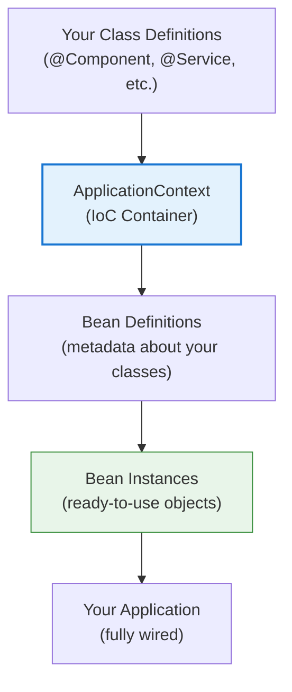

# 01 — IoC Container

## Overview

The IoC (Inversion of Control) container is the **heart of Spring**. Instead of your code creating objects with `new`, you describe what you need and the container creates, configures, and manages them.

> **Python Bridge:** Python has no IoC container. You manually import and instantiate dependencies. FastAPI's `Depends()` is the closest equivalent but only works at the request handler level. Spring's IoC manages ALL objects in the application.

## Architecture

## Files

| File | What You'll Learn |
|---|---|
| `01-what-is-ioc.md` | IoC principle, why it exists, Python comparison |
| `02-beanfactory-vs-applicationcontext.md` | Two container types and when to use which |
| `03-xml-vs-annotation-config.md` | Evolution from XML to annotations to Java config |
| `IoCContainerDemo.java` | Basic IoC container usage |
| `ApplicationContextDemo.java` | ApplicationContext features demo |

## Exercises

| Exercise | Goal |
|---|---|
| `Ex01_XmlConfig.java` | Create beans using XML configuration |
| `Ex02_AnnotationConfig.java` | Refactor to annotation-based configuration |
