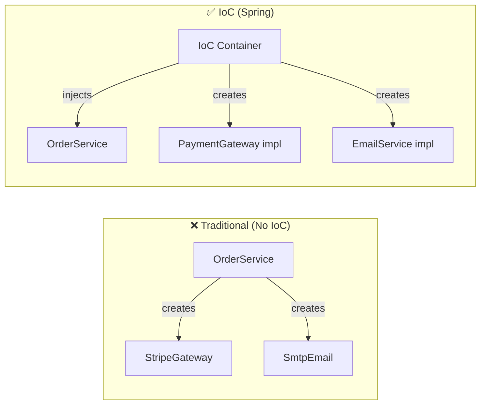

# 01 — What is IoC (Inversion of Control)

## The Problem Without IoC

Without IoC, your code creates and manages its own dependencies:

```java
// WITHOUT IoC — tight coupling, untestable
public class OrderService {
    private final PaymentGateway payment = new StripeGateway(); // hardcoded!
    private final EmailService email = new SmtpEmailService();  // hardcoded!
    private final OrderRepository repo = new JdbcOrderRepo();   // hardcoded!
}
// Cannot swap StripeGateway for MockGateway in tests
// Cannot change EmailService without recompiling OrderService
```

```python
# Python equivalent of the PROBLEM
class OrderService:
    def __init__(self):
        self.payment = StripeGateway()  # hardcoded!
        self.email = SmtpEmailService()  # hardcoded!
```

## The Solution — Inversion of Control

With IoC, a **container** creates objects and provides dependencies:

```java
// WITH IoC — loose coupling, testable
@Service
public class OrderService {
    private final PaymentGateway payment;   // interface, not concrete
    private final EmailService email;

    // Spring creates and injects the right implementations
    public OrderService(PaymentGateway payment, EmailService email) {
        this.payment = payment;
        this.email = email;
    }
}
```

```python
# Python equivalent (FastAPI)
class OrderService:
    def __init__(self, payment: PaymentGateway = Depends(get_payment)):
        self.payment = payment
```

## IoC Principle Visualized



## Why "Inversion"?

| Traditional Control | Inverted Control |
|---|---|
| Your class creates dependencies | Container creates dependencies |
| Your class chooses implementations | Container chooses implementations |
| Your class manages lifecycle | Container manages lifecycle |
| Control is IN your code | Control is OUTSIDE your code (inverted!) |

## The Hollywood Principle

> "Don't call us, we'll call you."

Your classes don't create dependencies — they **declare** what they need, and the container provides them. The container "calls" your constructor with the right objects.

## Python → Java Comparison

| Python | Java (Spring) | Notes |
|---|---|---|
| `import module; obj = Class()` | `@Component` + container auto-creates | Python: you create. Java: container creates |
| `Depends(get_db)` | Constructor parameter | FastAPI DI is request-scoped only |
| No container concept | `ApplicationContext` | Python has no lifecycle-managed object graph |
| `pytest` fixtures | `@Autowired` with `@MockBean` | Both used for test dependency replacement |

## Benefits of IoC

1. **Loose coupling** — classes depend on interfaces, not implementations
2. **Testability** — inject mocks via constructor in tests
3. **Flexibility** — swap implementations via configuration, not code
4. **Lifecycle management** — container handles creation, init, destruction
5. **Aspect-oriented support** — container can wrap beans with proxies

## Interview Questions

### Conceptual

**Q1: What is Inversion of Control and why is it called "inversion"?**
> IoC means the framework controls object creation and wiring instead of your code. It's "inverted" because traditionally YOUR code creates dependencies (`new Service()`), but with IoC, the CONTAINER creates and injects them into your code.

**Q2: How does Spring IoC compare to Python's dependency injection pattern?**
> Python has no built-in IoC container. FastAPI's `Depends()` is the closest equivalent but only works at route handler level. Spring's IoC manages ALL objects in the application at startup — controllers, services, repositories, configurations — with lifecycle management.

### Scenario/Debug

**Q3: Your team has 50 services all using `new StripeGateway()`. The business wants to switch to PayPal. How does IoC help?**
> With IoC, you'd have a `PaymentGateway` interface. All 50 services inject `PaymentGateway` via constructor. To switch, you create a `PayPalGateway` implementation of the same interface and mark it as `@Primary` (or use `@Profile`). Zero changes to any of the 50 services.

### Quick Fire

**Q4: Name three benefits of IoC.**
> Loose coupling (interface-based), testability (inject mocks), flexibility (swap implementations via config).

**Q5: What annotation puts a class into the Spring IoC container?**
> `@Component` (and its specializations: `@Service`, `@Repository`, `@Controller`).
