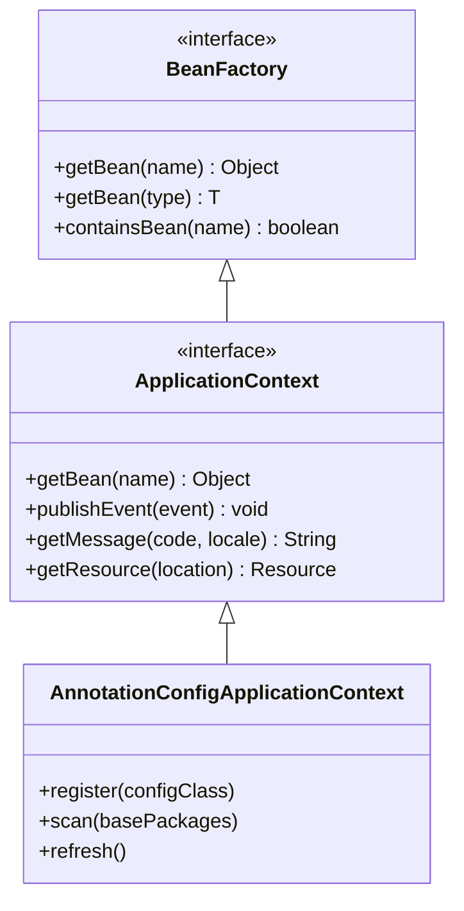
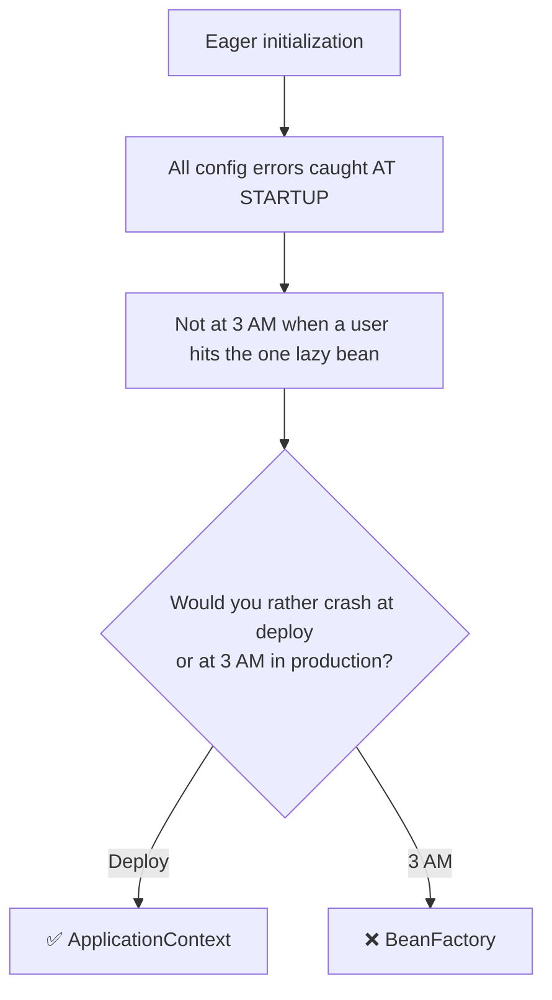

# 02 — BeanFactory vs ApplicationContext

## Two Container Types

Spring provides two IoC container interfaces. In practice, you **always use ApplicationContext**.



## Comparison Table

| Feature | BeanFactory | ApplicationContext |
|---|---|---|
| Bean creation | Lazy (on first `getBean()`) | Eager (all singletons at startup) |
| Event publishing | ❌ | ✅ `publishEvent()` |
| AOP support | Limited | Full |
| i18n (messages) | ❌ | ✅ `getMessage()` |
| Resource loading | ❌ | ✅ `getResource()` |
| Bean lifecycle | Basic | Full 12-phase lifecycle |
| Memory | Lower | Higher (preloads beans) |
| Startup speed | Faster | Slower (but catches errors early!) |
| **Use in practice** | **Never** | **Always** |

## Why ApplicationContext Wins



## Common ApplicationContext Implementations

| Class | Usage |
|---|---|
| `AnnotationConfigApplicationContext` | Standalone app with `@Configuration` |
| `AnnotationConfigWebApplicationContext` | Web app with `@Configuration` |
| `ClassPathXmlApplicationContext` | Standalone app with XML (legacy) |
| `SpringApplication.run()` | Spring Boot — auto-selects the right one |

## Python Comparison

```python
# Python has no equivalent to BeanFactory or ApplicationContext
# The closest concept is a dependency injection container

# Python manual approach:
db = Database()
repo = UserRepo(db)
service = UserService(repo)
controller = UserController(service)

# FastAPI approach (partial DI):
@app.get("/users")
def get_users(service: UserService = Depends(get_user_service)):
    return service.find_all()
# But Depends() only works at route level — not for service → repo wiring
```

## Interview Questions

### Conceptual

**Q1: What's the difference between BeanFactory and ApplicationContext?**
> BeanFactory is the basic container with lazy bean creation. ApplicationContext extends BeanFactory and adds eager initialization, event publishing, i18n, and full AOP support. In practice, always use ApplicationContext.

**Q2: Why does ApplicationContext eagerly initialize singletons?**
> To catch configuration errors at startup rather than at runtime. If a bean has a missing dependency, you'll get a `BeanCreationException` immediately at startup — not when a user triggers the lazy initialization in production.

### Scenario/Debug

**Q3: Your application starts fine but crashes with `NoSuchBeanDefinitionException` 2 hours later when a specific endpoint is hit. What's likely wrong?**
> The bean might be scoped as `@Lazy` or might be in a BeanFactory (lazy creation). Switch to ApplicationContext's eager initialization so the missing dependency is caught at startup, not at runtime.

### Quick Fire

**Q4: Which `ApplicationContext` implementation does Spring Boot use?**
> `AnnotationConfigServletWebServerApplicationContext` (for web apps) or `AnnotationConfigApplicationContext` (for non-web apps). `SpringApplication.run()` auto-selects.

**Q5: What does `ApplicationContext.publishEvent()` do?**
> Publishes an application event to all registered `@EventListener` methods — implementing the Observer pattern inside Spring.
