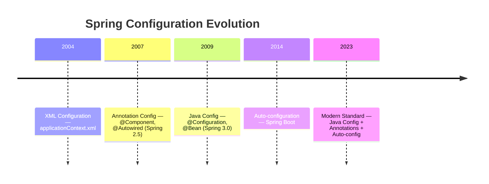
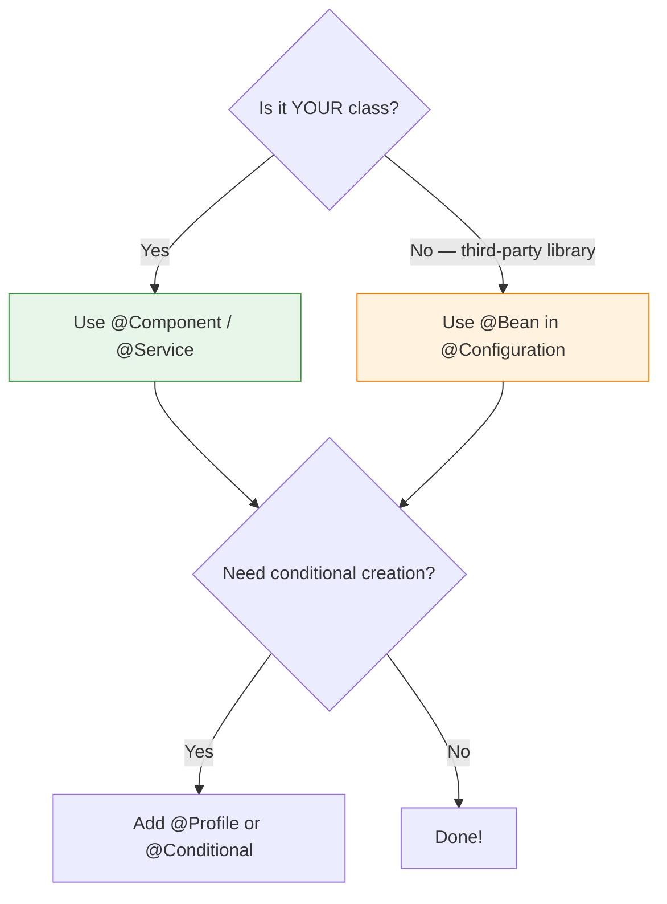

# 03 — XML vs Annotation vs Java Configuration

## Evolution of Spring Configuration



## The Three Approaches

### 1. XML Configuration (Legacy — Don't Use)

```xml
<!-- applicationContext.xml — 500+ lines was common -->
<bean id="userService" class="com.example.UserService">
    <constructor-arg ref="userRepository"/>
</bean>
<bean id="userRepository" class="com.example.JdbcUserRepository">
    <constructor-arg ref="dataSource"/>
</bean>
```

### 2. Annotation Configuration (Modern)

```java
@Service
public class UserService {
    private final UserRepository repo;

    public UserService(UserRepository repo) { // auto-injected
        this.repo = repo;
    }
}
```

### 3. Java Configuration (Recommended for control)

```java
@Configuration
public class AppConfig {
    @Bean
    public DataSource dataSource() {
        return new HikariDataSource(hikariConfig());
    }
}
```

## Comparison

| Aspect | XML | Annotations | Java Config |
|---|---|---|---|
| Type safety | ❌ String-based | ✅ Compile-time | ✅ Compile-time |
| IDE refactoring | ❌ Breaks silently | ✅ Full support | ✅ Full support |
| Verbosity | Very verbose | Minimal | Moderate |
| Third-party beans | ✅ Can configure anything | ❌ Can't annotate external classes | ✅ @Bean for any class |
| Separation | Config separate from code | Config embedded in code | Config in dedicated classes |
| Runtime errors | Late (at getBean) | Early (at scan) | Early (at scan) |

## When to Use Each



## Python Comparison

```python
# Python has no XML config phase — it always was "just Python"
# Python equivalent of @Component:
class UserService:
    def __init__(self, repo: UserRepository):
        self.repo = repo

# Python equivalent of @Configuration + @Bean:
def create_data_source():  # factory function
    return psycopg2.connect(dsn)
```

## Interview Questions

### Conceptual

**Q1: Why did Spring move from XML to annotation-based configuration?**
> XML configs had no compile-time safety (typos in class names only found at runtime), no IDE refactoring support, and became unmanageably large (500+ line XML files). Annotations are type-safe, refactor-friendly, and keep config close to the code.

**Q2: When would you use @Bean instead of @Component?**
> When configuring third-party library classes that you can't annotate with @Component. Examples: `DataSource`, `ObjectMapper`, `RestTemplate`, `KafkaTemplate`.

### Scenario/Debug

**Q3: You need the same application to use H2 in development and PostgreSQL in production. Which approach works best?**
> Use `@Configuration` with `@Profile`: one `@Bean DataSource` method with `@Profile("dev")` returning H2, another with `@Profile("prod")` returning PostgreSQL.

### Quick Fire

**Q4: Can a class have both @Component and @Bean?**
> No. @Component goes on the class itself. @Bean goes on a method inside a @Configuration class. They're two different ways to register beans.

**Q5: What's the modern recommended combination?**
> Annotations (@Component/@Service) for your classes + Java Config (@Configuration/@Bean) for third-party integrations + Spring Boot auto-configuration for infrastructure.
