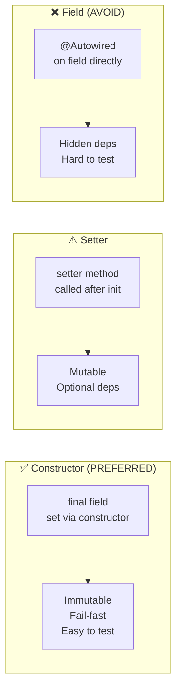

# 02 — Dependency Injection

## Overview

Dependency Injection (DI) is the **mechanism** by which the IoC container provides dependencies to your objects. Instead of a class creating its own dependencies, they are "injected" from outside.

> **Python Bridge:** FastAPI uses `Depends()` for DI — but only at the route handler level. Spring injects at ALL levels: controllers, services, repositories, configurations, event listeners, aspects...

## The Three Injection Types

## Files

| File | What You'll Learn |
|---|---|
| `01-constructor-injection.md` | Why constructor injection is the gold standard |
| `02-setter-injection.md` | When setter injection is appropriate |
| `03-field-injection.md` | Why field injection is an anti-pattern |
| `04-qualifier.md` | Choosing between multiple implementations |
| `05-primary.md` | Setting a default implementation |
| `ConstructorInjectionDemo.java` | Constructor-based DI in action |
| `SetterInjectionDemo.java` | Setter-based DI patterns |
| `QualifierDemo.java` | @Qualifier and @Primary usage |

## Exercises

| Exercise | Goal |
|---|---|
| `Ex01_DIRefactor.java` | Refactor field injection to constructor injection |
| `Ex02_MultipleImplementations.java` | Wire multiple implementations with @Qualifier |
