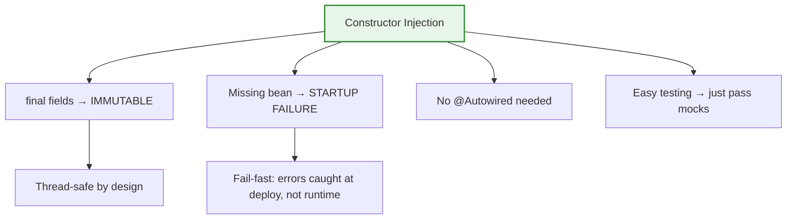

# 01 — Constructor Injection (The Gold Standard)

## WHY Constructor Injection Was Invented

Before constructor injection, Spring used **setter injection**. The problem: you could create an object in an **invalid state** — with missing dependencies. Constructor injection makes it **impossible** to create a partially-wired object.

## The Pattern

```java
@Service
public class OrderService {
    private final PaymentGateway payment;  // final = immutable
    private final OrderRepository repo;

    // Single constructor — Spring auto-injects (no @Autowired needed since 4.3)
    public OrderService(PaymentGateway payment, OrderRepository repo) {
        this.payment = payment;
        this.repo = repo;
    }
}
```

```python
# Python equivalent
class OrderService:
    def __init__(self, payment: PaymentGateway, repo: OrderRepository):
        self.payment = payment
        self.repo = repo
```

## Why It's Best



## Comparison: Three Injection Types

| Feature | Constructor | Setter | Field |
|---|---|---|---|
| Immutability | ✅ `final` fields | ❌ Mutable | ❌ Mutable |
| Missing dependency | ✅ Compile error | ❌ NPE at runtime | ❌ NPE at runtime |
| Testing | ✅ Pass via `new` | ⚠️ Needs setter | ❌ Needs reflection |
| Circular deps | ✅ Fails fast (good!) | ⚠️ Silently works | ⚠️ Silently works |
| @Autowired needed | ❌ Not for single ctor | ✅ Required | ✅ Required |
| Spring team recommends | ✅ **Yes** | ⚠️ For optional only | ❌ **Never** |

## Testing With Constructor Injection

```java
// Test — no Spring needed, no reflection, no magic
@Test
void testOrder() {
    var mockPayment = mock(PaymentGateway.class);
    var mockRepo = mock(OrderRepository.class);
    var service = new OrderService(mockPayment, mockRepo); // just new!
    // ... test
}
```

## Interview Questions

### Conceptual

**Q1: Why does the Spring team recommend constructor injection?**
> Three reasons: (1) Immutability — fields can be `final`. (2) Fail-fast — missing dependencies cause startup failure, not runtime NPE. (3) Testability — create objects with `new` and pass mocks directly.

**Q2: When is @Autowired NOT needed on a constructor?**
> Since Spring 4.3, if a class has a **single constructor**, Spring auto-detects it as the injection point. @Autowired is only needed when there are multiple constructors.

### Scenario/Debug

**Q3: You have two constructors. Spring throws `BeanCreationException: No qualifying constructor`. How do you fix it?**
> Add `@Autowired` to the constructor Spring should use. With multiple constructors, Spring can't auto-detect which one to use.

**Q4: Why does constructor injection expose circular dependencies while setter injection hides them?**
> Constructor injection requires ALL dependencies at creation time. If A needs B and B needs A, neither can be created → fails immediately. Setter injection creates A first (half-initialized), then sets B. This hides the design problem.

### Quick Fire

**Q5: What's the Python equivalent of `final` field + constructor injection?**
> Python doesn't have `final`, but `@dataclass(frozen=True)` with `__init__` parameters is the closest equivalent.
