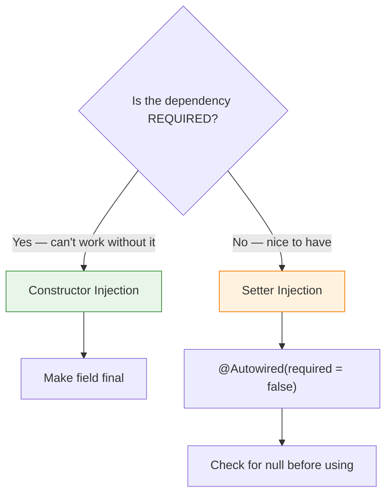

# 02 — Setter Injection

## When Setter Injection Is Appropriate

Setter injection is for **optional dependencies** — things your class can function without. Constructor injection is for required dependencies.

## The Pattern

```java
@Service
public class ReportService {
    private final DataSource dataSource;  // required
    private CacheManager cache;           // optional — not final!

    // Required dependency via constructor
    public ReportService(DataSource dataSource) {
        this.dataSource = dataSource;
    }

    // Optional dependency via setter
    @Autowired(required = false)
    public void setCacheManager(CacheManager cache) {
        this.cache = cache;
    }

    public Report generate() {
        if (cache != null) {
            // use cache
        }
        // generate from dataSource
    }
}
```

```python
# Python equivalent
class ReportService:
    def __init__(self, data_source: DataSource, cache: CacheManager = None):
        self.data_source = data_source
        self.cache = cache  # optional with default None
```

## Constructor vs Setter Decision



## Risks of Setter Injection

1. **Mutable state** — dependency can be changed after construction
2. **Late failure** — missing optional dependency only discovered when used
3. **Hidden circular dependencies** — A and B can reference each other (design smell)

## Interview Questions

### Conceptual

**Q1: When is setter injection preferred over constructor injection?**
> Only for truly optional dependencies where the class can function without them. Example: an optional `CacheManager` that speeds up processing but isn't required.

### Scenario/Debug

**Q2: Your class has 15 constructor parameters. Should you switch to setter injection?**
> No — the real problem is that the class has too many responsibilities. Refactor into smaller classes with fewer dependencies (Single Responsibility Principle). Don't use setter injection to hide a design problem.

### Quick Fire

**Q3: What does `@Autowired(required = false)` do on a setter?**
> Spring will inject the dependency if available, but won't throw an error if no matching bean exists. The field stays `null`.
