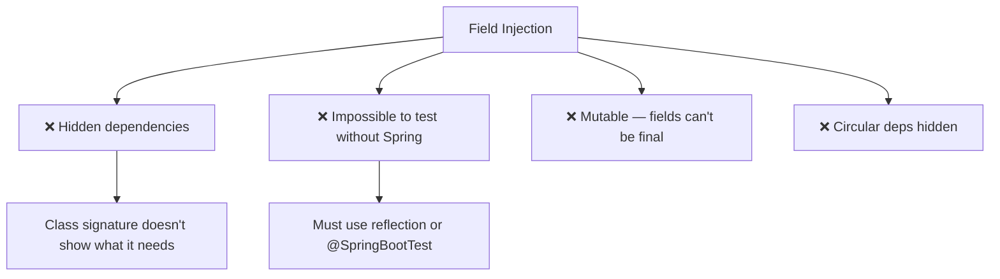

# 03 — Field Injection (The Anti-Pattern)

## Why Field Injection Exists — And Why You Should Avoid It

Field injection is the most **concise** but most **dangerous** injection type. It injects directly into fields without constructors or setters.

```java
// ❌ FIELD INJECTION — Don't do this in production
@Service
public class OrderService {
    @Autowired private PaymentGateway payment;  // no constructor!
    @Autowired private OrderRepository repo;     // no setter!
}
```

## Why It's Bad



| Problem | Explanation |
|---|---|
| **Hidden deps** | Looking at the class, you can't see what it needs without reading every field |
| **Untestable** | Can't use `new OrderService(mock, mock)` — must use Spring or reflection |
| **Not final** | Can't declare fields `final` → not truly immutable |
| **Framework lock-in** | Code is tightly coupled to Spring's `@Autowired` |

## The Fix — Refactor to Constructor

```java
// ❌ Before: field injection
@Service
public class OrderService {
    @Autowired private PaymentGateway payment;
    @Autowired private OrderRepository repo;
}

// ✅ After: constructor injection
@Service
public class OrderService {
    private final PaymentGateway payment;
    private final OrderRepository repo;

    public OrderService(PaymentGateway payment, OrderRepository repo) {
        this.payment = payment;
        this.repo = repo;
    }
}
```

## Python Comparison

```python
# Python doesn't have field injection
# Python ALWAYS uses constructor (__init__) injection — which is correct!

class OrderService:
    def __init__(self, payment: PaymentGateway, repo: OrderRepository):
        self.payment = payment
        self.repo = repo
# Python got this right by default — no @Autowired on fields needed!
```

## Interview Questions

### Conceptual

**Q1: Why does IntelliJ warn about field injection?**
> Because it creates untestable, mutable code with hidden dependencies. IntelliJ recommends constructor injection for all required dependencies.

### Scenario/Debug

**Q2: You need to unit test a class with 3 `@Autowired` fields. How?**
> Option 1 (bad): Use `@SpringBootTest` — slow, loads entire context. Option 2 (bad): Use `ReflectionTestUtils.setField()` — fragile. Option 3 (best): Refactor to constructor injection, then just `new Service(mock1, mock2, mock3)`.

### Quick Fire

**Q3: Can field-injected fields be `final`?**
> No. `final` fields must be set in the constructor. Field injection happens after construction, so the field can't be `final`.
