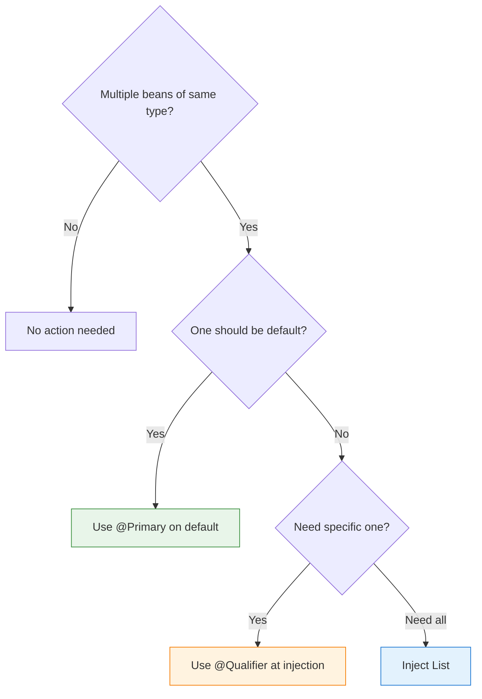

# 04 — @Qualifier — Choosing Between Multiple Implementations

## The Problem

When you have **multiple beans of the same type**, Spring doesn't know which one to inject:

```java
@Service public class EmailNotifier implements Notifier { }
@Service public class SmsNotifier implements Notifier { }

// Spring: "I have 2 Notifier beans! Which one do you want?" → Exception!
@Service
public class AlertService {
    public AlertService(Notifier notifier) { } // ❌ ambiguous
}
```

## @Qualifier Solves It

```java
@Service("emailNotifier")  // explicit bean name
public class EmailNotifier implements Notifier { }

@Service("smsNotifier")
public class SmsNotifier implements Notifier { }

@Service
public class AlertService {
    public AlertService(@Qualifier("smsNotifier") Notifier notifier) { } // ✅ specific
}
```

## Decision Flow



## Python Comparison

```python
# Python — no @Qualifier equivalent (no container)
# You'd use factory function or explicit parameter

def get_notifier(channel: str) -> Notifier:
    if channel == "sms": return SmsNotifier()
    return EmailNotifier()  # default

# FastAPI
@app.get("/alert")
def alert(notifier: Notifier = Depends(lambda: get_notifier("sms"))):
    notifier.send(...)
```

## Advanced: Inject ALL Implementations

```java
@Service
public class BroadcastService {
    private final List<Notifier> allNotifiers;  // ALL implementations!

    public BroadcastService(List<Notifier> allNotifiers) {
        this.allNotifiers = allNotifiers; // [EmailNotifier, SmsNotifier, PushNotifier]
    }

    public void notifyAll(String message) {
        allNotifiers.forEach(n -> n.send(message));
    }
}
```

## Interview Questions

### Conceptual

**Q1: What happens if Spring finds two beans of the same type and neither @Primary nor @Qualifier is used?**
> Spring throws `NoUniqueBeanDefinitionException`. It can't decide which bean to inject.

### Scenario/Debug

**Q2: You have `@Primary` on EmailNotifier but one service needs SmsNotifier. How?**
> Use `@Qualifier("smsNotifier")` at that specific injection point. @Qualifier overrides @Primary.

### Quick Fire

**Q3: How do you inject ALL beans of a type?**
> Inject `List<Notifier>` — Spring collects all Notifier beans into the list automatically.
