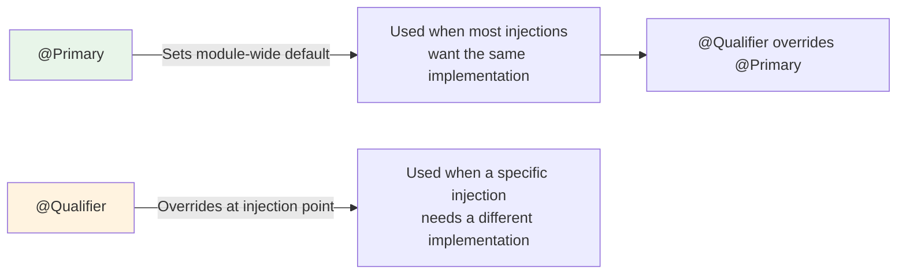

# 05 — @Primary — Setting a Default Implementation

## What @Primary Does

`@Primary` marks one bean as the **default** when multiple beans of the same type exist. Any injection point that doesn't use `@Qualifier` gets the primary bean.

```java
@Service
@Primary  // ← this is the default Notifier
public class EmailNotifier implements Notifier {
    public void send(String msg) { /* email */ }
}

@Service
public class SmsNotifier implements Notifier {
    public void send(String msg) { /* sms */ }
}

// No @Qualifier needed — gets EmailNotifier (the @Primary one)
@Service
public class OrderService {
    public OrderService(Notifier notifier) { } // → EmailNotifier
}
```

## @Primary vs @Qualifier



| Feature | @Primary | @Qualifier |
|---|---|---|
| Where placed | On the bean class/method | At the injection point |
| Scope | Global default | Per-injection override |
| Precedence | Lower | Higher (wins over @Primary) |
| Use case | "Most places want this bean" | "This specific place needs a different bean" |

## Python Comparison

```python
# Python equivalent — default parameter value
def get_notifier(channel: str = "email") -> Notifier:
    notifiers = {"email": EmailNotifier(), "sms": SmsNotifier()}
    return notifiers[channel]

# @Primary = the default parameter value ("email")
# @Qualifier = explicitly passing channel="sms"
```

## Interview Questions

### Conceptual

**Q1: What happens when both @Primary and @Qualifier are present?**
> @Qualifier wins. It's more specific — it says "I want THIS exact bean". @Primary is the fallback when no @Qualifier is specified.

### Scenario/Debug

**Q2: You have 3 NotificationService implementations. Most use cases need Email, one needs SMS, and one test needs a Mock. How?**
> Use `@Primary` on EmailNotificationService (default for most). Use `@Qualifier("sms")` on the one service that needs SMS. In tests, use `@MockBean` to replace the primary.

### Quick Fire

**Q3: Can you have multiple @Primary beans of the same type?**
> No — Spring throws an error. Only ONE bean of a type can be @Primary.
