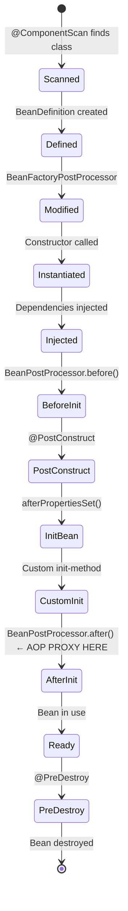

# 03 — Bean Lifecycle

## Overview

Every Spring bean goes through a **12-phase lifecycle** from definition to destruction. Understanding this lifecycle is essential for debugging Spring applications and knowing when/how to hook into it.

> **Python Bridge:** FastAPI has `@app.on_event("startup")` and `@app.on_event("shutdown")`. Spring has 12 phases of lifecycle hooks — @PostConstruct, @PreDestroy, BeanPostProcessor, and more.

## Bean Lifecycle (12 Phases)

## Files

| File | What You'll Learn |
|---|---|
| `01-bean-creation-flow.md` | Complete 12-phase lifecycle with code hooks |
| `02-init-destroy.md` | InitializingBean, DisposableBean, custom methods |
| `03-postconstruct-predestroy.md` | Modern annotation-based lifecycle callbacks |
| `04-bean-scopes.md` | Singleton vs Prototype vs Request vs Session |
| `05-beanpostprocessor.md` | How Spring creates AOP proxies and custom processing |
| `BeanLifecycleDemo.java` | Full lifecycle demo with log output |
| `BeanScopeDemo.java` | Singleton vs Prototype behavior |
| `BeanPostProcessorDemo.java` | Custom BeanPostProcessor implementation |

## Exercises

| Exercise | Goal |
|---|---|
| `Ex01_LifecycleHooks.java` | Implement all lifecycle callbacks and verify order |
