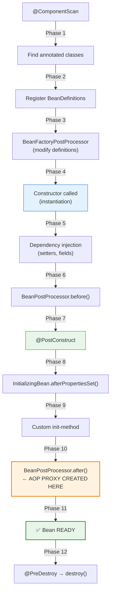

# 01 — Bean Creation Flow (12 Phases)

## The Complete Bean Lifecycle

Every Spring bean goes through **12 phases** from discovery to destruction. Understanding each phase is critical for debugging Spring applications.



## Phase Breakdown

| Phase | What Happens | Hook Available |
|---|---|---|
| 1 | @ComponentScan finds classes | — |
| 2 | BeanDefinition registered | — |
| 3 | BeanFactoryPostProcessor modifies definitions | Implement `BeanFactoryPostProcessor` |
| 4 | Constructor called | Constructor |
| 5 | Dependencies injected (setter/field) | Setter methods |
| 6 | BeanPostProcessor.before | Implement `BeanPostProcessor` |
| 7 | @PostConstruct | `@PostConstruct` annotation |
| 8 | afterPropertiesSet() | Implement `InitializingBean` |
| 9 | Custom init | `@Bean(initMethod="init")` |
| 10 | BeanPostProcessor.after | Implement `BeanPostProcessor` |
| 11 | Bean ready for use | — |
| 12 | Shutdown: @PreDestroy → destroy() | `@PreDestroy`, `DisposableBean` |

## Python Comparison

```python
# Python has no lifecycle phases — just __init__ and __del__
# The closest equivalents:
class Service:
    def __init__(self):     # Phase 4 (constructor) + Phase 5 (injection)
        self.db = Database()

    def __post_init__(self):  # Phase 7 (@PostConstruct) — dataclass only
        self.validate()

    def __del__(self):       # Phase 12 (@PreDestroy) — unreliable in Python!
        self.cleanup()

# FastAPI lifecycle:
@app.on_event("startup")   # ~ @PostConstruct (but app-level, not bean-level)
@app.on_event("shutdown")  # ~ @PreDestroy
```

## The Critical Phase 10 — AOP Proxy Creation

Phase 10 (`BeanPostProcessor.postProcessAfterInitialization`) is where Spring wraps your bean in a **proxy** for:
- `@Transactional` — transaction management
- `@Async` — async method execution
- `@Cacheable` — method result caching
- Custom AOP aspects

This is why **self-invocation breaks AOP** — `this.method()` calls the real object, not the proxy.

## Interview Questions

### Conceptual

**Q1: At which phase is the AOP proxy created?**
> Phase 10 — `BeanPostProcessor.postProcessAfterInitialization()`. This is why calling `this.transactionalMethod()` bypasses the proxy and breaks `@Transactional`.

**Q2: What's the difference between @PostConstruct and InitializingBean?**
> @PostConstruct is a standard Java annotation (JSR-250) — framework-agnostic. InitializingBean is a Spring-specific interface — couples your code to Spring. Prefer @PostConstruct.

### Scenario/Debug

**Q3: Your @PostConstruct method throws an exception. What happens?**
> The bean fails to initialize, which prevents ApplicationContext from starting. The entire application startup fails with a `BeanCreationException`.

### Quick Fire

**Q4: In what order do init callbacks execute?**
> @PostConstruct → InitializingBean.afterPropertiesSet() → custom init-method.

**Q5: In what order do destroy callbacks execute?**
> @PreDestroy → DisposableBean.destroy() → custom destroy-method.
