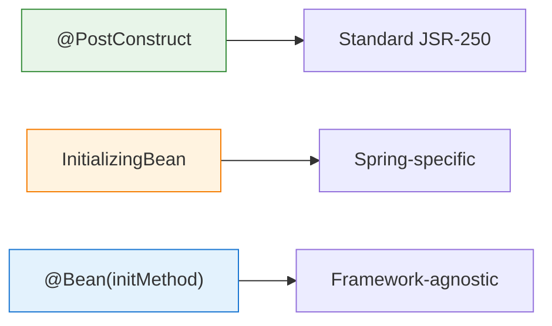

# 02 — Init and Destroy Methods

## Three Ways to Hook Into Lifecycle

```java
// Method 1: @PostConstruct / @PreDestroy (RECOMMENDED)
@PostConstruct public void init() { }
@PreDestroy public void cleanup() { }

// Method 2: InitializingBean / DisposableBean (Spring-specific)
implements InitializingBean → afterPropertiesSet()
implements DisposableBean → destroy()

// Method 3: @Bean attributes (framework-agnostic)
@Bean(initMethod = "init", destroyMethod = "cleanup")
```



## Use Cases for Init/Destroy

| Callback | Use Case | Example |
|---|---|---|
| Init | Validate configuration | Check DB connection on startup |
| Init | Preload data | Cache warmup |
| Init | Start background tasks | Schedule periodic jobs |
| Destroy | Close connections | Release DB pool |
| Destroy | Flush buffers | Write pending logs |
| Destroy | Deregister listeners | Clean up JMX beans |

## Python Comparison

```python
# Python context manager (closest equivalent)
class DatabasePool:
    def __enter__(self):     # ~ @PostConstruct
        self.pool = create_pool()
        return self

    def __exit__(self, *args):  # ~ @PreDestroy
        self.pool.close()

# FastAPI lifespan (app-level, not bean-level)
@asynccontextmanager
async def lifespan(app):
    db.connect()     # startup
    yield
    db.disconnect()  # shutdown
```

## Interview Questions

### Conceptual

**Q1: In what order do multiple init callbacks execute?**
> @PostConstruct → InitializingBean.afterPropertiesSet() → custom init-method (defined in @Bean).

### Scenario/Debug

**Q2: Your bean's @PreDestroy method never gets called. Why?**
> Two likely causes: (1) The application was killed with `kill -9` (no graceful shutdown). (2) The bean is `@Scope("prototype")` — Spring doesn't manage prototype beans after creation, so @PreDestroy is never called.

### Quick Fire

**Q3: Which approach is best for lifecycle callbacks?**
> @PostConstruct and @PreDestroy — they're standard Java (JSR-250), not Spring-specific, and the most concise.
