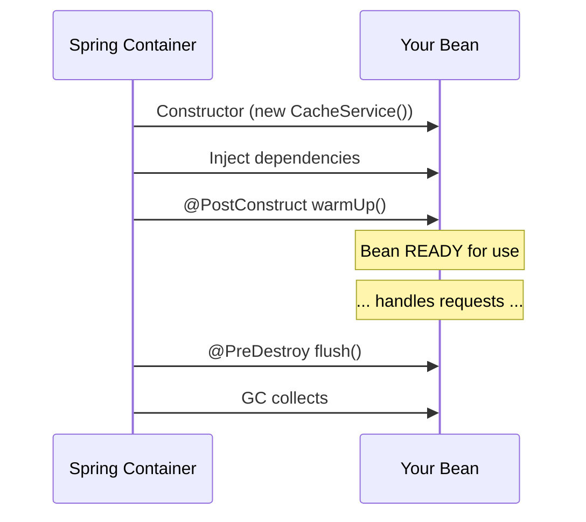

# 03 — @PostConstruct and @PreDestroy

## The Modern Lifecycle Callbacks

`@PostConstruct` and `@PreDestroy` are **standard Java annotations** (JSR-250), not Spring-specific. They're the recommended way to hook into the bean lifecycle.

```java
@Service
public class CacheService {
    private final Map<String, Object> cache = new ConcurrentHashMap<>();

    @PostConstruct
    public void warmUp() {  // called AFTER constructor + injection
        log.info("Warming up cache...");
        cache.put("config", loadConfig());
    }

    @PreDestroy
    public void flush() {  // called BEFORE bean destruction
        log.info("Flushing cache ({} entries)...", cache.size());
        persistToDisk(cache);
    }
}
```

## When Each Runs



## Python Comparison

```python
# Python @PostConstruct equivalent — __post_init__ (dataclass only)
@dataclass
class CacheService:
    config: Config

    def __post_init__(self):  # ~ @PostConstruct
        self.cache = self._warm_up()

# Python @PreDestroy equivalent — atexit
import atexit
atexit.register(cache_service.flush)  # ~ @PreDestroy
```

## Common @PostConstruct Use Cases

1. **Validate configuration** — fail fast if settings are wrong
2. **Cache warmup** — preload frequently accessed data
3. **Database migration check** — verify schema version
4. **Register with external systems** — service discovery, JMX

## Interview Questions

### Conceptual

**Q1: When does @PostConstruct execute relative to constructor injection?**
> AFTER the constructor and ALL dependencies are injected. The bean is fully constructed when @PostConstruct runs.

### Scenario/Debug

**Q2: You put @PostConstruct on a method with parameters. What happens?**
> It fails. @PostConstruct methods must have no parameters, return void, and not throw checked exceptions (though Spring handles them gracefully).

### Quick Fire

**Q3: Does @PreDestroy run for prototype-scoped beans?**
> No. Spring doesn't manage prototype beans after creation — you must clean up manually.
