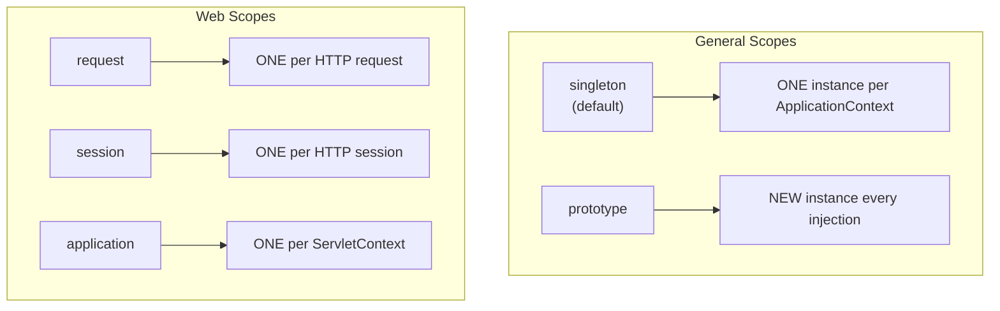

# 04 — Bean Scopes

## What Are Bean Scopes?

Scope determines **how many instances** of a bean exist and **when** they're created.

## The Five Scopes



| Scope | Instances | Created When | Destroyed When | Python Equivalent |
|---|---|---|---|---|
| `singleton` | 1 per context | At startup (eager) | Context shutdown | Module-level object |
| `prototype` | New each time | On every `getBean()` | Never (you manage) | `factory()` function |
| `request` | 1 per HTTP request | Request starts | Request ends | FastAPI `Depends(get_db)` |
| `session` | 1 per user session | Session created | Session expires | Flask `session` |

## Singleton vs Prototype

```java
// SINGLETON (default) — same instance everywhere
@Service  // same PaymentService for ALL requests
public class PaymentService { }

// PROTOTYPE — new instance each time
@Scope("prototype")
@Component
public class ShoppingCart { }  // each user gets their own cart
```

## The Singleton Scope Trap

```java
@Service  // singleton — shared across ALL threads
public class Counter {
    private int count = 0;  // ❌ SHARED MUTABLE STATE — race condition!

    public int increment() {
        return ++count;  // NOT thread-safe!
    }
}
```

> **Rule:** Singleton beans must be **stateless** (no mutable instance fields) or use thread-safe types (`AtomicInteger`, `ConcurrentHashMap`).

## Python Comparison

```python
# Python module-level = Java singleton scope
db = Database()  # one instance, used by all functions

# Python function call = Java prototype scope
def get_shopping_cart():
    return ShoppingCart()  # new instance each call

# FastAPI Depends = Java request scope
@app.get("/orders")
def get_orders(db: Session = Depends(get_db)):
    pass  # db is per-request, closed after response
```

## Interview Questions

### Conceptual

**Q1: What is the default scope in Spring?**
> Singleton. One instance per ApplicationContext, shared across all injection points. Created at startup.

**Q2: Why must singleton beans be stateless?**
> Because singleton beans are shared across ALL concurrent request threads. Mutable fields create race conditions. Use prototype or request scope for stateful beans.

### Scenario/Debug

**Q3: You inject a prototype-scoped bean into a singleton. You expect a new prototype each request, but get the same one. Why?**
> The prototype is injected once at singleton creation time. After that, the singleton always references the same prototype instance. Fix: inject `ObjectProvider<PrototypeBean>` or `Provider<PrototypeBean>` and call `.getObject()` each time.

### Quick Fire

**Q4: Does Spring call @PreDestroy on prototype beans?**
> No. Spring doesn't manage prototype beans after creation. You must handle cleanup yourself.

**Q5: What scope is closest to FastAPI's `Depends(get_db)`?**
> Request scope (`@Scope("request")`) — creates one instance per HTTP request.
