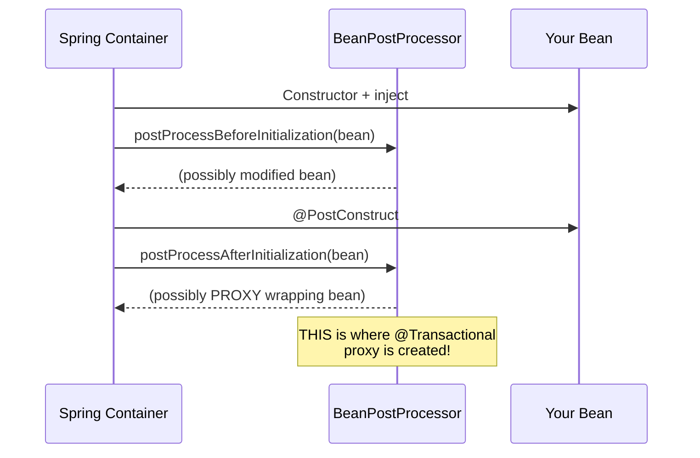

# 05 — BeanPostProcessor — Spring's Secret Weapon

## What Is a BeanPostProcessor?

A `BeanPostProcessor` is a hook that Spring calls for **every bean** during creation. It's how Spring implements `@Transactional`, `@Async`, `@Cacheable`, and custom AOP proxies.



## How It Works

```java
@Component
public class TimingBeanPostProcessor implements BeanPostProcessor {

    @Override
    public Object postProcessBeforeInitialization(Object bean, String name) {
        // Called BEFORE @PostConstruct — can modify or wrap the bean
        return bean;
    }

    @Override
    public Object postProcessAfterInitialization(Object bean, String name) {
        // Called AFTER @PostConstruct — can return a PROXY wrapping the original
        if (bean.getClass().isAnnotationPresent(Timed.class)) {
            return createTimingProxy(bean);  // wrap with timing logic
        }
        return bean;
    }
}
```

## Built-in BeanPostProcessors

| BeanPostProcessor | What It Does |
|---|---|
| `AutowiredAnnotationBPP` | Processes @Autowired, @Value |
| `CommonAnnotationBPP` | Processes @PostConstruct, @PreDestroy, @Resource |
| `AsyncAnnotationBPP` | Wraps @Async methods in thread pool proxy |
| `AnnotationAwareAspectJAutoProxyCreator` | Creates AOP proxies (@Transactional, @Cacheable) |

## Python Comparison

```python
# Python equivalent: class decorator (but applied manually, not globally)
def timed(cls):
    original_init = cls.__init__
    def new_init(self, *args, **kwargs):
        start = time.time()
        original_init(self, *args, **kwargs)
        print(f"{cls.__name__} init took {time.time()-start:.3f}s")
    cls.__init__ = new_init
    return cls

@timed  # manually applied to each class
class MyService: ...

# Spring BPP = applying this decorator to ALL beans automatically!
```

## Interview Questions

### Conceptual

**Q1: How does @Transactional work under the hood?**
> A `BeanPostProcessor` (`AnnotationAwareAspectJAutoProxyCreator`) detects beans with `@Transactional` methods in phase 10 and returns a proxy that wraps method calls with transaction logic (begin → call original → commit/rollback).

**Q2: What's the difference between `postProcessBefore` and `postProcessAfter`?**
> `Before` runs before @PostConstruct — useful for setting properties. `After` runs after @PostConstruct — used to replace the bean with a proxy (AOP, @Async).

### Scenario/Debug

**Q3: You write a BeanPostProcessor but it only processes 3 of your 50 beans. Why?**
> The BPP itself is a bean, so it must be registered BEFORE other beans. If your BPP depends on other beans, those beans are created early (before BPP registration) and miss processing.

### Quick Fire

**Q4: Can a BeanPostProcessor return a different object than what was passed in?**
> Yes — that's exactly how proxy creation works. The original bean is replaced with a proxy wrapping it.
