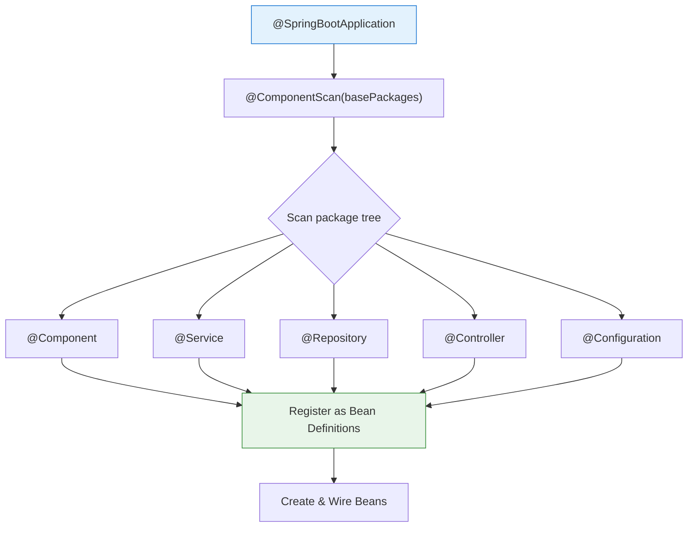

# 04 — Component Scanning

## Overview

Component scanning is how Spring **discovers** your beans automatically. Instead of manually registering every class, you annotate them with stereotypes (@Component, @Service, etc.) and Spring finds them at startup.

> **Python Bridge:** Python has no equivalent — you `import` and instantiate manually. Spring scans your package tree and auto-creates instances of every annotated class. It's like Python auto-importing every module in a package.

## How It Works

## Files

| File | What You'll Learn |
|---|---|
| `01-stereotype-annotations.md` | @Component vs @Service vs @Repository vs @Controller |
| `02-component-scan.md` | @ComponentScan configuration, include/exclude filters |
| `03-configuration-classes.md` | @Configuration + @Bean for third-party integration |
| `04-conditional-beans.md` | @Profile, @ConditionalOnProperty, @ConditionalOnClass |
| `ComponentScanDemo.java` | Base package scanning in action |
| `ConfigurationDemo.java` | @Configuration + @Bean method patterns |
| `ConditionalBeanDemo.java` | Profile-based and conditional bean creation |

## Exercises

| Exercise | Goal |
|---|---|
| `Ex01_CustomStereotype.java` | Create a custom stereotype annotation |
