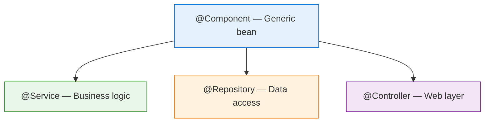

# 01 — Stereotype Annotations

## The Four Stereotypes

Spring uses **stereotypes** to classify beans by architectural layer:



| Annotation | Layer | Extra Behavior | Python Equivalent |
|---|---|---|---|
| `@Component` | Generic | None | A regular class |
| `@Service` | Business | None (semantic only) | A service class |
| `@Repository` | Data Access | SQL exception translation | A repository/DAO class |
| `@Controller` | Web | Request handling | FastAPI router |
| `@RestController` | Web | @Controller + @ResponseBody | FastAPI app |

## @Repository Special Behavior

`@Repository` automatically translates **vendor-specific SQL exceptions** into Spring's `DataAccessException` hierarchy:

```java
// Without @Repository → your code catches vendor-specific exceptions
catch (org.postgresql.util.PSQLException e) { }  // PostgreSQL only!

// With @Repository → Spring translates to generic exceptions
catch (DataAccessException e) { }  // works for ANY database
```

## Python Comparison

```python
# Python has no stereotypes — all classes are just classes
# The closest equivalent is naming convention:

class UserService:       # ~ @Service (by convention)
    pass

class UserRepository:    # ~ @Repository (by convention)
    pass

class UserController:    # ~ @Controller (by convention)
    pass

# Key difference: Python conventions have NO runtime behavior
# Spring stereotypes are detected by @ComponentScan and get special treatment
```

## Interview Questions

### Conceptual

**Q1: What's the difference between @Component, @Service, @Repository, and @Controller?**
> They all register beans in the container. @Service and @Controller are purely semantic (no extra behavior). @Repository adds automatic SQL exception translation. @Controller enables request mapping.

### Scenario/Debug

**Q2: You annotate a DAO class with @Component instead of @Repository. What breaks?**
> The bean still works for basic operations. But vendor-specific database exceptions won't be translated into Spring's `DataAccessException` hierarchy, making error handling database-dependent.

### Quick Fire

**Q3: What annotation combines @Controller + @ResponseBody?**
> `@RestController` — methods return data directly (not view names).
