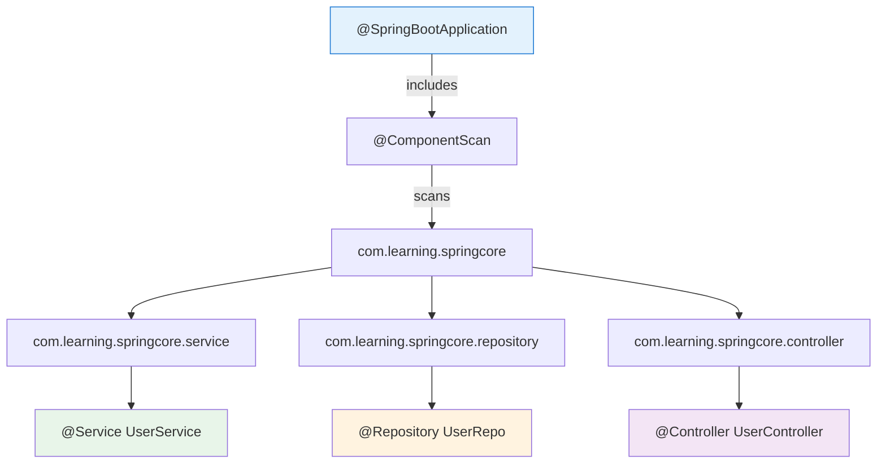

# 02 — @ComponentScan

## How Spring Finds Your Beans

`@ComponentScan` tells Spring which packages to search for `@Component`, `@Service`, `@Repository`, and `@Controller` classes.



## Default Behavior

`@SpringBootApplication` includes `@ComponentScan` — it scans the **package of the main class and all sub-packages**.

```java
// Main class in com.learning.springcore
@SpringBootApplication  // scans com.learning.springcore.**
public class SpringCoreApp { }

// ✅ Found (sub-package):
//   com.learning.springcore.service.UserService
//   com.learning.springcore.repository.UserRepo

// ❌ NOT found (different package tree):
//   com.other.library.SomeService
```

## Custom @ComponentScan

```java
@Configuration
@ComponentScan(
    basePackages = {"com.learning.service", "com.other.library"},
    excludeFilters = @ComponentScan.Filter(
        type = FilterType.ANNOTATION,
        classes = TestConfiguration.class  // skip test configs
    )
)
public class AppConfig { }
```

## Python Comparison

```python
# Python has no component scanning
# You must explicitly import and wire everything

from service.user_service import UserService
from repository.user_repo import UserRepo

service = UserService(UserRepo())  # manual wiring

# Spring equivalent: just annotate with @Service and @Repository
# Spring finds them all automatically via package scanning
```

## Interview Questions

### Conceptual

**Q1: What does @SpringBootApplication include?**
> Three annotations combined: `@Configuration` + `@EnableAutoConfiguration` + `@ComponentScan`. The component scan starts from the main class's package.

### Scenario/Debug

**Q2: Your @Service bean is not being detected. What's likely wrong?**
> (1) The class is not in a sub-package of the main class. (2) It's excluded by a filter. (3) Missing @Component/@Service annotation. (4) It's in a JAR that isn't scanned.

### Quick Fire

**Q3: Can you have multiple @ComponentScan annotations?**
> Yes — use `@ComponentScans({@ComponentScan("pkg1"), @ComponentScan("pkg2")})` or specify multiple base packages in one annotation.
