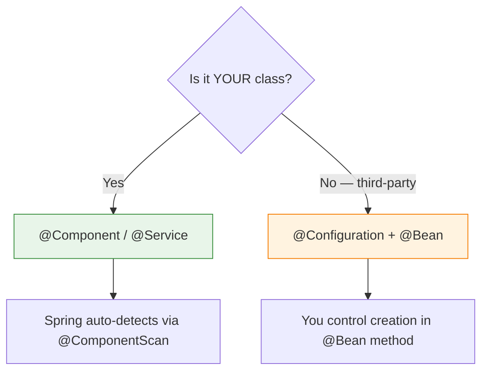

# 03 — @Configuration Classes

## What Is @Configuration?

`@Configuration` marks a class as a **source of bean definitions**. Methods annotated with `@Bean` create and return objects that Spring manages.

```java
@Configuration
public class AppConfig {

    @Bean
    public ObjectMapper objectMapper() {
        return new ObjectMapper()
                .registerModule(new JavaTimeModule())
                .disable(SerializationFeature.WRITE_DATES_AS_TIMESTAMPS);
    }

    @Bean
    public RestTemplate restTemplate() {
        return new RestTemplate();
    }
}
```

## When to Use @Configuration + @Bean



- **Your classes:** `@Component`, `@Service`, `@Repository`
- **Third-party libraries:** `@Bean` in `@Configuration` (you can't put @Component on someone else's class)

## Full vs Lite Mode

```java
// FULL MODE (default) — @Configuration creates a CGLIB proxy
@Configuration
public class AppConfig {
    @Bean
    public ServiceA serviceA() {
        return new ServiceA(serviceB());  // calls serviceB() on PROXY
    }

    @Bean
    public ServiceB serviceB() {
        return new ServiceB();  // same instance returned!
    }
}

// LITE MODE — @Component with @Bean (NO proxy)
@Component  // not @Configuration!
public class AppConfig {
    @Bean
    public ServiceA serviceA() {
        return new ServiceA(serviceB());  // calls serviceB() DIRECTLY
    }
    // serviceB() creates NEW instance each call — NOT the managed bean!
}
```

## Python Comparison

```python
# Python factory functions = Java @Bean methods
def create_database():  # ~ @Bean
    return Database(host="localhost", port=5432)

def create_cache():     # ~ @Bean
    return Redis(host="localhost", port=6379)

# Python has no equivalent to Full/Lite mode
# Each call to create_database() returns a NEW instance
```

## Interview Questions

### Conceptual

**Q1: What's the difference between @Configuration Full mode and Lite mode?**
> Full mode (@Configuration) creates a CGLIB proxy — inter-bean references return the SAME managed bean. Lite mode (@Component with @Bean) has no proxy — inter-bean method calls create NEW objects, not the managed beans. Always use @Configuration for @Bean methods.

### Scenario/Debug

**Q2: You call `serviceB()` inside `serviceA()` and expect the same singleton. But you get two different instances. What's wrong?**
> You're in Lite mode — the class is annotated with @Component instead of @Configuration. Change to @Configuration to get CGLIB proxy behavior.

### Quick Fire

**Q3: When is @Bean the ONLY option for registering a bean?**
> When configuring third-party library classes — you can't add @Component to code you don't control.
