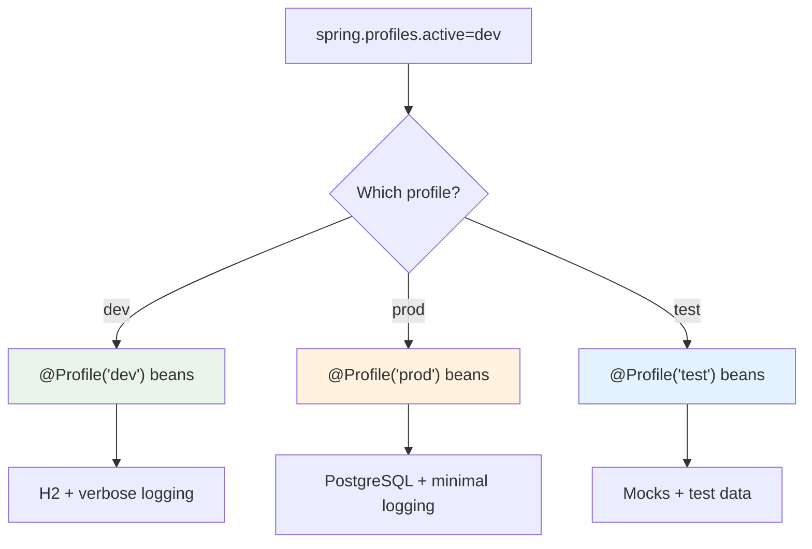

# 04 — Conditional Beans (@Profile, @Conditional)

## The Problem

You need **different beans** for different environments:
- **Dev:** H2 in-memory database, verbose logging
- **Prod:** PostgreSQL, minimal logging
- **Test:** Mock services

## @Profile — Environment-Based Bean Selection

```java
@Configuration
public class DataSourceConfig {

    @Bean
    @Profile("dev")
    public DataSource devDataSource() {
        return new EmbeddedDatabaseBuilder()
                .setType(EmbeddedDatabaseType.H2)
                .build();
    }

    @Bean
    @Profile("prod")
    public DataSource prodDataSource() {
        HikariConfig config = new HikariConfig();
        config.setJdbcUrl("jdbc:postgresql://prod-server:5432/app");
        return new HikariDataSource(config);
    }
}
```

## Activating Profiles

```bash
# application.yml
spring.profiles.active: dev

# Command line
./gradlew bootRun --args="--spring.profiles.active=prod"

# Environment variable
SPRING_PROFILES_ACTIVE=prod java -jar app.jar
```



## @Conditional — Fine-Grained Control

```java
@Bean
@ConditionalOnProperty(name = "cache.enabled", havingValue = "true")
public CacheManager cacheManager() {
    return new ConcurrentMapCacheManager("products");
}

@Bean
@ConditionalOnClass(name = "io.lettuce.core.RedisClient")
public CacheManager redisCacheManager() {
    return new RedisCacheManager(...);
}

@Bean
@ConditionalOnMissingBean(CacheManager.class)
public CacheManager noopCacheManager() {
    return new NoOpCacheManager();  // fallback
}
```

## Python Comparison

```python
# Python environment-based config
import os

if os.getenv("ENV") == "prod":
    db = PostgresDatabase()
else:
    db = SqliteDatabase()

# FastAPI settings
class Settings(BaseSettings):
    database_url: str = "sqlite:///dev.db"
    class Config:
        env_file = ".env"

# Spring @Profile = Python env-based branching, but at bean creation level
# Spring @Conditional = feature flags at the bean level
```

## Interview Questions

### Conceptual

**Q1: What's the difference between @Profile and @Conditional?**
> @Profile selects beans based on active environment profiles (dev/prod/test). @Conditional is more granular — it selects beans based on properties, classes on classpath, or custom conditions.

### Scenario/Debug

**Q2: How does Spring Boot auto-configuration use @Conditional?**
> Spring Boot starters use `@ConditionalOnClass` (only configure if library is on classpath), `@ConditionalOnMissingBean` (provide default only if user hasn't defined their own), and `@ConditionalOnProperty` (enable features via config).

### Quick Fire

**Q3: How do you activate a profile in tests?**
> `@ActiveProfiles("test")` on the test class.
