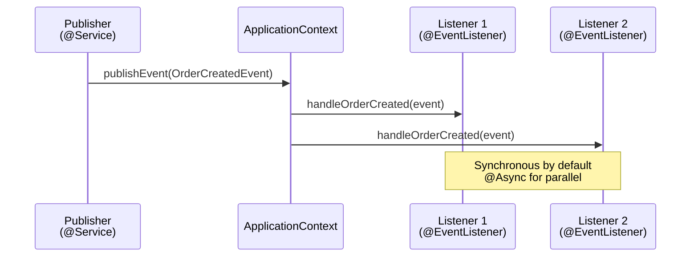

# 05 — Spring Events

## Overview

Spring Events implement the **Observer pattern** inside the Spring container. Components can publish events without knowing who listens, achieving loose coupling between modules.

> **Python Bridge:** Spring Events = Python's `blinker` signals or a simple pubsub system. `publisher.publishEvent(event)` is like `signal.send(data)`. The key difference: Spring manages listener lifecycle and supports async processing.

## Event Flow

## Files

| File | What You'll Learn |
|---|---|
| `01-application-events.md` | Built-in Spring events (startup, shutdown, refresh) |
| `02-custom-events.md` | Creating and publishing your own events |
| `03-async-events.md` | Non-blocking event handling with @Async |
| `04-event-driven-architecture.md` | Designing systems around events |
| `ApplicationEventDemo.java` | Built-in event listeners |
| `CustomEventDemo.java` | Custom event publishing and listening |
| `AsyncEventDemo.java` | Async event handling with thread pools |

## Exercises

| Exercise | Goal |
|---|---|
| `Ex01_OrderEventSystem.java` | Build an order processing event pipeline |
