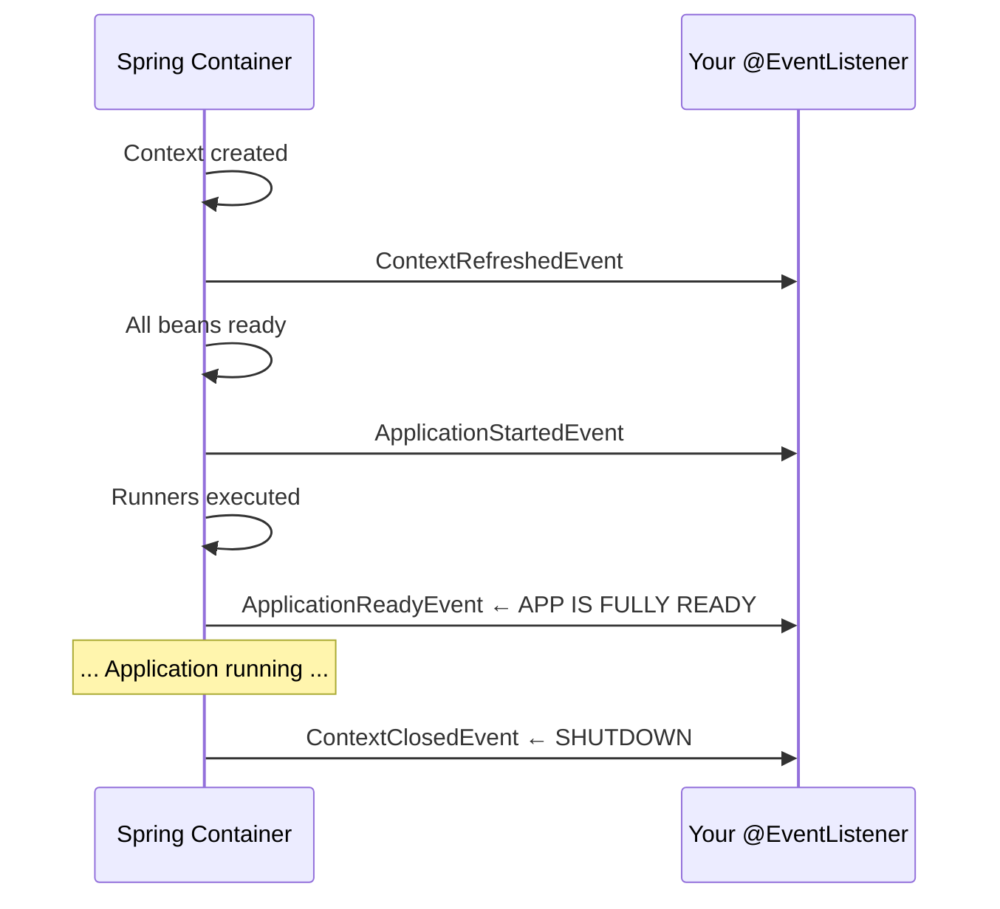

# 01 — Application Events (Built-in)

## What Are Application Events?

Spring publishes events at key **lifecycle moments**. You can listen to these events to perform actions at the right time.



## Key Built-in Events

| Event | When Fired | Common Use |
|---|---|---|
| `ContextRefreshedEvent` | After all beans created + @PostConstruct | Cache warmup, validation |
| `ApplicationStartedEvent` | After context refresh, before runners | Early initialization |
| `ApplicationReadyEvent` | After runners complete = FULLY READY | Start accepting traffic, healthcheck |
| `ContextClosedEvent` | Application shutting down | Cleanup, deregister |
| `ApplicationFailedEvent` | Startup failed | Alert, diagnostic logging |

## Listening to Events

```java
@Component
public class StartupListener {

    @EventListener
    public void onReady(ApplicationReadyEvent event) {
        log.info("Application is READY at port {}", getPort());
        // Start processing queue, enable healthcheck, etc.
    }

    @EventListener
    public void onShutdown(ContextClosedEvent event) {
        log.info("Shutting down — flushing buffers...");
    }
}
```

## Python Comparison

```python
# FastAPI lifecycle events
from contextlib import asynccontextmanager

@asynccontextmanager
async def lifespan(app: FastAPI):
    # ~ ApplicationReadyEvent
    print("App starting...")
    yield
    # ~ ContextClosedEvent
    print("App shutting down...")

app = FastAPI(lifespan=lifespan)
```

## Interview Questions

### Conceptual

**Q1: What's the difference between ApplicationStartedEvent and ApplicationReadyEvent?**
> `ApplicationStartedEvent` fires after context refresh but before CommandLineRunners execute. `ApplicationReadyEvent` fires after ALL runners complete — the app is truly ready for traffic.

### Scenario/Debug

**Q2: You need to preload a cache but only after ALL beans are initialized. Which event?**
> `ApplicationReadyEvent` — it fires after all beans are created, @PostConstruct methods run, and CommandLineRunners complete. Using @PostConstruct might run too early if other beans aren't ready yet.

### Quick Fire

**Q3: What event fires when the application fails to start?**
> `ApplicationFailedEvent` — use it to send alerts or write diagnostic logs.
