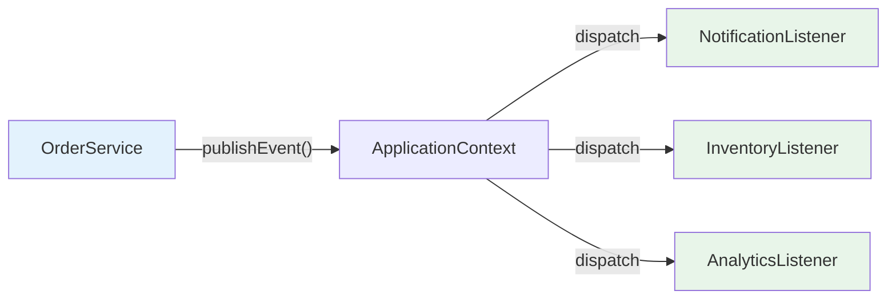

# 02 — Custom Events

## Creating Your Own Events

Since Spring 4.2, **any POJO** can be an event — no need to extend `ApplicationEvent`.

```java
// Event — simple record (Java 21)
public record OrderCreatedEvent(Long orderId, String customer, BigDecimal total) {}

// Publisher — fires the event
@Service
public class OrderService {
    private final ApplicationEventPublisher publisher;

    public OrderService(ApplicationEventPublisher publisher) {
        this.publisher = publisher;
    }

    public void createOrder(OrderRequest req) {
        Order order = saveOrder(req);
        publisher.publishEvent(new OrderCreatedEvent(order.getId(), req.customer(), req.total()));
    }
}

// Listener — reacts to the event
@Component
public class NotificationListener {
    @EventListener
    public void onOrderCreated(OrderCreatedEvent event) {
        sendEmail(event.customer(), "Your order #" + event.orderId() + " is confirmed!");
    }
}
```

## Event Flow



> **Key benefit:** OrderService doesn't know about NotificationListener, InventoryListener, or AnalyticsListener. You can add/remove listeners without changing the publisher.

## Python Comparison

```python
# Python blinker signals
from blinker import signal
order_created = signal('order-created')

# Publisher
order_created.send(order)

# Listener
@order_created.connect
def on_order_created(sender, **kwargs):
    send_email(...)
```

## Interview Questions

### Conceptual

**Q1: Why use events instead of direct method calls?**
> Loose coupling — the publisher doesn't know about listeners. You can add new reactions (email, SMS, analytics) without modifying the publisher. This is the Open/Closed Principle.

### Scenario/Debug

**Q2: Your event listener throws an exception. What happens to the publisher?**
> By default, events are synchronous — the exception propagates to the publisher and rolls back the transaction. Use `@Async` on the listener if you want fire-and-forget behavior.

### Quick Fire

**Q3: Do custom events need to extend ApplicationEvent in Spring 4.2+?**
> No. Any POJO works — including Java records. Spring detects the event type from the @EventListener method parameter.
