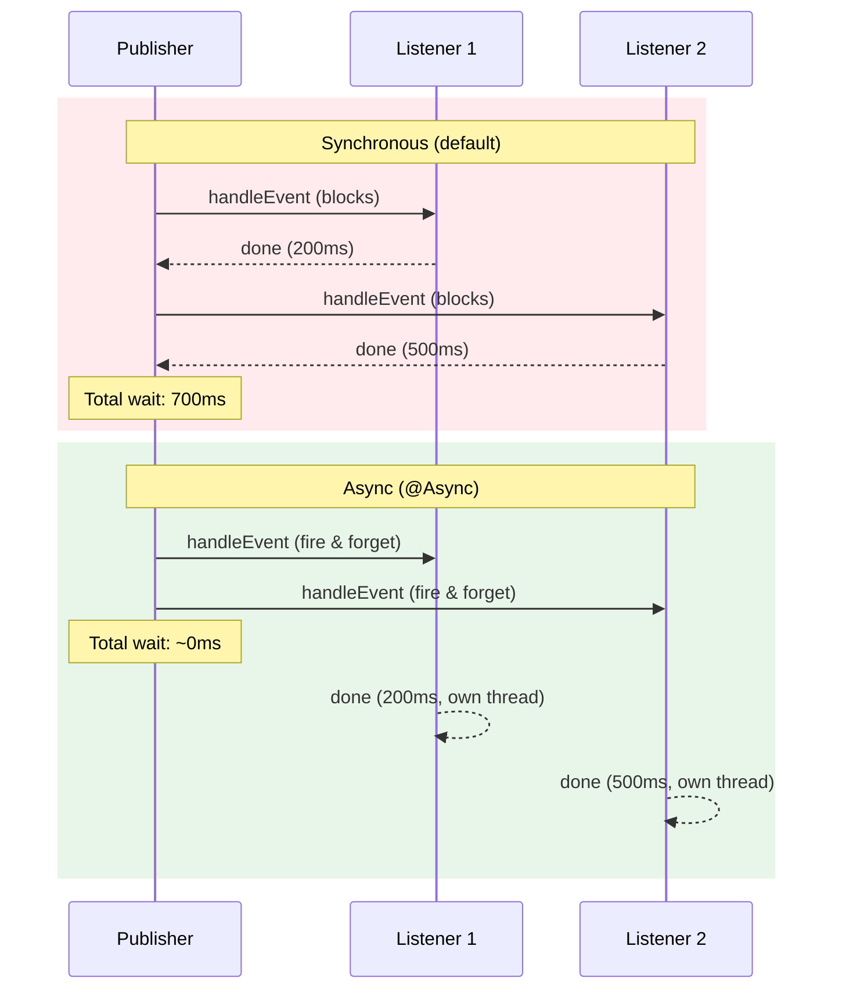

# 03 — Async Events

## The Problem With Synchronous Events

By default, Spring events are **synchronous** — the publisher waits for ALL listeners to complete:

```
Publisher → Listener1 (200ms) → Listener2 (500ms) → Publisher continues
Total: 700ms added to publisher's execution time!
```

## The Solution: @Async Events

```java
// 1. Enable async processing
@Configuration
@EnableAsync
public class AsyncConfig {
    @Bean
    public Executor taskExecutor() {
        ThreadPoolTaskExecutor executor = new ThreadPoolTaskExecutor();
        executor.setCorePoolSize(5);
        executor.setMaxPoolSize(10);
        executor.setQueueCapacity(25);
        executor.setThreadNamePrefix("async-event-");
        return executor;
    }
}

// 2. Mark listener as async
@Component
public class EmailListener {
    @Async
    @EventListener
    public void onOrderCreated(OrderCreatedEvent event) {
        // Runs in separate thread — publisher doesn't wait!
        sendEmail(event.customer(), "Order confirmed!");
    }
}
```

## Sync vs Async Comparison



## Error Handling in Async Events

```java
// Async errors don't propagate to the publisher!
// Configure an error handler:
@Configuration
public class AsyncConfig implements AsyncConfigurer {
    @Override
    public AsyncUncaughtExceptionHandler getAsyncUncaughtExceptionHandler() {
        return (throwable, method, params) -> {
            log.error("Async event error in {}: {}", method.getName(), throwable.getMessage());
            // Alert, retry, store in dead letter queue, etc.
        };
    }
}
```

## Python Comparison

```python
# Python asyncio equivalent
import asyncio

async def on_order_created(event):
    await send_email(event.customer)

# Fire and forget
asyncio.create_task(on_order_created(event))  # ~ @Async @EventListener
```

## Interview Questions

### Conceptual

**Q1: What happens if an @Async event listener throws an exception?**
> The exception is NOT propagated to the publisher (it's in a different thread). You must configure an `AsyncUncaughtExceptionHandler` to handle it — otherwise the error is silently swallowed.

### Scenario/Debug

**Q2: Your @Async listener runs in the same thread as the publisher. Why?**
> You forgot `@EnableAsync` on a @Configuration class. Without it, @Async annotations are ignored and Spring executes synchronously.

### Quick Fire

**Q3: Can you control the thread pool for @Async events?**
> Yes — define a `TaskExecutor` bean, or use `@Async("myExecutor")` to target a specific named executor.
