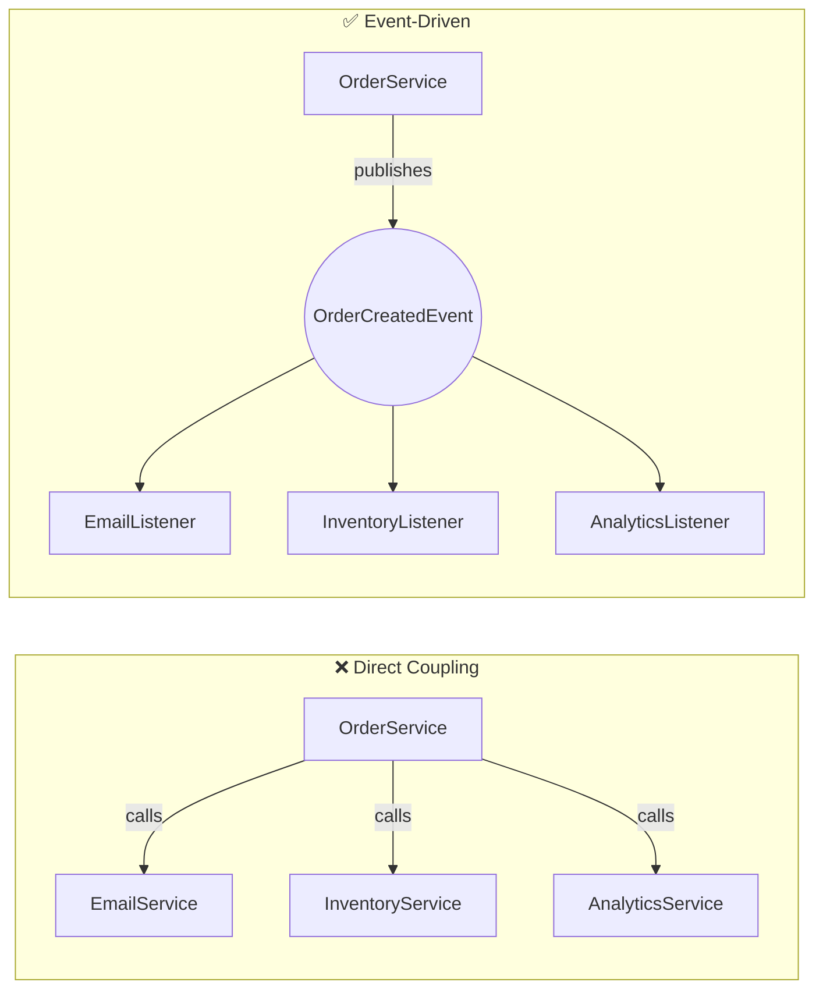

# 04 — Event-Driven Architecture

## What Is Event-Driven Architecture?

EDA is a design approach where components communicate through **events** rather than direct method calls. The publisher doesn't know (or care) who listens.



## When to Use Events

| ✅ Use Events | ❌ Don't Use Events |
|---|---|
| Side effects (email, logging, analytics) | Core business logic (calculate price) |
| Cross-cutting concerns | Simple CRUD operations |
| When new reactions may be added later | When you need the result immediately |
| When failure of listener shouldn't fail publisher | When operations must succeed together |

## @TransactionalEventListener

For events that should only execute if the **transaction commits**:

```java
@Component
public class EmailListener {
    // Only sends email if the order was actually saved (tx committed)
    @TransactionalEventListener(phase = TransactionPhase.AFTER_COMMIT)
    public void onOrderCreated(OrderCreatedEvent event) {
        sendConfirmationEmail(event.customer());
    }
}
```

| Phase | When |
|---|---|
| `AFTER_COMMIT` | After transaction commits (most common) |
| `AFTER_ROLLBACK` | After transaction rolls back |
| `AFTER_COMPLETION` | After any outcome |
| `BEFORE_COMMIT` | Just before commit |

## Python Comparison

```python
# Python event-driven patterns:

# 1. Simple pubsub
from pubsub import pub
pub.subscribe(on_order, 'order.created')
pub.sendMessage('order.created', order=order)

# 2. Django signals
from django.db.models.signals import post_save
@receiver(post_save, sender=Order)
def on_order_saved(sender, instance, **kwargs):
    send_email(instance.customer)

# Spring Events = Django signals with lifecycle management and async support
```

## Design Guidelines

1. **Events are past tense** — `OrderCreatedEvent`, `PaymentProcessedEvent` (not `CreateOrder`)
2. **Events are immutable** — use Java records, never modify after creation
3. **Events carry minimal data** — only IDs and essential info, not full entities
4. **Listeners are independent** — don't depend on execution order
5. **Use @TransactionalEventListener** for side effects that depend on transaction success

## Interview Questions

### Conceptual

**Q1: What's the difference between @EventListener and @TransactionalEventListener?**
> `@EventListener` executes immediately (during the transaction). `@TransactionalEventListener(AFTER_COMMIT)` waits until the transaction commits — ensuring you don't send a confirmation email for an order that was rolled back.

**Q2: How does event-driven architecture support the Open/Closed Principle?**
> The publisher is CLOSED for modification (doesn't change when new reactions are needed) but OPEN for extension (add new @EventListener classes without touching the publisher).

### Scenario/Debug

**Q3: You add a new listener but the old ones start failing. What's likely wrong?**
> If events are synchronous and the new listener throws an exception, it stops execution of subsequent listeners. Fix: make the new listener @Async, or add proper error handling.

### Quick Fire

**Q4: Should events carry full entities or just IDs?**
> Just IDs and minimal data. Listeners should fetch fresh data if needed — this avoids stale data issues and keeps events lightweight.
