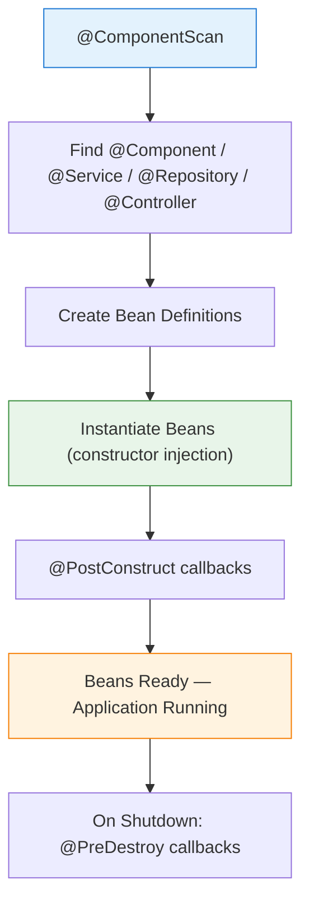

# Module 05 — Spring Core

## Overview

Spring Core is the **foundation of the entire Spring ecosystem**. It provides the IoC (Inversion of Control) container — a smart object factory that creates, wires, and manages the lifecycle of every object in your application.

> **Python Bridge:** In FastAPI, `Depends(get_db)` creates a fresh db session per request. Spring does more — it creates ALL services at startup, wires them together, and reuses the same singleton instance for every request.

## The One Mental Model

```
WITHOUT Spring:  new ServiceA(new ServiceB(new ServiceC(new RepoD())))
                 ↑ YOU manually wire everything — rigid, untestable

WITH Spring:     @Service class ServiceA { ... }
                 @Service class ServiceB { ... }
                 → Spring finds them, creates them, wires them automatically
```

## Architecture



## Sub-Topics

| # | Topic | Key Concept | Python Equivalent |
|---|---|---|---|
| 01 | [IoC Container](./01-ioc-container/) | ApplicationContext = the smart factory | No equivalent — Python has no container |
| 02 | [Dependency Injection](./02-dependency-injection/) | Constructor > Setter > Field injection | `Depends()` in FastAPI |
| 03 | [Bean Lifecycle](./03-bean-lifecycle/) | @PostConstruct → use → @PreDestroy | `@app.on_event("startup")` |
| 04 | [Component Scanning](./04-component-scanning/) | @Component/@Service/@Repository auto-detection | No equivalent — Python imports explicitly |
| 05 | [Spring Events](./05-spring-events/) | Publisher/Subscriber pattern inside Spring | Python `blinker` signals / `pubsub` |

## How to Run

```bash
# Run the Spring Boot application
./gradlew :05-spring-core:bootRun

# Run tests
./gradlew :05-spring-core:test
```

## Python → Java Quick Reference

| Python (FastAPI) | Java (Spring Core) |
|---|---|
| `app = FastAPI()` | `@SpringBootApplication` class |
| `Depends(get_db)` | Constructor injection (`@Autowired` implicit) |
| `@app.on_event("startup")` | `@PostConstruct` |
| `@app.on_event("shutdown")` | `@PreDestroy` |
| Module-level function | `@Bean` method in `@Configuration` |
| No equivalent | `@Qualifier("specific")` to choose between implementations |
| No scope concept | `@Scope("singleton")` vs `@Scope("prototype")` |
