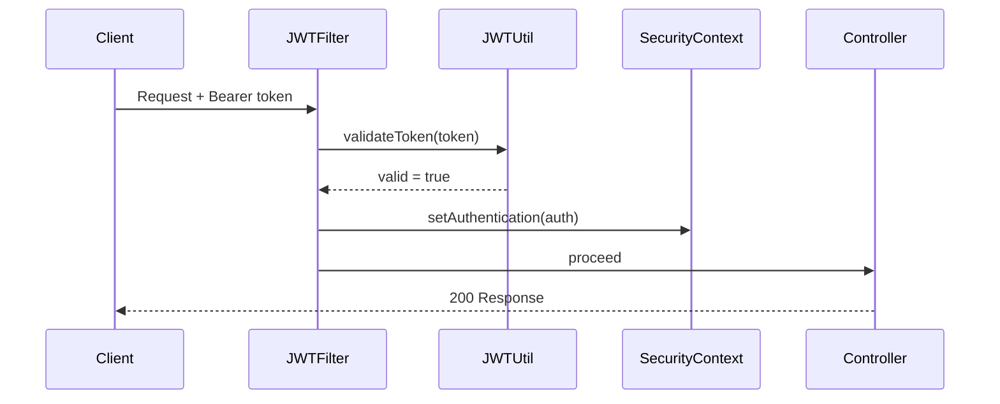
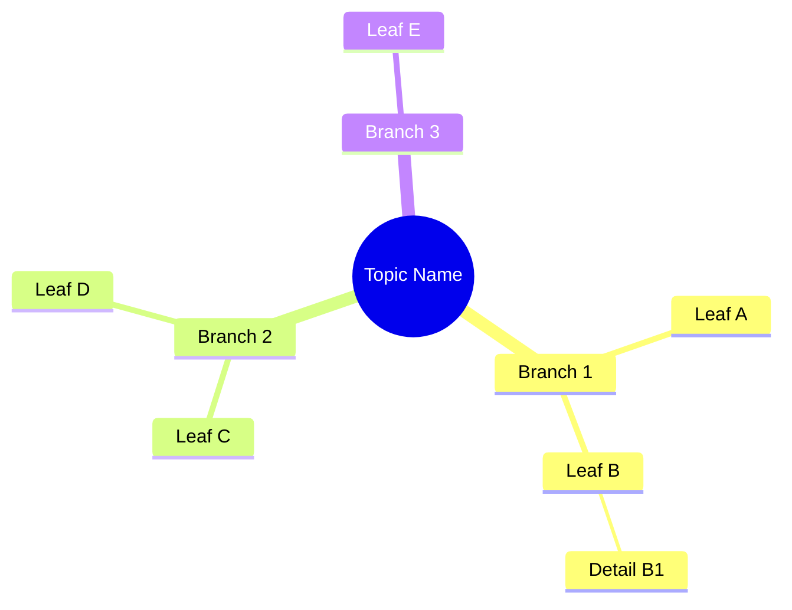
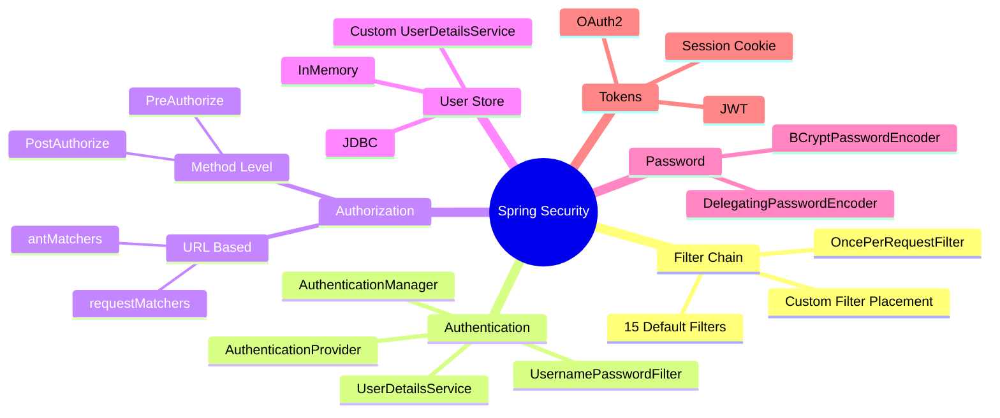

# Spring Mastery — Implementation Plan (v3)

> **Who this is for:** Python/FastAPI engineer | Data Engineering | 12 years industry | New Java/Spring closure
> **Build tool:** Gradle (Groovy DSL) throughout — no Maven
> **Philosophy:** Python comparison → WHY invented → ASCII + Mermaid diagrams → code → mindmap → interview questions → mini-project

---

## How This Plan Works

Every phase follows the same loop. Never skip phases — Spring is layered, and each phase is a prerequisite for the next.

```
┌──────────────────────────────────────────────────────────────────┐
│  THE LEARNING LOOP (repeat for every topic)                       │
│                                                                    │
│  1. READ   README.md + MINDMAP.md  → big picture + visual map    │
│  2. READ   explanation/*.md        → concept + ASCII + Mermaid   │
│  3. ANSWER interview questions     → test understanding NOW       │
│  4. READ   explanation/*.java      → see it in annotated code     │
│  5. RUN    the demo file           → ./gradlew :module:run        │
│  6. BUILD  the mini-project        → apply concepts end-to-end   │
│  7. WRITE  exercises               → build from scratch           │
│  8. CHECK  PROGRESS_TRACKER        → tick the checkbox            │
└──────────────────────────────────────────────────────────────────┘
```

---

## Three Content Standards — Applied to Every File You Create

These are not optional. Every `.md` and `.java` file in this repo follows these standards. When in doubt, over-document.

---

### Standard 1 — Mermaid Diagrams in Every `.md` File

Every explanation markdown file must include at least one Mermaid diagram. Use the diagram type that best represents the concept. The full set of supported types and when to use each:

| Mermaid Type | Syntax Opening | Use This For |
|---|---|---|
| **flowchart** | `flowchart TD` | Decision trees, request flows, if/else logic, algorithm steps |
| **sequenceDiagram** | `sequenceDiagram` | Service calls, auth handshakes, event propagation, HTTP flows |
| **erDiagram** | `erDiagram` | Database entity relationships, JPA mapping visualisation |
| **classDiagram** | `classDiagram` | Class hierarchies, interface implementations, OOP relationships |
| **stateDiagram-v2** | `stateDiagram-v2` | Bean lifecycle, circuit breaker states, thread states, order status |
| **mindmap** | `mindmap` | Module overview, concept relationships, topic decomposition |
| **gitGraph** | `gitGraph` | Git branching strategies, feature branch workflows |
| **C4Context** | `C4Context` | System-level architecture: users / external systems / your system |
| **C4Container** | `C4Container` | Container view: Spring Boot app / DB / Redis / Message broker |
| **C4Component** | `C4Component` | Internal Spring Boot structure: Controller / Service / Repo layers |
| **gantt** | `gantt` | Learning timeline, project milestones, phase schedules |
| **journey** | `journey` | User journeys: login flow, checkout, registration, API usage |
| **pie** | `pie` | Proportions: test coverage layers, dependency categories |
| **quadrantChart** | `quadrantChart` | 2×2 comparisons: tech choice matrices, risk/effort, performance |
| **xychart-beta** | `xychart-beta` | Benchmarks, performance data, growing metrics over time |
| **timeline** | `timeline` | Technology history, Spring version evolution, framework timeline |
| **block-beta** | `block-beta` | Block architecture diagrams: Docker Compose stacks, system blocks |

**Rule:** Pick the diagram type that makes the concept clearest. Use multiple diagrams per file when one type is not enough. Always render them inside fenced code blocks:

````markdown

````

---

### Standard 2 — Mindmap Files

**Where to create a `MINDMAP.md`:**

- Every module `README.md` must contain a `mindmap` diagram inline
- Every sub-topic with 3+ distinct concepts gets a standalone `MINDMAP.md` file
- Every mini-project gets a `MINDMAP.md` showing what concepts it uses

**Template for `MINDMAP.md`:**

````markdown
# [Sub-topic Name] — Concept Mindmap



## What This Map Shows
One paragraph explaining the branches and their relationships.

## Recommended Reading Order
1. Start at [Leaf A] → read `01-leaf-a.md`
2. Then [Leaf B] → read `02-leaf-b.md`
3. Leaf B1 depends on understanding B first
```
````

**Example — Spring Security mindmap:**

````markdown

````

---

### Standard 3 — Interview Questions in Every Sub-topic `.md`

**Format rules:**

- Every `explanation/*.md` file ends with an `## Interview Questions` section
- Minimum 3 questions per file, maximum 8
- Questions are grouped: Conceptual → Scenario/Debug → Quick Fire
- Every question has an answer or hint immediately below it
- Questions go from easier to harder within the file
- The aggregate from all files feeds `resources/interview-prep/*.md`

**Template:**

````markdown
---

## Interview Questions

### Conceptual

**Q1: What is [concept] and why does it exist?**
> [2–3 sentence answer covering origin problem and solution]

**Q2: What is the difference between X and Y?**
> X does ___. Y does ___. Choose X when ___, choose Y when ___.

### Scenario / Debug

**Q3: Your `@Transactional` method is not rolling back on exception. What are the 3 most likely causes?**
> 1. The exception is checked (not RuntimeException) — add `rollbackFor = Exception.class`
> 2. The method is called from within the same class (self-invocation bypasses the proxy)
> 3. The exception is being caught inside the method before it propagates

**Q4: [Scenario question about a bug or design decision]**
> [Step-by-step reasoning answer]

### Quick Fire
- Can you inject a prototype bean into a singleton? How? *(Yes — via @Lookup or scoped proxy)*
- Is SessionFactory thread-safe? *(Yes)* Is Session thread-safe? *(No)*
- What is the default fetch type for @OneToMany? *(LAZY)*
````

---

---

## Gradle Command Reference (Use These Everywhere)

```bash
# Run a Spring Boot app (any module)
./gradlew :07-spring-rest-api:bootRun

# Run a specific main class (for pure Java demos without Spring Boot)
./gradlew :00-java-foundation:run --args="VariablesDemo"

# Run all tests
./gradlew test

# Run tests for one module
./gradlew :14-testing:test

# Run one specific test class
./gradlew :14-testing:test --tests "com.learning.ProductRepositoryTest"

# Run one specific test method
./gradlew :14-testing:test --tests "com.learning.ProductRepositoryTest.shouldFindByCategory"

# Build a fat JAR
./gradlew :07-spring-rest-api:bootJar

# See all dependency versions
./gradlew :07-spring-rest-api:dependencies

# Check for outdated dependencies
./gradlew dependencyUpdates

# Clean build artifacts
./gradlew clean

# Build Docker image (Spring Boot 3 + Paketo buildpacks)
./gradlew :07-spring-rest-api:bootBuildImage

# Continuous test run (re-runs on file change)
./gradlew :14-testing:test --continuous
```

---

## Commenting Standards for All Java Files

Every file you create must follow these four commenting layers. This is non-negotiable — the comments ARE the documentation:

### Layer 1 — File-Level Header (every .java file)

```java
/**
 * ╔══════════════════════════════════════════════════════════════════╗
 * ║  FILE   : ClassName.java                                         ║
 * ║  MODULE : XX-module-name / YY-subtopic                          ║
 * ║  GRADLE : ./gradlew :XX-module-name:bootRun                     ║
 * ╠══════════════════════════════════════════════════════════════════╣
 * ║  PURPOSE        : One sentence — what this file demonstrates     ║
 * ║  WHY IT EXISTS  : What problem existed before this feature       ║
 * ║  PYTHON COMPARE : Python/FastAPI equivalent pattern              ║
 * ║  USE CASES      : 3–4 real-world scenarios                       ║
 * ╠══════════════════════════════════════════════════════════════════╣
 * ║  ASCII DIAGRAM                                                    ║
 * ║  (architecture / flow / state machine for this concept)          ║
 * ╠══════════════════════════════════════════════════════════════════╣
 * ║  HOW TO RUN     : exact Gradle command                           ║
 * ║  EXPECTED OUTPUT: what you should see in console                 ║
 * ║  RELATED FILES  : other files in this module to read next        ║
 * ╚══════════════════════════════════════════════════════════════════╝
 */
```

### Layer 2 — Class-Level Comment (every class)

```java
/**
 * ProductService — business logic layer for Product domain.
 *
 * <p><b>Layer responsibility:</b> Contains all business rules. Never talks
 * directly to HTTP (Controller's job) or directly to DB (Repository's job).
 *
 * <p><b>Python equivalent:</b>
 * <pre>
 *   class ProductService:  # Python service in FastAPI
 *       def __init__(self, repo: ProductRepo = Depends()):
 *           self.repo = repo  # injected by FastAPI
 *
 *   # Spring equivalent — injected by Spring at startup:
 *   @Service
 *   public class ProductService {
 *       private final ProductRepository repo;  // constructor-injected
 * </pre>
 *
 * <p><b>Why @Service not @Component:</b> Semantically identical to Spring,
 * but @Service signals "this is business logic" to developers and tooling.
 *
 * <p><b>ASCII — Layered Architecture:</b>
 * <pre>
 *   HTTP Request
 *       │
 *       ▼
 *   [ ProductController ]   ← validates input, maps DTO↔Entity
 *       │
 *       ▼
 *   [ ProductService ]      ← business rules, orchestration  ← YOU ARE HERE
 *       │
 *       ▼
 *   [ ProductRepository ]   ← data access only
 *       │
 *       ▼
 *   [ Database ]
 * </pre>
 */
@Service
@Transactional(readOnly = true)  // Default read-only; override for writes
public class ProductService {
```

### Layer 3 — Method-Level Comment (every public method)

```java
/**
 * Find products matching optional search filters with pagination.
 *
 * <p><b>Why optional filters:</b> A search API that requires all filters is useless.
 * This uses JPA Specifications to build dynamic WHERE clause only for
 * provided parameters.
 *
 * <p><b>Python equivalent:</b>
 * <pre>
 *   def search_products(name: str = None, category: str = None,
 *                        min_price: float = None) -> List[Product]:
 *       query = db.query(Product)
 *       if name: query = query.filter(Product.name.ilike(f'%{name}%'))
 *       if category: query = query.filter(Product.category == category)
 *       return query.all()
 * </pre>
 *
 * <p><b>Flow:</b>
 * <pre>
 *   searchProducts(name="boot", null, 100.0)
 *       │
 *       ▼
 *   Build Specification: name LIKE '%boot%' AND price <= 100.0
 *       │
 *       ▼
 *   repository.findAll(spec, pageable)
 *       │
 *       ▼
 *   Page<Product> → map to Page<ProductResponse>
 * </pre>
 *
 * @param name      optional product name substring (case-insensitive)
 * @param category  optional exact category name
 * @param maxPrice  optional maximum price filter
 * @param pageable  pagination: page number, size, sort
 * @return paginated product response DTOs matching all provided filters
 * @throws CategoryNotFoundException if category is provided but doesn't exist
 */
@Transactional(readOnly = true)
public Page<ProductResponse> searchProducts(
        String name, String category, BigDecimal maxPrice, Pageable pageable) {
```

### Layer 4 — Inline Comments (complex logic only)

```java
// DO use inline comments for:
// 1. Non-obvious algorithm steps
// 2. Business rule explanation
// 3. Gotcha warnings

// Example:
String token = authHeader.substring(7); // Remove "Bearer " prefix (7 chars)

// @Transactional(readOnly=true) tells Hibernate to set FlushMode=NEVER
// This prevents accidental writes and enables DB read replicas
@Transactional(readOnly = true)
public List<Product> findAll() { ... }

// DO NOT use inline comments for obvious code:
int total = price * quantity; // BAD: calculates total  ← unnecessary
```

---

## Phase 0 — Environment & Repository Bootstrap

**Duration:** 1–2 days | **Folder:** `setup/`

### What to install

```bash
# 1. SDKMAN (manages Java/Gradle versions — like pyenv for Python)
curl -s "https://get.sdkman.io" | bash
source "$HOME/.sdkman/bin/sdkman-init.sh"

# 2. Java 21 (LTS)
sdk install java 21.0.3-tem
java -version  # should print: openjdk 21...

# 3. Gradle (use wrapper per project — don't install globally)
# Each project has gradlew — use that. Never ./gradle, always ./gradlew

# 4. IntelliJ IDEA Community (free)
# Download from jetbrains.com/idea
# Plugins to install: Lombok, Spring Boot, Docker, .env files

# 5. Docker Desktop
# Download from docker.com/products/docker-desktop
docker --version  # should print: Docker version 25+
```

### Create the root repo

```bash
mkdir spring-mastery && cd spring-mastery
git init
echo "# Spring Mastery Learning Repo" > README.md

# Root settings.gradle — declare all modules
cat > settings.gradle << 'EOF'
rootProject.name = 'spring-mastery'
include ':00-java-foundation'
include ':01-advanced-java'
include ':02-gradle-build-tool'
// ... add more as you create them
EOF
```

### Mental model before starting

```
Python world you know:          Java world you're entering:
────────────────────────────    ────────────────────────────
python script.py                javac Script.java → Script.class → java Script
pip install requests            ./gradlew dependencies (Gradle resolves)
requirements.txt                build.gradle dependencies { }
pyproject.toml                  build.gradle + settings.gradle
uvicorn main:app                ./gradlew bootRun (embedded Tomcat)
pytest                          ./gradlew test (JUnit5)
.env file                       application.yml + environment variables
FastAPI app = FastAPI()         @SpringBootApplication main class
@app.get("/")                   @GetMapping("/") on @RestController method
Depends(get_db)                 @Autowired (constructor injection preferred)
```

---

## Phase 1 — Java Foundation

**Duration:** 3 weeks | **Folders:** `00-java-foundation/`, `01-advanced-java/`

### Why you cannot skip this

Java is NOT Python with semicolons. The differences that will bite you in Spring:

| Java | Python | Why it matters for Spring |
|------|--------|--------------------------|
| `List<String>` only holds Strings | `list` holds anything | Spring Data methods return `List<Product>`, not `List` |
| Checked exceptions must be caught | All exceptions optional | Spring wraps most into unchecked RuntimeException |
| `interface` = strict contract | Duck typing | Spring depends on interfaces for proxying |
| `synchronized` keyword | GIL (not the same) | Spring handles concurrent requests per bean scope |
| `static` = class-level | Module-level variables | Spring beans are NOT static; context manages them |

### Week 1 — Core Language + OOP

| Day | Topic | File(s) to write | Key insight |
|-----|-------|-----------------|-------------|
| 1 | JVM flow + types | `HowJavaWorks.java`, `VariablesDemo.java` | `int` is not `Integer`; autoboxing trap |
| 2 | Control flow | `ControlFlowDemo.java` | Java 14+ switch expression vs Python match |
| 3 | Classes + constructors | `ClassAndObjectDemo.java` | `this()` chaining vs Python `__init__` |
| 4 | Encapsulation + Inheritance | `InheritanceDemo.java` | `extends` is single; `super()` must be first |
| 5 | Polymorphism + Interfaces | `PolymorphismDemo.java`, `InterfaceDemo.java` | Interface = contract; not Python duck typing |
| 6 | Abstract + Access modifiers | `AbstractDemo.java` | abstract when sharing state; interface when defining contract |
| 7 | Exercises | `Ex01_BankAccount`, `Ex02_ShapeHierarchy` | Run with `./gradlew :00-java-foundation:run` |

**Python comparison embedded in every file header:**

```java
/**
 * PYTHON COMPARE:
 *   Python:  class Dog(Animal):           # inherits Animal
 *                def __init__(self):
 *                    super().__init__()   # calls parent __init__
 *
 *   Java:    public class Dog extends Animal {
 *                public Dog() {
 *                    super();             // calls parent constructor
 *                }
 *            }
 *
 * KEY DIFFERENCE: Java does NOT support multiple class inheritance.
 * Use interfaces for multiple type contracts.
 */
```

### Week 2 — Advanced OOP + Collections + Functional

| Day | Topic | File(s) | Key insight |
|-----|-------|---------|-------------|
| 8 | Generics | `GenericsDemo.java` | `List<String>` vs `List<Object>` is NOT the same at compile time |
| 9 | Collections | `ListDemo.java`, `MapDemo.java` | HashMap=Python dict; ArrayList=Python list |
| 10 | Sorting | `SortingDemo.java` | `Comparator.comparing()` = Python `key=lambda` |
| 11 | Exceptions | `ExceptionHierarchyDemo.java` | Checked exceptions are Java-specific; Spring converts them |
| 12 | Lambdas + Functional | `LambdaDemo.java` | `Predicate<T>` = Python `Callable[[T], bool]` |
| 13 | Stream API | `StreamApiDemo.java` | `.filter().map().collect()` = Python `filter()/map()/list()` |
| 14 | Optional | `OptionalDemo.java` | `Optional<T>` prevents NPE; similar to Python `Optional[T]` hint |

### Week 3 — Concurrency + Design Patterns

| Day | Topic | File(s) | Key insight |
|-----|-------|---------|-------------|
| 15 | Threads | `ThreadLifecycleDemo.java` | Spring Boot server handles each request in a thread |
| 16 | ExecutorService | `ExecutorServiceDemo.java` | Thread pools; never create raw `new Thread()` in production |
| 17 | Proxy pattern | `ProxyPatternDemo.java` | **Critical**: Spring AOP = JDK Proxy + CGLIB under the hood |
| 18 | Builder + Strategy | `BuilderPatternDemo.java` | Spring uses Builder everywhere; Strategy = @Bean selection |
| 19 | Modern Java | `RecordsDemo.java` | Java records = Python dataclasses; use for DTOs |
| 20–21 | Design patterns | All patterns | Observer = Spring Events; Factory = BeanFactory |

**Mini-Project: Library CLI**
After finishing week 3, build `mini-project-00-library-cli/`:

```bash
./gradlew :mini-project-00-library-cli:run
```

Uses: OOP + Collections + Streams + Exceptions + JUnit5 tests — no Spring. Validates your Java foundation before moving on.

---

## Phase 2 — Gradle + JDBC + Hibernate

**Duration:** 1 week | **Folders:** `02-gradle-build-tool/`, `03-jdbc/`, `04-hibernate-jpa/`

### Gradle — your new build tool

Think of Gradle as `pip + poetry + make` combined:

```groovy
// build.gradle — this is your requirements.txt + Makefile

dependencies {
    // "implementation" = your app needs this at runtime
    // Like: pip install requests  (goes in requirements.txt)
    implementation 'org.springframework.boot:spring-boot-starter-web'

    // "testImplementation" = only needed for tests
    // Like: pip install pytest  (goes in dev-requirements.txt)
    testImplementation 'org.springframework.boot:spring-boot-starter-test'

    // "runtimeOnly" = needed at runtime but not to compile
    runtimeOnly 'org.postgresql:postgresql'

    // "compileOnly" = needed to compile but not shipped
    // Lombok: generates code at compile time, not needed in JAR
    compileOnly 'org.projectlombok:lombok'
    annotationProcessor 'org.projectlombok:lombok'
}
```

Key Gradle tasks to know cold:

```bash
./gradlew bootRun          # Start Spring Boot app (like: uvicorn main:app)
./gradlew test             # Run all tests (like: pytest)
./gradlew bootJar          # Build runnable JAR (like: docker build)
./gradlew dependencies     # Show dependency tree (like: pip list)
./gradlew clean            # Remove build/ folder
```

### JDBC — Learn This to Understand What JPA Eliminates

Build `CRUDWithJDBC.java` — a full CRUD for one table. You will write ~100 lines of boilerplate for something JPA does in 5 lines. This contrast is the entire lesson.

```java
// JDBC way (what you write without JPA):
// File: CRUDWithJDBC.java
// ============================================================
// Python psycopg2 equivalent:
//   conn = psycopg2.connect(dsn)
//   cursor = conn.cursor()
//   cursor.execute("INSERT INTO products VALUES (%s, %s)", (name, price))
//   conn.commit()
//
// Java JDBC equivalent (much more verbose):
Connection conn = DriverManager.getConnection(url, user, pass);
PreparedStatement ps = conn.prepareStatement(
    "INSERT INTO products (name, price) VALUES (?, ?)");
ps.setString(1, name);     // position 1
ps.setBigDecimal(2, price); // position 2
ps.executeUpdate();
conn.commit();
conn.close();
// 8 lines just to insert one row. Then multiply by 4 CRUD operations.
// This is why JPA exists.
```

### Hibernate / JPA — Your SQLAlchemy

```java
// JPA way (after learning Hibernate):
// File: ProductRepository.java
// ============================================================
// Python SQLAlchemy equivalent:
//   class Product(Base):
//       __tablename__ = 'products'
//       id = Column(Integer, primary_key=True)
//       name = Column(String)
//       price = Column(Numeric)
//
// Java JPA equivalent:
@Entity
@Table(name = "products")
public class Product {
    @Id
    @GeneratedValue(strategy = GenerationType.IDENTITY)
    private Long id;

    @Column(nullable = false)
    private String name;

    @Column(precision = 10, scale = 2)
    private BigDecimal price;
}
// Spring Data JPA then generates ALL CRUD automatically
```

**Critical concepts to master:**

| Concept | What it is | Why it matters | Python SQLAlchemy equivalent |
|---------|-----------|----------------|------------------------------|
| N+1 Problem | 1 query fetches parents, then N queries fetch each child | Kills performance silently | SQLAlchemy lazy loading same problem |
| EAGER vs LAZY | When related objects are fetched | Wrong default = performance bug | `lazy=True` in SQLAlchemy |
| @Transactional | Session boundary | When Hibernate can write to DB | `with session.begin():` |
| L1 Cache | Session-level object identity map | Same ID = same object reference | SQLAlchemy session identity map |
| Cascade | Operations that propagate to children | Delete parent → delete children | `cascade="all, delete-orphan"` |

**Demonstrate N+1 problem explicitly:**

```java
/**
 * N+1 PROBLEM DEMONSTRATION
 *
 * File: FetchTypeDemo.java
 *
 * BAD (N+1 queries):
 *   List<Department> depts = deptRepo.findAll();  // Query 1: SELECT * FROM departments
 *   for (Department d : depts) {
 *       d.getEmployees().size(); // Query 2..N: SELECT * FROM employees WHERE dept_id=?
 *   }
 *   // With 10 departments: 1 + 10 = 11 queries!
 *
 * GOOD (1 query with JOIN FETCH):
 *   @Query("SELECT d FROM Department d JOIN FETCH d.employees")
 *   List<Department> findAllWithEmployees();
 *   // With 10 departments: 1 query total
 */
```

### Test using Docker PostgreSQL

```bash
# Start PostgreSQL for all JDBC/Hibernate work
docker run --name spring-pg \
  -e POSTGRES_DB=learning \
  -e POSTGRES_USER=admin \
  -e POSTGRES_PASSWORD=secret \
  -p 5432:5432 -d postgres:15

# Verify
docker exec -it spring-pg psql -U admin -d learning -c "\dt"
```

---

## Phase 3 — Spring Core

**Duration:** 1 week | **Folder:** `05-spring-core/`

### The one mental model you must internalize

Spring is a smart object factory. You describe what you need. Spring creates it, wires it, and manages its lifecycle. You never call `new SomeService()` in production code.

```
FastAPI Dependency Injection:          Spring Dependency Injection:
────────────────────────────────       ────────────────────────────────
def get_db() -> Session:               @Repository
    db = SessionLocal()                public class ProductRepository {}
    try:
        yield db                       @Service
    finally:                           public class ProductService {
        db.close()                         // Spring injects repo at startup
                                           private final ProductRepository repo;
@app.get("/products")
async def list_products(               @RestController
    db: Session = Depends(get_db)      public class ProductController {
):                                         // Spring injects service at startup
    return db.query(Product).all()         private final ProductService service;

# KEY DIFFERENCE:
# FastAPI injects PER REQUEST (fresh db session each time)
# Spring injects AT STARTUP (same service instance for all requests)
# Spring can also inject per-request via @RequestScope
```

### Phase 3 topic order with WHY for each

| Day | Build | WHY this feature was invented |
|-----|-------|------------------------------|
| 1 | `IoCConceptDemo.java` | Without IoC: `new ServiceA(new ServiceB(new ServiceC()))` — rigid coupling |
| 2 | `ConstructorInjectionDemo.java` | Setter injection made circular deps common; constructor injection exposes them |
| 3 | `ComponentScanDemo.java` | Without scanning: register every bean manually in XML — 500+ line XML files |
| 4 | `JavaConfigDemo.java` | XML configs had no IDE support, no refactoring, no type checking |
| 5 | `BeanScopeDemo.java` | Singleton is wrong for stateful beans; prototype is wrong for stateless services |
| 6 | `BeanLifecycleDemo.java` | Need to open DB connections at start, close at shutdown — lifecycle hooks |
| 7 | `ConditionalDemo.java` | Different beans for dev/prod/test without code change — profiles |

**ASCII: Spring Application Context startup sequence**

```
./gradlew bootRun
       │
       ▼
  1. JVM starts; loads Spring Boot main class
       │
       ▼
  2. SpringApplication.run() called
       │
       ▼
  3. ApplicationContext created
       │
       ▼
  4. @ComponentScan: scan packages for @Component/@Service/@Repository/@Controller
       │
       ▼
  5. @Configuration classes processed: @Bean methods called
       │
       ▼
  6. Dependency injection: wire all beans together (constructor first)
       │
       ▼
  7. @PostConstruct methods called on each bean
       │
       ▼
  8. ApplicationReadyEvent fired → your app is running
       │
       ▼
  9. Handle requests...
       │
       ▼
  10. On shutdown: @PreDestroy on each bean → graceful stop
```

**Mini-Project: Notification Engine**
Build `mini-project-01-notification-engine/` — pure Spring Core, no HTTP, no DB. Demonstrates: @Configuration, @Bean, @Service, @Profile, @PostConstruct, ApplicationEvent. Test by running main class directly.

---

## Phase 4 — Spring Boot Fundamentals

**Duration:** 1 week | **Folder:** `06-spring-boot-fundamentals/`

### What Spring Boot adds over Spring

| Spring (raw) | Spring Boot | WHY Boot adds this |
|-------------|-------------|-------------------|
| You configure Tomcat manually | Embedded Tomcat auto-configured | No WAR deployment, just `java -jar app.jar` |
| You declare every dependency version | Parent BOM manages versions | Eliminates dependency version conflicts |
| You configure Jackson/DataSource/etc | Auto-configuration | Spring detects classpath and configures automatically |
| You write spring.factories entries | Spring Boot reads AutoConfiguration.imports | Plug-in architecture for library authors |

### Deep dive: auto-configuration

```java
/**
 * HOW SPRING BOOT AUTO-CONFIGURATION WORKS
 *
 * File: AutoConfigExplorer.java
 *
 * When you add spring-boot-starter-web to build.gradle:
 *   1. Gradle downloads: spring-boot-starter-web
 *   2. Which pulls in: spring-webmvc, tomcat-embed-core, jackson-databind
 *   3. Spring Boot sees spring-webmvc on classpath
 *   4. Loads: DispatcherServletAutoConfiguration
 *   5. Which is @ConditionalOnClass(DispatcherServlet.class) → present → configure it
 *   6. Creates DispatcherServlet bean with default config
 *   7. You write @RestController and it just works
 *
 * Python equivalent:
 *   When you pip install fastapi[all]:
 *   - uvicorn comes with it
 *   - pydantic comes with it
 *   - All configured to work together automatically
 *   Spring Boot starters work the same way.
 */

// Print all auto-configured beans in main():
ConfigurableApplicationContext ctx = SpringApplication.run(App.class, args);
Arrays.stream(ctx.getBeanDefinitionNames())
      .sorted()
      .forEach(System.out::println);
// You'll see: dataSourceAutoConfiguration, jacksonAutoConfiguration, etc.
```

### Deep dive: Spring Boot beans and lifecycle

```
FULL BEAN LIFECYCLE (must know for debugging):

Bean Definition Phase (at startup):
  @ComponentScan finds @Component/@Service/@Repository
  @Configuration @Bean methods registered
       │
       ▼
BeanFactoryPostProcessor runs (modify definitions BEFORE instantiation)
  e.g., PropertySourcesPlaceholderConfigurer resolves ${...} values
       │
       ▼
Bean Instantiation (constructor called)
       │
       ▼
BeanPostProcessor.postProcessBeforeInitialization()
  e.g., @Autowired field injection (but use constructor injection!)
       │
       ▼
@PostConstruct method called
  e.g., initialise connection pool, warm up cache
       │
       ▼
InitializingBean.afterPropertiesSet()  (less common)
       │
       ▼
Custom init-method (bean is READY TO USE)
       │
       ▼
BeanPostProcessor.postProcessAfterInitialization()
  e.g., THIS IS WHERE AOP PROXY IS CREATED
       │
       ▼
Bean in use (handling requests)
       │
       ▼
@PreDestroy method called (on app shutdown)
       │
       ▼
DisposableBean.destroy()  (less common)
```

**Write `FullBeanLifecycleDemo.java`** that implements every interface above and prints a line at each phase. Run it and watch the sequence.

### Configuration management deep dive

```
PROPERTY RESOLUTION ORDER (higher = wins):
1. Command line args:         java -jar app.jar --server.port=9090
2. System environment vars:   SERVER_PORT=9090 (note: _ replaces .)
3. application-{profile}.yml: application-prod.yml
4. application.yml:           default config
5. @ConfigurationProperties:  type-safe binding
6. Default values in code:    @Value("${port:8080}")
                                            ↑ default if not found

Python equivalent:
  os.environ.get("PORT", "8080")  # same fallback pattern
  But Spring has 7 layers vs Python's 1
```

**Mini-Project: Config Demo App**
`mini-project-02-config-demo-app/`: same app behaves differently in dev (H2 DB, verbose logging) vs prod (PostgreSQL, minimal logging). Activates with `./gradlew bootRun --args="--spring.profiles.active=prod"`.

---

## Phase 5 — Spring REST API

**Duration:** 2 weeks | **Folders:** `07-spring-rest-api/`

### FastAPI vs Spring Boot REST — complete comparison

| Concept | FastAPI | Spring Boot |
|---------|---------|-------------|
| App declaration | `app = FastAPI()` | `@SpringBootApplication` on main class |
| Route definition | `@app.get("/items/{id}")` | `@GetMapping("/items/{id}")` on method |
| Path param | `def get(id: int)` | `@PathVariable Long id` |
| Query param | `def get(q: str = None)` | `@RequestParam(required=false) String q` |
| Request body | `def create(item: ItemSchema)` | `@RequestBody ItemRequest request` |
| Response model | `response_model=ItemResponse` | Return `ResponseEntity<ItemResponse>` |
| Validation | Pydantic automatic | `@Valid` on `@RequestBody` |
| HTTP 404 | `raise HTTPException(404)` | `throw new ResourceNotFoundException()` |
| Error handler | `@app.exception_handler(...)` | `@RestControllerAdvice` |
| Middleware | `@app.middleware("http")` | `OncePerRequestFilter` |
| Dependency | `Depends(get_db)` | `@Autowired` (constructor injection) |
| Auto-docs | Built-in at /docs | `springdoc-openapi` at /swagger-ui.html |
| Async | `async def` natively | `WebFlux` (separate topic); Servlet is sync |

### Week 1 — REST controller + validation + exceptions

| Day | Build | What to understand |
|-----|-------|------------------|
| 1 | `BasicRestController.java` | @RestController = @Controller + @ResponseBody automatic |
| 2 | `PathVariableDemo.java` | /products/{id}/reviews/{reviewId} — multiple vars |
| 3 | `RequestBodyDemo.java` | DTO class + @Valid + @NotNull + @Size |
| 4 | `ResponseEntityDemo.java` | Return 201 Created with Location header on POST |
| 5 | `GlobalExceptionHandler.java` | @RestControllerAdvice; one place for all errors |
| 6 | `ValidationAnnotationsDemo.java` | All bean validation annotations; custom @Constraint |
| 7 | DTOs + mapper | Separate Request/Response DTOs; never expose entities directly |

**ASCII: Request flow through Spring Boot REST**

```
HTTP Request: POST /api/products
                │
                ▼
        [ DispatcherServlet ]         ← Front controller; routes to handler
                │
                ▼
        [ HandlerMapping ]            ← Finds ProductController.createProduct()
                │
                ▼
        [ FilterChain ]               ← Security filters, logging filters
                │
                ▼
        [ ArgumentResolver ]          ← Deserializes JSON body → ProductRequest DTO
                │
                ▼
        [ Validator ]                 ← @Valid: runs all @NotNull/@Size/@Email checks
                │  (if invalid → MethodArgumentNotValidException → GlobalExceptionHandler)
                ▼
        [ ProductController ]         ← Your @PostMapping method
                │
                ▼
        [ ProductService ]            ← Business logic
                │
                ▼
        [ ProductRepository ]         ← Persists to DB
                │
                ▼
        [ MessageConverter ]          ← Serializes ProductResponse → JSON
                │
                ▼
        HTTP Response: 201 Created + JSON body
```

### Week 2 — Swagger + Versioning + Full CRUD project

| Day | Build | What to understand |
|-----|-------|------------------|
| 8 | `SwaggerConfig.java` + annotations | Springdoc: auto-generates OpenAPI 3.0 spec |
| 9 | API versioning | URI versioning (/v1/ /v2/) — most common in enterprise |
| 10–14 | `07-spring-rest-api/08-full-crud-project/` | Complete Employee API: all CRUD + pagination + search |

**How to test at every step:**

```bash
# Quick test — is it running?
curl -s http://localhost:8080/actuator/health | jq .

# GET all
curl -s http://localhost:8080/api/employees | jq .

# GET paginated
curl -s "http://localhost:8080/api/employees?page=0&size=5&sort=name,asc" | jq .

# POST create
curl -s -X POST http://localhost:8080/api/employees \
  -H "Content-Type: application/json" \
  -d '{"name":"John Doe","email":"john@example.com","salary":75000}' | jq .

# GET by ID (replace 1 with actual ID from previous response)
curl -s http://localhost:8080/api/employees/1 | jq .

# PUT update
curl -s -X PUT http://localhost:8080/api/employees/1 \
  -H "Content-Type: application/json" \
  -d '{"name":"John Updated","email":"john@example.com","salary":80000}' | jq .

# PATCH partial update
curl -s -X PATCH http://localhost:8080/api/employees/1 \
  -H "Content-Type: application/json" \
  -d '{"salary":85000}' | jq .

# DELETE
curl -s -X DELETE http://localhost:8080/api/employees/1

# Test validation error (missing required fields)
curl -s -X POST http://localhost:8080/api/employees \
  -H "Content-Type: application/json" \
  -d '{"name":""}' | jq .  # Should return 400 with field errors

# Open Swagger UI in browser
open http://localhost:8080/swagger-ui.html
```

---

## Phase 6 — Spring Data JPA

**Duration:** 1 week | **Folder:** `08-spring-data-jpa/`

### Why Spring Data JPA eliminates boilerplate

```java
// Without Spring Data JPA: (~150 lines of DAO boilerplate per entity)
@Repository
public class ProductDAO {
    @PersistenceContext
    private EntityManager em;

    public Product findById(Long id) {
        return em.find(Product.class, id);
    }
    public List<Product> findAll() {
        return em.createQuery("SELECT p FROM Product p", Product.class).getResultList();
    }
    public Product save(Product p) { em.persist(p); return p; }
    public void delete(Long id) { em.remove(em.find(Product.class, id)); }
    // ... 20 more methods
}

// With Spring Data JPA: (3 lines — Spring generates everything above)
public interface ProductRepository extends JpaRepository<Product, Long> {
    // findById, findAll, save, delete, count — ALL built-in
    // Spring generates implementation at runtime via Proxy
}
```

### Derived query methods — how method names become SQL

```java
// Method name → SQL (Spring parses the name to build the query)
// ============================================================
// Python SQLAlchemy equivalent:
//   session.query(Product).filter(Product.name == name).all()

List<Product> findByName(String name);
// → SELECT * FROM products WHERE name = ?

List<Product> findByNameContainingIgnoreCase(String name);
// → SELECT * FROM products WHERE LOWER(name) LIKE LOWER('%'||?||'%')

List<Product> findByCategoryAndPriceLessThanEqual(String cat, BigDecimal maxPrice);
// → SELECT * FROM products WHERE category = ? AND price <= ?

Optional<Product> findBySkuCode(String sku);
// → SELECT * FROM products WHERE sku_code = ?  (returns Optional)

Page<Product> findByCategory(String cat, Pageable pageable);
// → SELECT * FROM products WHERE category = ? LIMIT ? OFFSET ?

long countByCategory(String category);
// → SELECT COUNT(*) FROM products WHERE category = ?

boolean existsBySkuCode(String sku);
// → SELECT EXISTS(SELECT 1 FROM products WHERE sku_code = ?)
```

### @Transactional — the most important annotation to understand correctly

```
WHAT @Transactional DOES:
    At startup, Spring creates a PROXY around your @Service class.
    When you call a @Transactional method, the proxy:
        1. Opens DB connection
        2. Begins transaction
        3. Calls your actual method
        4. On success: commits transaction
        5. On RuntimeException: rolls back transaction
        6. Closes connection

THE SELF-INVOCATION TRAP (most common @Transactional bug):
    // File: OrderService.java
    @Service
    public class OrderService {

        @Transactional  // ← This WORKS (called through proxy)
        public void placeOrder(Order order) {
            validateOrder(order);  // ← Calls internal method...
        }

        @Transactional(propagation = REQUIRES_NEW)  // ← This DOES NOT WORK
        public void validateOrder(Order order) {     // ← Bypasses proxy! Direct call!
            // The REQUIRES_NEW is IGNORED because this was called from
            // placeOrder() directly (this.validateOrder), not through proxy
        }
    }

FIX: Inject self, or extract to separate service class.

PYTHON EQUIVALENT:
    # SQLAlchemy:
    with session.begin():    # @Transactional
        service.place_order(order)
    # If exception: session.rollback() automatic
    # Spring does the same with a proxy wrapper
```

**Mini-Project: Product Catalogue**
`mini-project-03-product-catalogue/` — Product + Category with pagination, search via Specifications, JpaRepository, @Transactional service layer. Test with `@DataJpaTest`.

---

## Phase 7 — Spring Security

**Duration:** 2 weeks | **Folder:** `10-spring-security/`

### Learn the filter chain before writing any config

Before touching SecurityConfig, fully understand this ASCII diagram and be able to draw it from memory:

```
HTTP Request
    │
    ▼
┌──────────────────────────────────────────────────────┐
│  Security Filter Chain (beans ordered by @Order)     │
│                                                        │
│  1. DisableEncodeUrlFilter                            │
│  2. WebAsyncManagerIntegrationFilter                  │
│  3. SecurityContextPersistenceFilter                  │ ← Load SecurityContext from session
│  4. HeaderWriterFilter                                │
│  5. CorsFilter                                        │
│  6. CsrfFilter                                        │ ← CSRF token check
│  7. LogoutFilter                                      │
│  8. UsernamePasswordAuthenticationFilter              │ ← Form login processing
│  9. BasicAuthenticationFilter                         │
│  10. RequestCacheAwareFilter                          │
│  11. SecurityContextHolderAwareRequestFilter          │
│  12. RememberMeAuthenticationFilter                   │
│  13. AnonymousAuthenticationFilter                    │ ← Sets anonymous user if none
│  14. ExceptionTranslationFilter                       │ ← Converts auth exceptions to HTTP
│  15. FilterSecurityInterceptor / AuthorizationFilter  │ ← FINAL authorization check
│                                                        │
└──────────────────────────────────────────────────────┘
    │  (all 15 pass)
    ▼
  Your Controller

PYTHON FASTAPI EQUIVALENT:
  @app.middleware("http")
  async def auth_middleware(request: Request, call_next):
      token = request.headers.get("Authorization")
      if not validate_token(token):
          raise HTTPException(401)
      return await call_next(request)
  # Spring Security = 15 of these stacked in the correct order
```

### Week 1 — Form auth + UserDetails + BCrypt

| Day | Build | WHY this feature exists |
|-----|-------|------------------------|
| 1 | `SecurityFilterChainDemo.java` | Print all 15 filters — know what you're configuring |
| 2 | Custom login form | Default Spring login is ugly; real apps need custom UI |
| 3 | `CustomUserDetailsService.java` | In-memory users are for demos; prod users come from DB |
| 4 | `RegistrationController.java` | Storing raw passwords is a crime; BCrypt with 12 rounds |
| 5 | Role-based URL access | ADMIN can delete; USER can only read; enforcement at URL level |
| 6 | `MethodSecurityDemo.java` | URL rules are coarse; method security adds fine-grained checks |
| 7 | Exercise: secure Employee API | Apply everything to the Employee API from Phase 5 |

**BCrypt explanation:**

```java
/**
 * WHY BCRYPT:
 * File: RegistrationController.java
 *
 * Python equivalent:
 *   from passlib.hash import bcrypt
 *   hashed = bcrypt.hash("plaintext", rounds=12)
 *   bcrypt.verify("plaintext", hashed)  # True
 *
 * Java Spring equivalent:
 *   BCryptPasswordEncoder encoder = new BCryptPasswordEncoder(12);
 *   String hashed = encoder.encode("plaintext");
 *   encoder.matches("plaintext", hashed);  // true
 *
 * WHY NOT MD5/SHA:
 *   MD5("password") = always same hash → rainbow table attack
 *   BCrypt("password") = different hash each time (salt inside)
 *   BCrypt is deliberately slow (12 rounds = ~100ms) → brute force impractical
 */
```

### Week 2 — JWT

| Day | Build | WHY |
|-----|-------|-----|
| 8 | `JWTUtil.java` | Session cookies don't work in microservices; JWT does |
| 9 | `JWTAuthFilter.java` | Every request needs token validation before controller |
| 10 | `AuthController.java` | Login endpoint that issues JWT |
| 11 | Stateless SecurityConfig | STATELESS = no session; JWT replaces session |
| 12 | Refresh token | 15-minute access tokens expire; need refresh flow |
| 13–14 | Mini-project | Full JWT auth system from scratch |

**JWT flow diagram:**

```
STATEFUL (Session) flow:               STATELESS (JWT) flow:
──────────────────────────────         ──────────────────────────────
POST /login                            POST /login
  ↓ authenticate                         ↓ authenticate
  ↓ create session (server memory)       ↓ create JWT (server signs, sends)
  ← 200 + Set-Cookie: JSESSIONID        ← 200 + {"token": "eyJh..."}

GET /api/data                          GET /api/data
  Cookie: JSESSIONID=xyz                 Authorization: Bearer eyJh...
  ↓ lookup session in memory             ↓ validate signature (no DB lookup)
  ← 200 + data                          ← 200 + data

PROBLEM with sessions:                 WHY JWT for microservices:
  Server A knows session                 Any service can validate signature
  Server B doesn't → sticky sessions    No shared session store needed
  required → no horizontal scale        Stateless → horizontally scalable
```

**Mini-Project: JWT Secured API**
`mini-project-05-jwt-secured-api/` — register, login, receive JWT, use JWT to access protected endpoints. Test with Postman collection committed in the project.

---

## Phase 8 — Spring AOP

**Duration:** 1 week | **Folder:** `12-spring-aop/`

### AOP = Python decorators, but applied at the container level

```python
# Python decorator (manual, applied per function):
def log_calls(func):
    def wrapper(*args, **kwargs):
        print(f"Calling {func.__name__}")
        result = func(*args, **kwargs)
        print(f"Done {func.__name__}")
        return result
    return wrapper

@log_calls  # Must manually add to every function
def place_order(order): ...

@log_calls  # Must manually add to every function
def cancel_order(order): ...
```

```java
// Spring AOP (automatic, applies to any matching method):
@Aspect
@Component
public class LoggingAspect {

    // Applies to ALL methods in service package — no @annotation needed on each method
    @Around("execution(* com.learning.service.*.*(..))")
    public Object logAllServiceMethods(ProceedingJoinPoint pjp) throws Throwable {
        log.info("Calling: {}", pjp.getSignature().getName());
        Object result = pjp.proceed();
        log.info("Done: {}", pjp.getSignature().getName());
        return result;
    }
}
// Automatically applies to ALL service methods without touching each method
```

### AOP proxy mechanics — critical to understand

```
WITHOUT AOP:
    Controller → [ ProductService ] → Repository

WITH AOP (@Service that is @Transactional):
    Spring creates a PROXY at startup:
    Controller → [ PROXY ] → [ ProductService ] → Repository
                   │
                   └─ Intercepts call
                   └─ Opens transaction (if @Transactional)
                   └─ Calls advice (@Before/@Around)
                   └─ Calls actual method
                   └─ Calls advice (@After/@AfterReturning)
                   └─ Commits/rolls back transaction

THIS IS WHY SELF-INVOCATION BREAKS AOP:
    ProductService.methodA() calls this.methodB()
    "this" = real object, NOT the proxy
    Proxy is bypassed → no transaction, no logging
```

### Real-world aspects to build

```java
// 1. LoggingAspect.java — Log every service call with timing
@Around("execution(* com.learning.service.*.*(..))")
// Log: method name, args (masked if sensitive), return value, duration

// 2. PerformanceAspect.java — Alert on slow methods
@Around("@annotation(com.learning.annotation.SlowMethodAlert)")
// If method takes > threshold ms → send alert (log/metric/email)

// 3. AuditAspect.java — Audit trail for data changes
@AfterReturning("@annotation(com.learning.annotation.Auditable)")
// Save AuditLog entity: who, what, when, old value, new value

// 4. RetryAspect.java — Retry on transient failures
@Around("@annotation(com.learning.annotation.Retryable)")
// Catch specific exceptions, retry up to maxAttempts with backoff sleep
```

**Mini-Project: Audited Service**
`mini-project-06-audited-service/` — add AOP logging, performance monitoring, and audit trail to the Product Catalogue project.

---

## Phase 9 — Drools Rules Engine

**Duration:** 1 week | **Folder:** `13-drools-rules-engine/`

### WHY Drools was invented — the key motivation

```java
/**
 * WITHOUT DROOLS (the problem it solves):
 *
 * Imagine a loan eligibility service with 50 rules:
 */
public boolean isEligible(LoanApplication app) {
    if (app.getAge() < 21) return false;
    if (app.getCreditScore() < 600) return false;
    if (app.getMonthlyIncome() < app.getLoanAmount() / 36) return false;
    if (app.getEmploymentType() == UNEMPLOYED) return false;
    if (app.getExistingLoans() > 3) return false;
    // ... 45 more if-else statements
    // Business wants to ADD a rule? Redeploy Java code.
    // Business wants to CHANGE a threshold? Redeploy Java code.
    // Non-technical analyst cannot read/verify this code.
}

/**
 * WITH DROOLS (the solution):
 */
// LoanEligibilityRules.drl — business analyst can read and change this:
rule "Age Requirement"
    when
        $app : LoanApplication(age < 21)
    then
        $app.setRejected(true);
        $app.addReason("Applicant must be 21 or older");
end

rule "Credit Score Minimum"
    when
        $app : LoanApplication(creditScore < 600)
    then
        $app.setRejected(true);
        $app.addReason("Credit score below minimum threshold");
end
// Business analyst can change 600 → 650 in the .drl file, no Java redeploy
// Business analyst can verify rules in Excel decision table format
```

### Industry use cases

```
WHERE DROOLS IS USED IN PRODUCTION:
┌─────────────────────────────────────────────────────────┐
│ Insurance:    Premium calculation; claim approval        │
│ Banking:      Loan eligibility; fraud scoring            │
│ E-Commerce:   Dynamic pricing; discount engine           │
│ Healthcare:   Drug interaction checking; eligibility     │
│ Telecom:      Plan recommendation; billing rules         │
│ Government:   Tax calculation; benefit eligibility       │
└─────────────────────────────────────────────────────────┘
ALL SHARE THE SAME PATTERN:
  Complex, frequently-changing business rules that
  non-technical stakeholders need to verify/modify.
```

### Gradle dependency

```groovy
// build.gradle for Drools module
dependencies {
    implementation 'org.drools:drools-core:9.44.0.Final'
    implementation 'org.drools:drools-compiler:9.44.0.Final'
    implementation 'org.kie:kie-spring:7.74.1.Final'
}
```

**Mini-Project: Loan Approval Engine**
`mini-project-07-loan-approval-engine/` — REST API where POST /loan/apply evaluates Drools rules and returns approved/rejected with reasons. Rules are in `.drl` file. Changing rules does not require changing Java.

---

## Phase 10 — Testing

**Duration:** 1 week | **Folder:** `14-testing/`

### Testing layers — what to test where

```
┌────────────────────────────────────────────────────────────────┐
│  TESTING PYRAMID                                               │
│                                                                │
│           /\                                                   │
│          /  \    E2E Tests (few, slow)                        │
│         /----\   Postman / Selenium                           │
│        /  Int \  @SpringBootTest + Testcontainers             │
│       /--------\  Real DB, Full context                       │
│      /  Slice   \ @WebMvcTest (controller only)               │
│     /------------\ @DataJpaTest (JPA only)                    │
│    /   Unit Tests  \ JUnit5 + Mockito                         │
│   /________________\ No Spring, pure Java, very fast          │
│                                                                │
│  PYTHON EQUIVALENT:                                            │
│    Unit   → pytest with unittest.mock                         │
│    Slice  → TestClient(app) in FastAPI (similar to WebMvcTest)│
│    Integration → pytest with real DB (no direct equivalent)   │
└────────────────────────────────────────────────────────────────┘
```

### Mockito vs Python unittest.mock — direct comparison

```java
// MOCKITO                              PYTHON unittest.mock
// ─────────────────────────────        ──────────────────────────────
@Mock                                   mock_repo = MagicMock()
ProductRepository mockRepo;

// Stub return value                    // Stub return value
when(mockRepo.findById(1L))             mock_repo.find_by_id.return_value = (
    .thenReturn(Optional.of(product)); Optional[product]

// Stub exception                       // Stub exception
when(mockRepo.findById(99L))            mock_repo.find_by_id.side_effect = (
    .thenThrow(                         NotFoundException()
        new NotFoundException());

// Verify called                        // Verify called
verify(mockRepo, times(1))              mock_repo.save.assert_called_once_with(
    .save(any(Product.class));              ANY)

// Capture argument                     // Capture argument
ArgumentCaptor<Product> captor =        # Python: just inspect call_args
    ArgumentCaptor.forClass(Product.class);
verify(mockRepo).save(captor.capture());
Product saved = captor.getValue();
```

### MockMvc — testing controllers without starting a server

```java
/**
 * @WebMvcTest(ProductController.class)
 *
 * Starts ONLY the web layer (no DB, no service implementation).
 * Mock the service. Test controller logic in isolation.
 *
 * Python FastAPI equivalent:
 *   from fastapi.testclient import TestClient
 *   client = TestClient(app)
 *   response = client.get("/products/1")
 *   assert response.status_code == 200
 */
@WebMvcTest(ProductController.class)
class ProductControllerTest {

    @Autowired MockMvc mockMvc;
    @MockBean ProductService productService;  // Mock the dependency

    @Test
    void getProduct_whenFound_returns200() throws Exception {
        // ARRANGE — stub the mock
        when(productService.findById(1L)).thenReturn(sampleProduct());

        // ACT + ASSERT — in one fluent chain
        mockMvc.perform(get("/api/products/1")
                   .contentType(MediaType.APPLICATION_JSON))
               .andExpect(status().isOk())
               .andExpect(jsonPath("$.name").value("Test Product"))
               .andExpect(jsonPath("$.price").value(99.99));

        // VERIFY — service was called exactly once with id=1
        verify(productService, times(1)).findById(1L);
    }
}
```

---

## Phase 11 — Microservices

**Duration:** 3 weeks | **Folder:** `15-microservices/`

### Phase breakdown

**Week 1: Services + Communication**

- Two independent Spring Boot apps
- Feign client with service-name resolution
- Eureka for service discovery

**Week 2: Infrastructure**

- API Gateway with JWT validation
- Resilience4j circuit breakers + retry
- Distributed tracing with Zipkin

**Week 3: Full Project**

- `15-microservices/07-microservices-project/` with 5 services + gateway + eureka

### Key concept: why Feign over RestTemplate

```java
// RestTemplate (verbose, manual):
String url = "http://product-service/api/products/" + productId;
Product product = restTemplate.getForObject(url, Product.class);

// WebClient (async, verbose):
Product product = webClient.get()
    .uri("http://product-service/api/products/{id}", productId)
    .retrieve()
    .bodyToMono(Product.class)
    .block();

// Feign (declarative, clean):
@FeignClient(name = "product-service")  // service name from Eureka
public interface ProductFeignClient {
    @GetMapping("/api/products/{id}")
    Product findById(@PathVariable Long id);
}
// Then inject and call like a normal service:
Product product = productFeignClient.findById(productId);
// Feign handles: URL resolution, serialization, retry, fallback

// Python equivalent: httpx with retries configured, pointing to service name
// Feign is the declarative equivalent of Python's httpx clients
```

### Circuit breaker states

```
CLOSED (normal)            OPEN (failing)          HALF-OPEN (testing)
─────────────────          ─────────────────        ─────────────────
All requests pass          All requests fail         Limited requests pass
through to service         immediately with           to test if recovered
                           fallback response

  Request → Service          Request → Fallback        Request → Service
    │                          │ (fast fail)              (probe call)
    ▼                          ▼                          │
  Success                    No network call             Success → CLOSED
                                                         Failure → OPEN

TRANSITION RULES:
  CLOSED → OPEN:     failure rate > threshold (e.g., 50% in last 10 calls)
  OPEN → HALF-OPEN:  after waitDurationInOpenState (e.g., 60 seconds)
  HALF-OPEN → CLOSED: permittedCalls succeed
  HALF-OPEN → OPEN:   any permitted call fails
```

---

## Phase 12 — Docker

**Duration:** 3–4 days | **Folder:** `16-docker/`

### Spring Boot multi-stage Dockerfile

```dockerfile
# Stage 1: Build (Maven/Gradle + JDK)
FROM eclipse-temurin:21-jdk AS builder
WORKDIR /app

# Copy Gradle wrapper first (layer cached unless wrapper changes)
COPY gradlew .
COPY gradle gradle
RUN chmod +x gradlew

# Copy build files (layer cached unless deps change)
COPY build.gradle .
COPY settings.gradle .
RUN ./gradlew dependencies --no-daemon  # Pre-download deps into layer

# Copy source (layer changes with every code change)
COPY src src
RUN ./gradlew bootJar --no-daemon

# Stage 2: Runtime (JRE only — much smaller image)
FROM eclipse-temurin:21-jre
WORKDIR /app

# Non-root user (security best practice)
RUN adduser --system --group spring
USER spring:spring

# Copy only the JAR from builder
COPY --from=builder /app/build/libs/*.jar app.jar

EXPOSE 8080

# Use exec form (not shell form) — proper signal handling
ENTRYPOINT ["java", "-jar", "app.jar"]
```

### Docker Compose for development

```yaml
# docker-compose.yml — spin up full stack for development
version: '3.8'
services:
  postgres:
    image: postgres:15
    environment:
      POSTGRES_DB: myapp
      POSTGRES_USER: admin
      POSTGRES_PASSWORD: secret
    ports:
      - "5432:5432"
    healthcheck:
      test: ["CMD-SHELL", "pg_isready -U admin"]
      interval: 5s
      retries: 5

  redis:
    image: redis:7
    ports:
      - "6379:6379"

  app:
    build: .
    ports:
      - "8080:8080"
    environment:
      # Spring Boot relaxed binding: SPRING_DATASOURCE_URL → spring.datasource.url
      SPRING_DATASOURCE_URL: jdbc:postgresql://postgres:5432/myapp
      SPRING_DATASOURCE_USERNAME: admin
      SPRING_DATASOURCE_PASSWORD: secret
      SPRING_PROFILES_ACTIVE: docker
    depends_on:
      postgres:
        condition: service_healthy
```

---

## Phase 13 — Real World Projects

**Duration:** 4–6 weeks | **Folder:** `17-real-world-projects/`

These are the capstone projects. Build them without referring to earlier code — treat each as a real work task.

### Project 1: Employee Management (2–3 days)

Uses: Spring Boot + REST + JPA + Validation + Exception Handling
Tests: Full test suite (unit + controller + repository)

### Project 2: E-Commerce Platform (1–1.5 weeks)

Uses: everything up through AOP + Drools pricing engine + JWT
Tests: Integration tests with Testcontainers

### Project 3: Microservices E-Commerce (1.5–2 weeks)

Uses: Microservices + Eureka + Gateway + Feign + Resilience4j + Docker Compose
Tests: Each service independently; end-to-end via Docker Compose

### Project 4: Job Portal (1 week)

Uses: Spring MVC + Thymeleaf + Security + JPA
Tests: @WebMvcTest for controllers; @DataJpaTest for repos

---

## Overall Timeline

```
Week 1–3   : Phase 1 (Java Foundation) + Phase 0 (Setup)
Week 4     : Phase 2 (Gradle + JDBC + Hibernate)
Week 5     : Phase 3 (Spring Core) + mini-project-01
Week 6     : Phase 4 (Spring Boot Fundamentals) + mini-project-02
Week 7–8   : Phase 5 (Spring REST API) + mini-project (employee API)
Week 9     : Phase 6 (Spring Data JPA) + mini-project-03
Week 10–11 : Phase 7 (Spring Security + JWT) + mini-project-04 + 05
Week 12    : Phase 8 (Spring AOP) + mini-project-06
Week 13    : Phase 9 (Drools) + mini-project-07
Week 14    : Phase 10 (Testing — comprehensive)
Week 15–17 : Phase 11 (Microservices)
Week 16    : Phase 12 (Docker — parallel with Phase 11)
Week 17–20 : Phase 13 (Real World Projects)
```

---

## Progress Tracker

Paste this into `PROGRESS_TRACKER.md`:

```markdown
## Setup
- [ ] JDK 21 installed (sdk install java 21.0.3-tem)
- [ ] IntelliJ IDEA installed + plugins (Lombok, Spring Boot)
- [ ] Docker Desktop running
- [ ] Root Gradle repo initialized

## Phase 1 — Java Foundation
- [ ] 00-java-foundation/01-java-basics
- [ ] 00-java-foundation/02-oop-fundamentals
- [ ] 00-java-foundation/03-advanced-oop
- [ ] 00-java-foundation/04-strings-and-arrays
- [ ] 00-java-foundation/05-exception-handling
- [ ] 00-java-foundation/06-collections
- [ ] 00-java-foundation/07-functional-java
- [ ] 00-java-foundation/08-multithreading
- [ ] 01-advanced-java/01-design-patterns-java
- [ ] 01-advanced-java/03-modern-java-features
- [ ] MINI-PROJECT: mini-project-00-library-cli RUNS + TESTS PASS

## Phase 2 — Build Tools + Persistence
- [ ] 02-gradle-build-tool complete
- [ ] 03-jdbc complete
- [ ] 04-hibernate-jpa/01-hibernate-basics
- [ ] 04-hibernate-jpa/02-jpa-annotations
- [ ] 04-hibernate-jpa/03-relationships (N+1 problem demonstrated)
- [ ] 04-hibernate-jpa/04-advanced-jpa

## Phase 3 — Spring Core
- [ ] 05-spring-core/01-ioc-and-di
- [ ] 05-spring-core/02-bean-configuration
- [ ] 05-spring-core/03-bean-scopes-lifecycle
- [ ] 05-spring-core/04-spring-events
- [ ] 05-spring-core/05-spring-expression-language
- [ ] MINI-PROJECT: mini-project-01-notification-engine RUNS

## Phase 4 — Spring Boot Fundamentals
- [ ] 06-spring-boot-fundamentals/01-spring-boot-internals
- [ ] 06-spring-boot-fundamentals/02-starters-and-dependencies
- [ ] 06-spring-boot-fundamentals/03-configuration-management
- [ ] 06-spring-boot-fundamentals/04-actuator-devtools
- [ ] 06-spring-boot-fundamentals/05-spring-boot-beans-deep-dive
- [ ] MINI-PROJECT: mini-project-02-config-demo-app RUNS (dev + prod profiles)

## Phase 5 — Spring REST API
- [ ] 07-spring-rest-api/01-rest-fundamentals
- [ ] 07-spring-rest-api/02-rest-controller
- [ ] 07-spring-rest-api/03-dto-pattern
- [ ] 07-spring-rest-api/04-exception-handling
- [ ] 07-spring-rest-api/05-validation
- [ ] 07-spring-rest-api/06-openapi-swagger
- [ ] 07-spring-rest-api/07-rest-api-versioning
- [ ] MINI-PROJECT: 07-spring-rest-api/08-full-crud-project RUNNING + ALL CURL TESTS PASS

## Phase 6 — Spring Data JPA
- [ ] 08-spring-data-jpa/01-spring-data-overview
- [ ] 08-spring-data-jpa/02-transactions (self-invocation trap understood)
- [ ] 08-spring-data-jpa/03-spring-data-rest
- [ ] MINI-PROJECT: mini-project-03-product-catalogue RUNNING + @DataJpaTest PASS

## Phase 7 — Spring Security + JWT
- [ ] 10-spring-security/01-security-architecture (can draw filter chain from memory)
- [ ] 10-spring-security/02-form-based-auth
- [ ] 10-spring-security/03-user-management
- [ ] 10-spring-security/04-method-security
- [ ] 10-spring-security/05-csrf-cors
- [ ] MINI-PROJECT: mini-project-04-secured-employee-api RUNNING + SECURITY TESTS PASS
- [ ] 11-jwt-oauth2/01-jwt-deep-dive
- [ ] 11-jwt-oauth2/02-oauth2
- [ ] MINI-PROJECT: mini-project-05-jwt-secured-api RUNNING + POSTMAN COLLECTION PASSES

## Phase 8 — Spring AOP
- [ ] 12-spring-aop/01-aop-concepts (proxy mechanics understood)
- [ ] 12-spring-aop/02-advice-types
- [ ] 12-spring-aop/03-pointcut-expressions
- [ ] 12-spring-aop/04-real-world-aop
- [ ] MINI-PROJECT: mini-project-06-audited-service RUNNING + AUDIT LOG POPULATES

## Phase 9 — Drools
- [ ] 13-drools-rules-engine/01-drools-concepts
- [ ] 13-drools-rules-engine/02-drl-syntax
- [ ] 13-drools-rules-engine/03-spring-boot-drools
- [ ] 13-drools-rules-engine/04-advanced-drools
- [ ] MINI-PROJECT: mini-project-07-loan-approval-engine RUNNING + RULE CHANGES WORK WITHOUT JAVA REDEPLOY

## Phase 10 — Testing
- [ ] 14-testing/01-junit5
- [ ] 14-testing/02-mockito
- [ ] 14-testing/03-spring-boot-testing
- [ ] 14-testing/04-testcontainers

## Phase 11 — Microservices
- [ ] 15-microservices/01-microservices-concepts
- [ ] 15-microservices/02-service-discovery (Eureka running)
- [ ] 15-microservices/03-inter-service-communication (Feign working)
- [ ] 15-microservices/04-api-gateway (routes working)
- [ ] 15-microservices/05-resilience (circuit breaker demonstrated)
- [ ] 15-microservices/07-microservices-project (all services running via docker-compose)

## Phase 12 — Docker
- [ ] 16-docker/01-docker-basics (Dockerfile built + pushed)
- [ ] 16-docker/02-docker-compose (full stack running)
- [ ] 16-docker/03-spring-docker-integration

## Real World Projects
- [ ] project-01-employee-management COMPLETE + ALL TESTS GREEN
- [ ] project-02-ecommerce-platform COMPLETE + ALL TESTS GREEN
- [ ] project-03-microservices-ecommerce COMPLETE + DOCKER COMPOSE RUNNING
- [ ] project-04-job-portal COMPLETE + ALL TESTS GREEN
```

---

## Interview Prep Checklist (start after Phase 7)

Questions you must answer cold:

**Core Java**

- How does HashMap work internally (hashCode → bucket index → linked list/tree)?
- What is the contract between `equals()` and `hashCode()`? What breaks if you override only one?
- What is a `ConcurrentModificationException`? How does `ConcurrentHashMap` avoid it?
- Explain the `volatile` keyword. When is it not enough?
- What is the difference between `Comparable` and `Comparator`?

**Spring Core**

- Explain IoC and DI. What problem do they solve? (don't just define — explain the pain before Spring)
- Constructor vs setter vs field injection — pros and cons of each
- What is the difference between `@Component`, `@Service`, `@Repository`? Are they interchangeable?
- What is the full bean lifecycle? Name 5 phases in order.
- What is a `BeanPostProcessor`? How does Spring AOP use it?
- Explain `@Transactional` self-invocation. Why does it break? How do you fix it?

**JPA/Hibernate**

- What is the N+1 problem? How do you detect it? How do you fix it?
- What is the difference between EAGER and LAZY fetching? What are the defaults?
- What happens in a `@Transactional` method — open to close? What triggers rollback?
- Explain optimistic vs pessimistic locking. When to use each?

**Spring Security**

- Draw the Spring Security filter chain (15 filters in order)
- How does JWT authentication work? Explain the filter you write
- What is CSRF? When should you disable it?
- What is the difference between authentication and authorization?

**Microservices**

- What is service discovery? Client-side vs server-side?
- Explain circuit breaker states: CLOSED → OPEN → HALF-OPEN
- What is an API Gateway? What problems does it solve?
- How do you handle distributed transactions? (Saga pattern)
- What is the difference between synchronous REST and asynchronous messaging?

```

---

## Mermaid Diagrams — Phase-by-Phase Creation Guide

Use this table to know exactly which Mermaid diagram types to create in each phase and why:

### Phase 1 — Java Foundation

| Sub-topic file | Diagram type | What to draw |
|---|---|---|
| `01-how-java-works.md` | `flowchart` + `C4Context` | `.java → javac → .class → JVM → output`; JDK/JRE/JVM system view |
| `02-variables-datatypes.md` | `classDiagram` | Primitive types + Wrapper class hierarchy |
| `01-class-and-object.md` | `classDiagram` + `sequenceDiagram` | Blueprint → 3 instances; `new` → constructor → heap |
| `04-inheritance.md` | `classDiagram` | Animal → Dog → GuideDog with overridden methods |
| `05-polymorphism.md` | `sequenceDiagram` | Runtime dispatch to correct overridden method |
| `06-abstraction.md` | `classDiagram` + `flowchart` | Abstract class vs Interface side-by-side; decision tree |
| `01-collections-overview.md` | `classDiagram` | Full Iterable → Collection → List/Set/Queue tree |
| `04-map.md` | `flowchart` | HashMap internals: hashCode → bucket → linked list/tree |
| `01-threads-basics.md` | `stateDiagram-v2` | NEW → RUNNABLE → BLOCKED → WAITING → TIMED_WAITING → TERMINATED |
| `04-stream-api.md` | `flowchart` | Source → intermediate ops (lazy) → terminal op → result |
| `01-exception-hierarchy.md` | `classDiagram` | Throwable → Error / Exception → Checked / Unchecked |
| Module `README.md` | `mindmap` | All 8 sub-topics of Java Foundation as a mindmap |
| `MINDMAP.md` (02-oop) | `mindmap` | All OOP pillars: encap/inherit/poly/abstraction + sub-concepts |
| `MINDMAP.md` (06-collections) | `mindmap` | Full collection taxonomy + use-case leaves |

### Phase 2 — Gradle + JDBC + Hibernate

| Sub-topic file | Diagram type | What to draw |
|---|---|---|
| `01-gradle-vs-maven.md` | `timeline` + `quadrantChart` | Gradle vs Maven history; speed/flexibility/learning matrix |
| `02-build-gradle-structure.md` | `flowchart` | Gradle 3 phases: Initialization → Configuration → Execution |
| `05-multi-module-gradle.md` | `C4Context` | Root project + child modules system context |
| `01-jdbc-architecture.md` | `C4Context` + `flowchart` | App/JDBC API/Driver/DB; connection lifecycle |
| `03-statement-types.md` | `classDiagram` | Statement → PreparedStatement → CallableStatement |
| `07-connection-pooling.md` | `flowchart` + `xychart-beta` | Borrow from pool flow; pool vs raw connection time benchmark |
| `08-jdbc-transactions.md` | `sequenceDiagram` | begin → SQL1 → SQL2 → commit/rollback |
| `02-hibernate-architecture.md` | `C4Component` + `sequenceDiagram` | SessionFactory/Session/Transaction; persist → flush → SQL |
| `04-fetch-types.md` | `sequenceDiagram` + `xychart-beta` | N+1 query sequence; query count scaling chart |
| `01-one-to-one.md` | `erDiagram` | User ↔ UserProfile entity relationship |
| `02-one-to-many.md` | `erDiagram` | Department → Employees with FK annotation |
| `03-many-to-many.md` | `erDiagram` | Students ↔ Courses with join table |
| `07-optimistic-locking.md` | `sequenceDiagram` | Two concurrent updates; second gets OptimisticLockException |

### Phase 3 — Spring Core

| Sub-topic file | Diagram type | What to draw |
|---|---|---|
| `01-what-is-ioc.md` | `flowchart` + `C4Context` | Manual wiring pain → Spring container wires it; App/Container/Beans |
| `02-dependency-injection.md` | `classDiagram` + `sequenceDiagram` | 3 injection types; constructor injection wiring at startup |
| `03-spring-container.md` | `C4Component` | ApplicationContext internals: BeanFactory/Environment/EventPublisher |
| `01-bean-scopes.md` | `stateDiagram-v2` + `flowchart` | Singleton vs Prototype lifecycle; scope selection decision tree |
| `02-lifecycle-hooks.md` | `sequenceDiagram` | Full 12-phase bean lifecycle sequence |
| `01-component-scanning.md` | `flowchart` | @ComponentScan → find annotations → register definitions |
| `02-custom-events.md` | `sequenceDiagram` | Event published → 2 async listeners execute independently |
| Module `README.md` | `mindmap` | Spring Core: IoC / DI / Beans / Scopes / Events / SpEL |

### Phase 4 — Spring Boot Fundamentals

| Sub-topic file | Diagram type | What to draw |
|---|---|---|
| `02-springbootapplication.md` | `flowchart` | @SpringBootApplication decomposed into 3 meta-annotations |
| `03-auto-configuration.md` | `sequenceDiagram` + `flowchart` | Classpath scan → conditional → configure; @ConditionalOnClass decision |
| `07-startup-sequence.md` | `sequenceDiagram` | main() → SpringApplication.run() → context refresh → ready |
| `01-bean-lifecycle-complete.md` | `stateDiagram-v2` + `sequenceDiagram` | All 12 phases as state machine; BeanPostProcessor wrapping |
| `02-config-hierarchy.md` | `flowchart` | CLI args > env vars > profile yml > yml > defaults resolution |
| Module `README.md` | `mindmap` | Boot: Auto-config / Starters / Embedded Server / Config / Actuator / Beans |

### Phase 5 — Spring REST API

| Sub-topic file | Diagram type | What to draw |
|---|---|---|
| `01-rest-principles.md` | `mindmap` | 6 REST constraints as mindmap branches |
| `04-json-and-jackson.md` | `sequenceDiagram` | JSON body → Jackson → DTO → business logic → DTO → Jackson → JSON |
| `01-rest-controller.md` | `flowchart` | HTTP request → DispatcherServlet → HandlerMapping → Controller |
| `02-controller-advice.md` | `sequenceDiagram` | Exception thrown → propagates → @ControllerAdvice → error response |
| `01-bean-validation.md` | `flowchart` | @Valid → ConstraintViolation → MethodArgumentNotValidException → 400 |
| Module `README.md` | `mindmap` | REST: Principles / Controller / DTO / Validation / Exceptions / Swagger / Versioning |

### Phase 6 — Spring Data JPA

| Sub-topic file | Diagram type | What to draw |
|---|---|---|
| `01-repository-hierarchy.md` | `classDiagram` | Repository → CrudRepository → PagingAndSorting → JpaRepository |
| `03-derived-query-methods.md` | `flowchart` | Method name parsing: find + By + Property + Condition |
| `07-pagination-sorting.md` | `sequenceDiagram` | Controller → Pageable → Service → Repo → Page<T> → PageResponse DTO |
| `08-specifications.md` | `flowchart` | Optional filters → Specification.and() → dynamic WHERE |
| `01-transactional-annotation.md` | `sequenceDiagram` | Proxy intercepts → begin tx → method → commit or rollback |
| `02-propagation-types.md` | `flowchart` + `sequenceDiagram` | Propagation decision tree; REQUIRES_NEW nested tx sequence |
| `03-isolation-levels.md` | `quadrantChart` | Isolation levels: consistency vs performance 2×2 |

### Phase 7 — Spring Security + JWT

| Sub-topic file | Diagram type | What to draw |
|---|---|---|
| `01-security-filter-chain.md` | `flowchart` + `sequenceDiagram` | All 15 filters in order; each filter decision (pass/reject) |
| `02-authentication-flow.md` | `sequenceDiagram` | Full auth: request → Filter → Manager → Provider → UserDetailsService → Context |
| `04-password-encoding.md` | `flowchart` + `xychart-beta` | Register (encode) → login (matches) flow; BCrypt rounds vs time chart |
| `01-csrf-attack.md` | `sequenceDiagram` + `journey` | CSRF attack sequence; user journey from login to attack |
| `03-cors.md` | `sequenceDiagram` | Preflight OPTIONS → server responds → actual request |
| `02-jwt-structure.md` | `flowchart` | base64url(header) + base64url(payload) + HMAC signature |
| `03-jwt-flow.md` | `sequenceDiagram` | Login → sign token → store; subsequent request → extract → validate |
| `06-refresh-tokens.md` | `sequenceDiagram` | Access expired → send refresh → rotate → new access token |
| `01-oauth2-concepts.md` | `sequenceDiagram` + `C4Context` | Auth Code flow; 4 OAuth2 roles context diagram |
| Module `README.md` (security) | `mindmap` | Security: Filter Chain / Authentication / Authorization / Users / CSRF / CORS |
| Module `README.md` (jwt) | `mindmap` | JWT: Structure / Flow / Refresh / Security issues / OAuth2 |

### Phase 8 — AOP

| Sub-topic file | Diagram type | What to draw |
|---|---|---|
| `01-aop-terminology.md` | `mindmap` + `flowchart` | All 7 AOP terms as mindmap; method call → proxy → advice chain → target |
| `03-proxy-mechanics.md` | `flowchart` + `sequenceDiagram` | JDK vs CGLIB selection; self-invocation bypass sequence |
| `05-around-advice.md` | `sequenceDiagram` | Around: before proceed → call → after proceed |

### Phase 9 — Drools

| Sub-topic file | Diagram type | What to draw |
|---|---|---|
| `01-what-is-drools.md` | `flowchart` + `C4Context` + `timeline` | Facts → Rete → Agenda → Execute; Spring/Drools context; Drools history |
| `01-drl-basics.md` | `flowchart` | Rule evaluation: when condition matches → then action fires |
| `02-stateless-vs-stateful.md` | `sequenceDiagram` | Stateless: insert → fire → discard; Stateful: insert → fire → modify → fire again |

### Phase 10 — Testing

| Sub-topic file | Diagram type | What to draw |
|---|---|---|
| `01-junit5-basics.md` | `flowchart` | Test lifecycle: @BeforeAll → @BeforeEach → @Test → @AfterEach → @AfterAll |
| `01-mocking-concept.md` | `pie` | Unit test composition: SUT / mocks / assertions |
| `01-springboottest.md` | `pie` | Test slice coverage: unit / @WebMvcTest / @DataJpaTest / @SpringBootTest |
| `04-mockmvc-patterns.md` | `sequenceDiagram` | MockMvc → DispatcherServlet → Controller → mocked Service → assert response |
| `01-testcontainers-intro.md` | `sequenceDiagram` | @Testcontainers → Docker pull → start → DynamicPropertySource → test → stop |

### Phase 11 — Microservices

| Sub-topic file | Diagram type | What to draw |
|---|---|---|
| `01-principles.md` | `C4Context` + `mindmap` | Full system: users/gateway/services/DBs; microservices principles mindmap |
| `02-communication-patterns.md` | `sequenceDiagram` × 2 + `quadrantChart` | Sync REST call; async queue call; sync vs async comparison matrix |
| `01-discovery-concept.md` | `sequenceDiagram` + `C4Container` | Register → query Eureka → call; Eureka/ServiceA/ServiceB containers |
| `02-open-feign.md` | `sequenceDiagram` | Feign call → Eureka → HTTP → decode → return |
| `01-gateway-concept.md` | `C4Context` + `flowchart` | Client → Gateway → services; request processing flow |
| `01-circuit-breaker.md` | `stateDiagram-v2` + `sequenceDiagram` | CLOSED → OPEN → HALF_OPEN transitions; failure sequence |
| `02-retry.md` | `sequenceDiagram` | Fail → wait → retry1 → fail → wait longer → retry2 → success |
| Project architecture | `C4Context` + `C4Container` | Full microservices project: all 5 services + gateway + eureka |

### Phase 12 — Docker

| Sub-topic file | Diagram type | What to draw |
|---|---|---|
| `01-containers-vs-vms.md` | `block-beta` + `timeline` | VM stack vs Container stack comparison; evolution from physical to K8s |
| `02-dockerfile-spring-boot.md` | `flowchart` | Multi-stage: build stage (JDK) → runtime stage (JRE) → small image |
| `01-compose-basics.md` | `C4Container` + `sequenceDiagram` | Spring Boot/PostgreSQL/Redis containers; docker-compose up sequence |

---

## Mindmap Creation Schedule

Build these mindmap files as you complete each phase. Do not skip them — they become your study material before interviews:

```

Phase 0  → setup/MINDMAP.md                      (toolchain overview)
Phase 1  → 00-java-foundation/MINDMAP.md          (complete Java map)
           00-java-foundation/02-oop/MINDMAP.md
           00-java-foundation/06-collections/MINDMAP.md
           00-java-foundation/07-functional/MINDMAP.md
           00-java-foundation/08-multithreading/MINDMAP.md
           01-advanced-java/01-design-patterns/MINDMAP.md
Phase 2  → 02-gradle-build-tool/MINDMAP.md
           04-hibernate-jpa/03-relationships/MINDMAP.md  (most complex topic)
Phase 3  → 05-spring-core/MINDMAP.md
           05-spring-core/01-ioc-and-di/MINDMAP.md
           05-spring-core/03-bean-scopes-lifecycle/MINDMAP.md
Phase 4  → 06-spring-boot-fundamentals/MINDMAP.md
           06-spring-boot-fundamentals/05-beans-deep-dive/MINDMAP.md
Phase 5  → 07-spring-rest-api/MINDMAP.md
Phase 6  → 08-spring-data-jpa/MINDMAP.md
           08-spring-data-jpa/02-transactions/MINDMAP.md
Phase 7  → 10-spring-security/MINDMAP.md           ← most important mindmap
           11-jwt-oauth2/MINDMAP.md
Phase 8  → 12-spring-aop/MINDMAP.md
Phase 9  → 13-drools-rules-engine/MINDMAP.md
Phase 10 → 14-testing/MINDMAP.md
Phase 11 → 15-microservices/MINDMAP.md
           15-microservices/07-project/architecture-mindmap.md
Phase 12 → 16-docker/MINDMAP.md

```

---

## Interview Questions Strategy

Every sub-topic `.md` ends with its own interview questions. As you finish each phase, do this:

```

1. Re-read all interview questions in that phase's modules
2. Answer them out loud (not by reading — actually answer)
3. For any you cannot answer: go back to the explanation file
4. Copy the questions you struggled with into resources/interview-prep/
5. Revisit those questions 3 days later (spaced repetition)

```

**The aggregate interview banks in `resources/interview-prep/` are built from all per-file questions. Never write questions there directly — always write them in the sub-topic file first, then aggregate.**

Total interview questions across all sub-topics: ~400+

| Module | Approx Questions |
|---|---|
| 00-java-foundation | 80 |
| 04-hibernate-jpa | 45 |
| 05-spring-core | 35 |
| 06-spring-boot-fundamentals | 30 |
| 07-spring-rest-api | 35 |
| 08-spring-data-jpa | 30 |
| 10-spring-security | 40 |
| 11-jwt-oauth2 | 25 |
| 12-spring-aop | 20 |
| 13-drools | 15 |
| 14-testing | 25 |
| 15-microservices | 40 |
| **Total** | **~420** |
